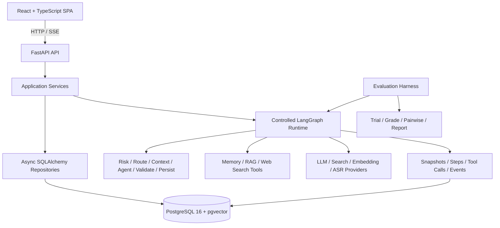

# Career Planning Buddy · AI 求职搭子

[](https://github.com/lyyjsr/career-planning-buddy/actions/workflows/ci.yml)
[](LICENSE)

> 面向计算机专业学生的证据化 AI 求职教练：把简历、目标岗位、规划、执行和模拟面试连接成一个可追踪、可复盘的闭环。

Career Planning Buddy is an evidence-grounded career coaching Agent for CS students. It turns job-search context into executable plans, structured interview practice, traceable feedback, and the next concrete action.

项目重点不在让模型自由发挥，而在于如何用受控工作流、状态机、快照、人工确认和离线评测，把 LLM 能力放进可验证的软件系统。

## 项目解决什么问题

计算机学生准备求职时，常见问题不是缺少建议，而是信息无法形成连续行动：

- 简历、目标 JD、项目准备和面试训练彼此割裂；
- 通用模型每轮从头回答，无法可靠继承真实执行结果；
- 建议缺少证据和可观察产物，完成后也不知道下一步；
- 模型输出无法追踪，Prompt 或 Provider 变化后难以回归验证。

本项目把用户路径收敛为：

```text
材料与目标 → 求职路线 → 今日行动 → 执行复盘
      ↓                         ↑
定向模拟面试 → 证据化报告 → 训练任务 / 简历新版本 → 复测
```

## 界面预览

> 截图位置已预留。请将脱敏后的图片放入 [`docs/assets/screenshots/`](docs/assets/screenshots/README.md)，再按目录说明替换下面的占位内容。

| 求职工作台 | 材料诊断 |
|---|---|
| _截图位：`workspace.png`_ | _截图位：`materials.png`_ |

| 模拟面试 | 面试报告 |
|---|---|
| _截图位：`interview-room.png`_ | _截图位：`interview-report.png`_ |

| 开发者追踪 |
|---|
| _截图位：`developer-trace.png`_ |

## 当前能力

| 模块 | 已实现能力 |
|---|---|
| 求职工作台 | 汇总简历、目标 JD、路线、今日任务和面试状态，给出下一步建议 |
| 路线与执行 | 目标澄清与确认、1–8 周方向、固定 7 天任务周期、任务进度、每日复盘和版本化重规划 |
| 求职材料 | 简历版本、目标 JD、材料诊断、主张与证据关联、用户确认后生成可回溯的新简历版本 |
| 模拟面试 | 基于冻结的简历和 JD 生成 4–6 题训练，支持逐题分析、有限追问、文本/单题音频回答和失败恢复 |
| 面试报告 | 用原回答证据生成优势、薄弱点和训练建议，可批量确认训练动作并进行跨场次复测比较 |
| 记忆与 RAG | Run 工作记忆、用户确认的个人记忆、经过审核的共享知识；简历/JD 文档自动分块入库，pgvector + pg_trgm 混合检索（RRF 融合）+ 可替换 Reranker + 可答复性门控，来源引用经证据可见性校验 |
| Agent Runtime | 固定 LangGraph、预算与截止时间、一次受控修复、取消、租约接管、降级和唯一终态；LLM 线级流式（SSE 进度事件 + 首 token 延迟指标） |
| Trace 与 Eval | 持久化 Step/Tool/Event/Snapshot，固定数据集、规则 Grader、Fixture、Provider 调用审计、Pairwise 校准与 Rubric 质量标注/Judge 校准管道、bad case 自动导出、检索指标（Recall@K/MRR/nDCG） |

## 为什么不是普通 LLM Wrapper

| 问题 | 项目中的处理 |
|---|---|
| 模型是否可以直接改数据库？ | 不可以。Agent 节点不操作 ORM，写入统一经过 Service、状态机和事务。 |
| 如何避免计划看起来正确但无法执行？ | Pydantic 结构化输出 + 确定性规则校验 + 最多一次业务修复 + 明确 fallback。 |
| 如何恢复断开的生成过程？ | Run、事件和快照先持久化；SSE 以 `agent_events` 为断线续传事实源。 |
| 如何避免模型偷偷记住敏感信息？ | 个人长期记忆先成为候选，只有用户确认后才进入后续上下文，并可关闭或删除。 |
| 如何保证简历不会被 Agent 静默覆盖？ | 改写建议逐条接受/拒绝，最终只创建带父版本引用的新版本。 |
| 如何知道改 Prompt 后有没有退化？ | 使用冻结运行身份、Mock/Fixture 数据集、确定性 Grader、Trace 和 Eval Report 回归验证。 |

## 系统架构



后端保持单体分层：`api → services → repositories`，Agent Runtime 通过 Provider Protocol 使用外部能力。MVP 不引入 Redis、Celery、微服务、MCP 或多 Agent 框架，异步 Run 由 PostgreSQL claim/lease/heartbeat 驱动。

### 三层上下文与记忆

```text
L1 Run 工作上下文
画像 + 当前路线 + 任务/复盘 + 材料/面试证据 → 压缩 → 输入快照

L2 用户个人记忆
复盘/报告 → MemoryCandidate → 用户确认 → 用户隔离的向量检索

L3 共享知识
搜索来源 → 候选经验原子 → 开发者审核 → pgvector → RAG 引用
```

搜索结果不会自动成为可信知识，个人记忆也不会被提升为全局知识。

## 技术栈

- Backend：Python 3.12、FastAPI、Pydantic v2、SQLAlchemy 2 Async、Alembic、LangGraph
- Frontend：React、TypeScript、Vite、React Router、TanStack Query、Tailwind CSS
- Data：PostgreSQL 16、pgvector + pg_trgm（文档混合检索）
- Runtime：OpenAI-compatible LLM、Baidu AI Search、本地 BGE Embedding、TEI Reranker（可替换）、可替换 ASR Provider
- Quality：Pytest、Vitest、Ruff、Mypy、OpenAPI Snapshot、GitHub Actions、Evaluation Harness
- Delivery：Docker Compose，单 Uvicorn Worker

## HTTP 边界防护与可观测性

所有请求经过一个边界守卫中间件（详见 [HTTP 限流与指标接入指南](docs/architecture/http-guard-and-metrics.md)）：

- **限流**：固定窗口计数，按"客户端 IP + Authorization 哈希"分桶（不同登录用户各自独立额度）；超限返回 `429` + `Retry-After`；health/metrics/docs 与 OPTIONS 预检豁免。`RATE_LIMIT_PER_MINUTE=0` 可整体关闭（Compose 默认 120/分钟），零外部依赖。
- **指标**：`GET /metrics` 暴露 Prometheus 文本格式——请求计数（路径已归一化防标签爆炸）、延迟 count/sum、在途请求数、限流拒绝数。
- **用量报表**：`GET /api/v1/dev/usage-report`（dev 角色）按状态/图/日/Provider 聚合成本（CNY）、延迟 P50/P95、token 量；`GET /api/v1/dev/repair-report` 输出修复机制触发/成功/预算拒绝率——全部来自既有数据，零额外埋点。

## 实测质量指标

冻结数据集、确定性 Grader、CI 硬门禁。当前数字（评测命令见 [测试与评测](#测试与评测)）：

| 评测 | 数据集 | 结果 |
|---|---|---|
| 意图路由（规则路由 `intent-rule-v3`） | `intent-routing-v1`（23 例） | 23/23 = 100% |
| Stage 5 规划/修复/重规划/安全 | `stage5-v1`（30 例，11 个 Grader） | 30/30 = 100% |
| Stage 5（Eval V2 全硬门禁） | `stage5-v1`，每例 1 trial | 硬门禁通过率 1.0，首试成功率 1.0 |
| Stage 6 记忆/上下文选择 | `stage6-memory-context-v1`（12 例） | 12/12 = 100% |
| 文档检索-字面查询（v1 集） | `retrieval-v1`（10 例，小语料） | 纯向量 1.0；混合+真实重排 0.95/MRR 1.00；混合 0.85；词法 0.85 |
| **文档检索-转述硬化（v2 集）** | `retrieval-v2`（15 例，6 篇文档/例 + 同域干扰 + 转述查询） | **混合 1.0/MRR 0.95 最优**；向量 1.0/0.84；词法 1.0/0.92；混合+重排降至 0.73/0.70（见下） |
| 真实运行（GLM-4.7，开发部署） | 58 条持久化 Run | 完成 89.7% / 降级 10.3%（业务修复路径）；延迟 P50 25.4s / P95 72.2s；token 输入 13.5 万 / 输出 7.6 万 |
| **stage5 真实基线（GLM-4.7，k=3）** | 30 例 × 3 trial = 90 次真实运行 | **硬门禁 72.2%**；首试成功率 73.3%（95%CI 55.6–85.8）；pass^3 70.0%；21 例 3/3 全过、8 例 0/3 全败（集中在工具调用与修复/重规划路径）；P50 26.1s / P95 47.0s |

检索评测（`python -m scripts.run_retrieval_eval --dataset retrieval-v1|v2`）在两代金标集上对比四模式（bge-m3 向量 + GPU bge-reranker-v2-m3）：**v1（字面查询、小语料）的绝对值偏乐观**——语料仅 2-4 chunk 且查询直引原文；v2 做了三项硬化（每例 6 篇文档含同域干扰、转述式查询不引原词、每 case 独立语料用户）。两代结论不同且都诚实记录：v1 上重排修正排序至 MRR 1.00；**v2 上混合融合是最优模式（Recall 1.0 / MRR 0.95），而神经重排在转述查询下反而劣化（0.73/0.70）**——诊断表明门控过严（降到 0.005 仅恢复至 0.733）与重排器对转述配对误排并存。生产启示：重排应条件启用或与混合分数融合而非替换排序——这是下一项改进的明确输入。失败用例自动导出为结构化 bad case，支持复现与归因。

stage5 真实基线（`python -m evals.v2 run --dataset stage5 --provider-mode live --trial-count 3`，隔离库）：mock 30/30 证明系统契约正确，真实 GLM 72.2% 是质量基线——失败集中在工具调用轮（create-07/08/09）、格式修复（repair-02/04）与重规划（replan-01/02/05）路径，与开发部署观察到的业务修复 0/6 相互印证；这 8 个全败 case 是 bad case 归因与下一轮 prompt 改进的直接输入。运行间方差（replan-03 二过一败）证明了 k=3 重复测量的必要性。

真实运行数字来自开发部署的持久化 Run（`GET /api/v1/dev/usage-report` 与 `GET /api/v1/dev/repair-report` 聚合）。收割过程暴露了两个诚实的可观测性缺口：真实 Provider 的按调用成本记账尚未接线（cost_cny 恒为 0，token 有记录）；provider_calls 审计表仅评测链路写入——生产可观测依赖 Run/Step 记录。

## 快速开始：免费 Mock 模式

默认模板使用确定性的 Mock LLM、Search、Embedding 和 ASR，不需要任何 API Key，也不会产生模型调用费用。

要求：Docker Desktop / Docker Engine，支持 Docker Compose。

```powershell
Copy-Item .env.example .env
docker compose up --build -d
docker compose ps
Invoke-RestMethod http://127.0.0.1:8000/health/ready
```

打开：

- Web：[http://localhost:5173](http://localhost:5173)
- API 文档：[http://localhost:8000/docs](http://localhost:8000/docs)

首次进入后可以注册账号或使用访客入口，完成最小画像，再从工作台体验材料、路线、任务和面试流程。

停止服务：

```powershell
docker compose down
```

`docker compose down` 不删除 PostgreSQL 命名卷；如需清空本地演示数据，请在确认后显式处理 Volume。

## 本地开发

要求：Python 3.12、Node.js 20、npm，以及 PostgreSQL 16 + pgvector。可以只用 Docker 启动数据库：

```powershell
Copy-Item .env.example .env
docker compose up -d postgres

cd backend
python -m venv .venv
.\.venv\Scripts\python -m pip install -r requirements.lock
.\.venv\Scripts\python -m pip install --no-deps -e .
.\.venv\Scripts\python -m alembic upgrade head
.\.venv\Scripts\python -m uvicorn app.main:app --reload
```

另开终端：

```powershell
cd frontend
npm ci
npm run dev
```

macOS/Linux 可使用 `./scripts/check.sh`，并将虚拟环境命令替换为 `.venv/bin/python`。

## Provider 配置

| 能力 | 安全默认值 | 真实模式 |
|---|---|---|
| Planning LLM | `mock` | `openai_compatible`，支持 DeepSeek 等兼容端点 |
| Search | `mock` | `baidu` |
| Embedding | `mock` | 预下载的本地 BGE 模型 |
| ASR | `mock` | `openai_compatible` |
| Eval | `mock` / `fixture` | `live`，仅显式开发者操作 |

真实 Provider 失败时不会静默切换到 Mock。密钥只允许放在被忽略的根目录 `.env` 或部署系统 Secret 中，禁止使用浏览器可见的 `VITE_*` 变量保存凭据。

完整字段和本地模型挂载方式见 [Provider 配置与部署](docs/third-party-integration/provider-configuration.md)。配置后可运行脱敏检查：

```powershell
cd backend
.\.venv\Scripts\python -m scripts.provider_status
.\.venv\Scripts\python -m scripts.audit_config
```

## 测试与评测

仓库的标准验收命令会执行后端 lint/type check、数据库迁移、单元与集成测试、离线评测冒烟、前端测试和生产构建：

```powershell
.\scripts\check.ps1
```

```bash
./scripts/check.sh
```

CI 强制使用 Mock Provider，不读取开发者真实密钥，也不会产生付费调用。单独运行评测冒烟：

```powershell
cd backend
.\.venv\Scripts\python -m evals.v2 run `
  --dataset runtime-smoke `
  --cases runtime-tool-error-01 `
  --provider-mode mock `
  --trial-count 1
```

Pairwise 结果在缺少足够真实人工标注时只标记为 `diagnostic_only`；离线指标不被包装成真实用户效果。

## 项目结构

```text
career-planning-buddy/
├─ backend/
│  ├─ app/                 # API、Service、Repository、Agent、Provider、Harness
│  ├─ alembic/             # 数据库迁移
│  ├─ evals/               # 固定数据集与评测框架
│  └─ tests/               # Schema/Service/Repository/API/Runtime 测试
├─ frontend/
│  └─ src/                 # 页面、组件、API Client、路由与前端测试
├─ docs/                   # 产品、架构、契约、实现和审查文档
├─ scripts/                # 跨前后端验收脚本
├─ compose.yaml
└─ .env.example            # 无密钥的 Mock 配置模板
```

## 文档导航

- [文档总索引](docs/README.md)
- [当前系统全景与已知限制](docs/architecture/current-system-overview.md)
- [ETCLOVG 七层架构审计](docs/architecture/etclovg-mapping.md)
- [HTTP 限流与指标接入指南](docs/architecture/http-guard-and-metrics.md)
- [规划质量 Rubric 与 Judge 校准标准](docs/standards/plan-quality-rubric.md)
- [产品概览](docs/overview/product-overview.md)
- [用户使用说明](docs/overview/user-manual.md)
- [Agent Runtime 契约](docs/model-design/agent-runtime/README.md)
- [Tool 契约](docs/model-design/tools/README.md)
- [数据模型](docs/model-design/data-models/README.md)
- [API 规范](docs/model-design/api-spec/README.md)
- [5 分钟演示脚本](docs/overview/demo-walkthrough.md)
- [生产就绪审查](docs/review/production-readiness-audit-2026-08-10.md)

## 安全、隐私与能力边界

- 用户身份来自 JWT Claims，业务请求不接受客户端传入的 `user_id` 作为身份依据。
- SSE 使用 Header 鉴权；Provider Key 不进入前端 Bundle、快照或稳定错误响应。
- 简历、JD、面试回答和个人记忆属于敏感数据，本项目默认面向本地部署，不提供公共托管实例。
- 当前部署形态为单机、单后端 Worker，尚未完成大规模生产验证或水平扩展。
- Agent Run 有数据库租约恢复和过期尝试隔离，但不宣称 LLM 调用 exactly-once。
- 现有兼容 Replay 接口明确属于 `legacy_trace_clone`；确定性 Graph Replay 仍是后续验收目标。
- 面试与简历建议是求职训练辅助，不等同于招聘决策、背景调查或专业法律意见。

发现安全问题请阅读 [SECURITY.md](SECURITY.md)，不要在公开 Issue 中提交密钥或用户数据。

## 参与贡献

提交修改前请阅读 [CONTRIBUTING.md](CONTRIBUTING.md)。本项目采用契约优先、单纵切交付和 Mock 优先验证，业务代码需要同时覆盖 Schema、Service、Repository、API 与确定性 Agent 节点。

## License

[MIT](LICENSE) © 2026 Li Ye
