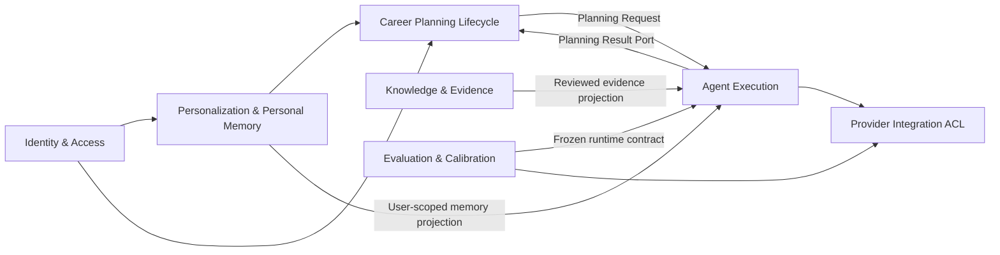

# DDD 子域与限界上下文地图

## 1. 核心领域

项目的核心领域不是 LLM 调用或 Agent 调度，而是：

> 基于用户职业画像、执行反馈和历史经验，持续生成并调整可执行的职业发展计划。

当前保持模块化单体和同一个 PostgreSQL，不以限界上下文为理由提前拆微服务。

## 2. 子域和模型所有权

| 限界上下文 | 子域类型 | 拥有的模型/规则 |
|---|---|---|
| Career Planning Lifecycle | 核心域 | Plan、Task、Review、CompanionMessage；继续、调整、归档和计划版本 |
| Agent Execution | 支撑域 | AgentRun、AgentStep、ToolCall、AgentEvent；lease、cancel、retry、deadline、terminal convergence |
| Personalization & Personal Memory | 支撑域 | UserProfile、MemoryCandidate、Memory；用户确认、关闭、删除和个人检索 |
| Knowledge & Evidence | 支撑域 | SearchSource、ExperienceAtomCandidate、ExperienceAtom；来源、审核、发布和失效 |
| Evaluation & Calibration | 支撑域/开发者产品域 | Experiment、Trial、Score、Pairwise、HumanAnnotation、CalibrationReport |
| Identity & Access | 通用域 | User、JWT、Role |
| Provider Integration | 通用域/防腐层 | LLM、Search、Embedding Provider |

## 3. Context Map

## 4. 允许的依赖方向

- API 只调用本上下文 Application Service，不直接操作 ORM；
- Agent Graph 依赖应用端口，不依赖 Planning 持久化实现；
- Execution 可以消费 Profile、Memory、Review、Plan 的只读投影，但不能修改其领域状态；
- Planning Result 的持久化通过 `PlanningResultPort` 收敛；
- Personal Memory 与公共 ExperienceAtom 不共享聚合和授权规则；
- Evaluation 可以调用冻结的 Runtime Contract，但生产 Agent Run 不依赖 Eval；
- Provider 只实现协议和防腐转换，不拥有业务状态机。

## 5. 当前实现和演进边界

当前代码仍主要按 API/Service/Repository/Model 技术层组织，属于 DDD Lite。已先引入
`PlanningResultPort` 隔离 Graph 和结果持久化；Context Builder 的多 Repository 读取仍是
下一阶段候选。只有新增功能或真实耦合问题出现时才逐步迁移到 `contexts/*`，不做一次性目录搬迁。

跨上下文流程由应用用例协调，未来优先从以下三个用例收紧：

1. `CompleteReviewUseCase`；
2. `StartNextPlanUseCase`；
3. `ProposeMemoriesFromReviewUseCase`。

不在当前阶段引入 Kafka、事件总线、分布式事务或独立微服务。
