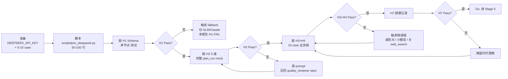

# PoC 验证报告

| 版本 | v1.0 |
|---|---|
| 日期 | 2026-07-24 |
| 状态 | **草稿矩阵已就绪；实测数据待 Pre-Stage 0 Provider PoC 跑完回填** |
| 目的 | Stage 0 前置 Provider PoC 的退出产物。没有此报告 + 全部假设判定 Pass，不进入 Stage 0/1（代码）|

English summary: Pre-Stage 0 provider PoC report. Lists 7 falsifiable hypotheses with thresholds, test method, and a blank measurement table to be filled after the spike. Any single FAIL triggers the ADR-005 fallback chain.

---

## 1. 本报告解决什么问题

ADR-005 决策"用 DeepSeek V4 + 五类 Provider"是基于**未实测假设**。决策标记 "Accepted（待 v4 spike 验证）"——意味着：

- 假设全 Pass → ADR-005 升号 "Accepted（已验证）"，进入 Stage 0 工程基线
- 任一 Fail → 触发 [ADR-005 备选方案](./adr.md)：换 GLM-4.5 / 换 Claude / 调降级链
- 全部 Unknown（未跑）→ **不允许进 Stage 0**（避免在错误地基上盖楼）

**本报告就是"假设清单 + 测试矩阵 + 实测数据"的载体。**

---

## 2. 待验证假设清单（7 项必验）

按风险等级排序。每项含：**假设 / 阈值 / 怎么验证 / 失败怎么办**。

### H1. DeepSeek Chat Completions 的 JSON mode 稳定输出 Pydantic schema ⭐⭐⭐

| 项 | 内容 |
|---|---|
| **假设** | `response_format={"type":"json_object"}` 模式下，DeepSeek 输出**能稳定解析为** `IntentResult` / `PlanCandidate` / `DecisionResult` |
| **阈值** | 5-10 case 实测，**通过率 ≥ 98%**（允许 1 次 schema 不匹配，触发 revise_or_fallback） |
| **怎么验证** | 跑 `scripts/poc_deepseek.py`（详见 [../third-party-integration/deepseek-api.md §8](../third-party-integration/deepseek-api.md)），对 5 个 intent 节点 case + 5 个 plan 节点 case 验证 schema 解析 |
| **失败怎么办** | ① 加结构化 prompt 强约束（如显式附 schema）→ 仍不行 ② 切 GLM-4.5 重跑 → 仍不行 ③ 换 Claude（推翻 ADR-005） |

### H2. 5 维质量评分通过率达标 ⭐⭐⭐

| 项 | 内容 |
|---|---|
| **假设** | 在 5-10 个真实 case 上，rule_validator + quality_reviewer 5 维评分**总通过率 ≥ 85%** |
| **阈值** | dim_1_startable ≥ 95% / dim_2_time_match ≥ 95% / dim_3_cognitive_load ≥ 90% / dim_4_continuity ≥ 80% / dim_5_deliverable ≥ 90%；总体 ≥ 85% |
| **怎么验证** | 用 5-10 个面试准备 / 简历修改 / 项目练手场景，手填 `expected.dimensions` 后跑完整 plan_run |
| **失败怎么办** | 维度细化调 prompt → 仍不行 → 召回 [quality_reviewer.spec.md](../model-design/agent-nodes/quality_reviewer.spec.md) 评审 |

### H3. 单 run 总成本 ≤ ¥0.2 ⭐⭐⭐

| 项 | 内容 |
|---|---|
| **假设** | 一次完整 plan_run（11 节点 + 1-2 轮 ReAct + 0-4 工具调用）总成本 **≤ ¥0.2 CNY**（[TDD §12.4 Budget](./tdd.md) 约束） |
| **阈值** | P50 ≤ ¥0.15 / P95 ≤ ¥0.20 / 无 case 超 ¥0.25（除非安全降级）|
| **怎么验证** | 跑 10 个 case 完整 plan_run，对每个 `agent_runs.cost_cny` 加总（详见 [deepseek-api.md §4](../third-party-integration/deepseek-api.md)）|
| **失败怎么办** | ① 减 ReAct 轮次 2→1 → ② 简单节点切更小模型 → ③ 关 web_search 走缓存 → ④ 仍超 → 召回 ADR-005 重评 |

### H4. 单次 plan_run 端到端延迟 ≤ 30s ⭐⭐

| 项 | 内容 |
|---|---|
| **假设** | 一次 plan_run（不算用户 SSE 渲染）P95 ≤ **30s**（用户体感"几秒"） |
| **阈值** | P50 ≤ 18s / P95 ≤ 30s / P99 ≤ 45s（超时即 trace 写 `latency_overrun` 并降级） |
| **怎么验证** | 同 H3 用例，记录 `agent_runs.latency_ms` 分布 |
| **失败怎么办** | ① 并行节点（context_builder 部分逻辑可与 LLM 调用并行）→ ② 减少 LLM 调用次数 |

### H5. DeepSeek 在中文语境下的规划质量与 Claude 3.5 相当 ⭐⭐

| 项 | 内容 |
|---|---|
| **假设** | 同一 case 用 Claude 3.5 Sonnet 跑 vs DeepSeek 跑，**5 维平均分差距 ≤ 5%** |
| **阈值** | DeepSeek mean(dim_1..5) ≥ Claude mean(dim_1..5) × 0.95 |
| **怎么验证** | 双 model 各跑 5 case，diff 五维分数（这是最贵的验证项，用最小 case 数降低成本） |
| **失败怎么办** | 如差距 < 10%，调 prompt 弥补；如 ≥ 10%，换 Claude（推翻 ADR-005） |

### H6. Embedding（DeepSeek 同厂 OR BGE）的 RAG 召回 top-5 命中率达标 ⭐⭐

| 项 | 内容 |
|---|---|
| **假设** | 用 30-50 个经验原子做向量库，相关 query top-5 召回命中率 **≥ 80%**（针对真实冷启动数据集）|
| **阈值** | 10 query × top-5，命中标答经验数 ≥ 8 个 case |
| **怎么验证** | Stage 4 才能跑（需先有 30-50 经验原子）；**MVP 窗口允许先跳过**，spike 延后 |
| **失败怎么办** | 多路召回（向量 + BM25）→ 调 embedding 维度 → 换 bge-m3 |

### H7. 国内可访问性 + 合规（数据不出境）⭐

| 项 | 内容 |
|---|---|
| **假设** | DeepSeek API（`api.deepseek.com`）国内可直连，延迟 ≤ 2s，无阻断 |
| **阈值** | 50 次调用全部成功；平均握手延迟 ≤ 1s |
| **怎么验证** | H1-H4 跑的过程顺便记录 |
| **失败怎么办** | 换国内代理商；或换 GLM-4.5（智谱，国内直连）|

---

## 3. 实测数据表（**待 spike 跑完回填**）

### 3.1 总体 Go/No-Go

| 假设 | 阈值 | 实测 | 判定 | 备注 |
|---|---|---|---|---|
| H1 Schema 稳定性 | ≥ 98% | _待填_ | ⬜ | |
| H2 5 维通过率 | ≥ 85% | _待填_ | ⬜ | |
| H3 单 run 成本 | ≤ ¥0.2 | _待填_ | ⬜ | |
| H4 端到端延迟 | P95 ≤ 30s | _待填_ | ⬜ | |
| H5 vs Claude 3.5 质量差距 | ≤ 5% | _待填_ | ⬜ | 可延后 |
| H6 RAG top-5 召回 | ≥ 80% | _待填_ | ⬜ | Stage 4 才跑 |
| H7 国内可访问 | 100% | _待填_ | ⬜ | |

**Go/No-Go 总判定**：⬜ **未跑 Spike**

- H1 + H2 + H3 + H4 + H7 全 Pass → **Go**（可进 Stage 0）
- 任一 Fail → **No-Go**，触发 ADR-005 fallback
- H5 + H6 可延后（不阻塞 Go 判定）

### 3.2 详细实测数据

#### H1 Schema 稳定性

| Case ID | 节点 | Schema | 解析结果 | tokens | 备注 |
|---|---|---|---|---|---|
| c-h1-01 | intent_router | IntentResult | _待填_ | _待填_ | |
| c-h1-02 | intent_router | IntentResult | _待填_ | _待填_ | |
| c-h1-03 | career_planning_agent | PlanCandidate | _待填_ | _待填_ | |
| c-h1-04 | quality_reviewer | ReviewResult | _待填_ | _待填_ | |
| ... | | | | | |

**H1 结论**：_待填_

#### H2 5 维评分

| Case ID | dim_1 | dim_2 | dim_3 | dim_4 | dim_5 | 总通过 | 备注 |
|---|---|---|---|---|---|---|---|
| c-h2-01 | _待填_ | _待填_ | _待填_ | _待填_ | _待填_ | _待填_ | |
| c-h2-02 | _待填_ | _待填_ | _待填_ | _待填_ | _待填_ | _待填_ | |

**H2 各维度 pass rate**：

| 维度 | 通过率 | 阈值 | 达标 |
|---|---|---|---|
| dim_1_startable | _待填_ | ≥ 95% | ⬜ |
| dim_2_time_match | _待填_ | ≥ 95% | ⬜ |
| dim_3_cognitive_load | _待填_ | ≥ 90% | ⬜ |
| dim_4_continuity | _待填_ | ≥ 80% | ⬜ |
| dim_5_deliverable | _待填_ | ≥ 90% | ⬜ |
| **总体** | _待填_ | **≥ 85%** | ⬜ |

#### H3 单 run 成本

| Case ID | tokens_in | tokens_out | LLM cost | Tool cost | total cost | 达标 (≤ ¥0.2) |
|---|---|---|---|---|---|---|
| c-h3-01 | _待填_ | _待填_ | _待填_ | _待填_ | _待填_ | ⬜ |
| ... | | | | | | |
| ** aggregates P50 / P95 / max** | _待填_ | _待填_ | _待填_ | _待填_ | _待填_ | |

#### H4 端到端延迟

| Case ID | latency_ms | 达标 (≤30s) |
|---|---|---|
| c-h4-01 | _待填_ | ⬜ |
| ... | | |
| P50 / P95 / P99 | _待填_ | |

#### H5 vs Claude 3.5 对比

| Case ID | DeepSeek 5 维分 | Claude 3.5 5 维分 | 差距 | 备注 |
|---|---|---|---|---|
| c-h5-01 | _待填_ | _待填_ | _待填_ | |

#### H6 RAG 召回

| Query | 命中标答 | top-5 列表 | 通过 |
|---|---|---|---|
| q-h6-01 | _待填_ | _待填_ | ⬜ |

#### H7 国内可访问

| 调用次数 | 成功数 | 平均握手延迟 | 失败原因 |
|---|---|---|---|
| 50 | _待填_ | _待填_ | _待填_ |

---

## 4. spike 执行计划

### 4.1 执行顺序

### 4.2 预计工时

| 步骤 | 工时 | 备注 |
|---|---|---|
| 准备 API Key + case | 0.5 天 | 业务方填 expected |
| 写 poc_deepseek.py | 0.5 天 | 简单脚本，无架构 |
| 跑 H1（5-10 case）| 0.5 天 | 单次调用快 |
| 跑 H2-H4（10 case 完整 plan_run） | 1 天 | mock tool 优先 |
| H5 对比测试 | 0.5 天 | 可与 H2-H4 并行 |
| 填报告 + 评审 | 0.5 天 | 走 verification-and-review.md |
| **总计** | **3-4 天** | 可压缩到 2 天 |

### 4.3 跑 spike 不做的事

- ❌ 不写 FastAPI / Docker / Alembic（属于 Stage 0）
- ❌ 不写 LangGraph 工作流（属于 Stage 2）
- ❌ 不写真实 Provider 实现（spike 直接调 openai-sdk，不经 LLMProvider Protocol）
- ❌ 不接 web_search 真服务（mock 返回即可，除非要验证 H3）

---

## 5. 与项目其它文档的关系

| 关联文档 | 关系 |
|---|---|
| [ADR-005](./adr.md) | 本报告的 Pass/Fail 决定 ADR-005 是否升号 / 召回 |
| [TDD §14 Cost](./tdd.md)  | 本报告 H3 跑完回填 TDD §14 实测数据 |
| [TDD §12.4 Budget](./tdd.md) | 本报告 H3 是该约束的验证 |
| [TDD §7.2 上下文预算](./tdd.md) | 本报告 H1 输出 token 实测影响预算校准 |
| [tdd.md §4.2 intent_router 低置信阈值 0.65](./tdd.md) | 本报告 H2 输出分布可校准该阈值 |
| [standards/security-and-compliance.md](../standards/security-and-compliance.md) | 本报告 H7 合规维度 |
| [third-party-integration/deepseek-api.md](../third-party-integration/deepseek-api.md) | 本报告 H1-H4 直接调用规则 |
| [model-design/harness/eval-system.md](../model-design/harness/eval-system.md) | 本报告 H2 验证逻辑是 Eval 系统的雏形 |
| [standards/testing-and-tdd.md](../standards/testing-and-tdd.md) | spike 不属于 TDD，但结果要进归档 |

---

## 6. Go/No-Go 判定矩阵

| 场景 | 判定 |
|---|---|
| H1 + H2 + H3 + H4 全 Pass | ✅ **Go：进 Stage 0**，ADR-005 升 "Accepted（已验证）" |
| 任一 H1-H4 Fail 且 fallback（GLM/Claude）补救成功 | ⚠️ **有条件 Go**：ADR-005 召回，修改主选，再验证 |
| H1-H4 任一 Fail 且 fallback 也 Fail | ❌ **No-Go**：项目暂停，重新评估 AI Agent 可行性 |
| H5（vs Claude）差距 5-10% | ⚠️ **延后处理**：进 Stage 0 同时持续调 prompt |
| H6（RAG）Fail | ⚠️ **不阻塞**：Stage 4 才需，Stage 0-3 可进 |
| H7（国内访问）Fail | ⚠️ **可补救**：换代理商后再跑 |

---

## 7. 不变量

| ID | 描述 |
|---|---|
| INV-PoC1 | 本报告的所有 `_待填_` 字段在 Stage 0 开工前 **必须替换为真实数据** |
| INV-PoC2 | 任一假设判定 Fail，**必须**在 ADR-005 反映（升号失败或召回） |
| INV-PoC3 | spike 期间产生的成本数据**必须**保留（用于后续校准 [TDD §14](./tdd.md)） |
| INV-PoC4 | spike 代码（`scripts/poc_deepseek.py`）**必须 commit 到 fork 仓库**（不立 PR），作为复现依据 |
| INV-PoC5 | 本报告 Pass 之后**才允许**进 Stage 0；绕过本报告进 Stage 0 视为违反 [AGENTS.md R-Plan1](../governance/AGENTS.md) |

---

## 8. 参考依据

| 来源 | 用于本文 § |
|---|---|
| [ADR-005 待验证假设](./adr.md) | §2 全部假设源头 |
| [TDD §14 成本约束](./tdd.md) | §2 H3 / §3 H3 |
| [TDD §12.4 Budget](./tdd.md) | §2 H3 |
| [TDD §7 上下文预算](./tdd.md) | §2 H1 |
| [TDD §4.2 confidence 阈值 0.65](./tdd.md) | §2 H2 校准依据 |
| [deepseek-api.md §8 spike 动作](../third-party-integration/deepseek-api.md) | §4 执行计划 |
| [quality_reviewer.spec.md](../model-design/agent-nodes/quality_reviewer.spec.md) | §2 H2 维度定义 |
| [stage-delivery-definition.md 阶段 3](../governance/stage-delivery-definition.md) | §1 PoC 阶段定位 |
| 《软件工程 PoC 验证报告标准模板》 | §3 报告格式 |

---

*本报告是 Stage 0 开工的必要前置条件。直到所有 _待填_ 数据被实测填入且 Go 判定为 Pass，**任何 backend 代码都不能开始**。*
