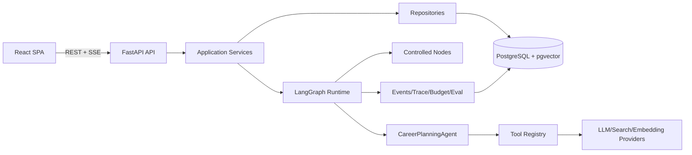
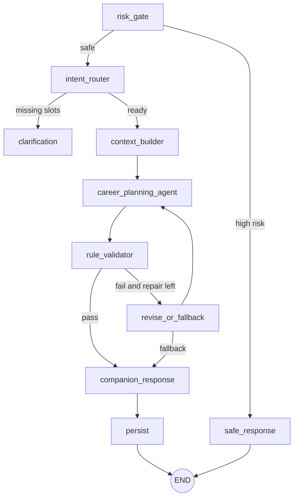

# TDD 技术设计文档 v2.0

## 1. 目标

系统将用户的求职目标和执行反馈转成可执行计划，并通过真实数据闭环持续调整。技术重点是：受控 Agent、结构化输出、可恢复 SSE、状态机、Trace 和 Eval。

## 2. 总体架构



## 3. 后端目录

```text
backend/app/
├── api/
│   ├── routers/
│   ├── dependencies.py
│   └── error_handlers.py
├── schemas/
├── services/
├── repositories/
├── models/
├── agent/
│   ├── graph.py
│   ├── state.py
│   └── nodes/
├── tools/
│   ├── registry.py
│   └── executors/
├── providers/
│   ├── protocols.py
│   ├── llm/
│   ├── search/
│   └── embedding/
├── harness/
│   ├── events.py
│   ├── trace.py
│   ├── budget.py
│   └── replay.py
├── core/
└── main.py
```

## 4. 分层责任

| 层 | 可以做 | 不可以做 |
|---|---|---|
| API | JWT、HTTP、SSE、DTO、错误映射 | 直接 ORM、核心规则 |
| Service | 用例、事务、幂等、状态机 | 厂商 SDK |
| Repository | 查询、锁、持久化 | Prompt、HTTP Response |
| Agent | Graph 和开放决策 | 直接 ORM 写入 |
| Provider | 外部服务适配 | 业务状态机 |
| Harness | Event、Trace、预算、Eval | 替代业务 Service |

## 5. Agent Graph



Stage 4 可在 context_builder 后加入 `distill_evidence`；Stage 5 可在 rule_validator 后加入 `quality_reviewer`。

## 6. Graph State

```python
class PlanningState(TypedDict, total=False):
    run_id: UUID
    user_id: UUID
    message: str
    hint_intent: str | None
    profile: dict
    intent: dict
    missing_slots: list[str]
    planning_context: dict
    tool_results: list[dict]
    candidate_plan: dict
    validation_result: dict
    repair_count: int
    final_plan: dict
    companion_message: str | None
    fallback_reason: str | None
    risk_category: str | None
```

State 中只放序列化数据，不放 ORM Session、SDK Client 和不可持久化对象。

## 7. Provider Protocol

```python
class LLMProvider(Protocol):
    async def complete(self, request: LLMRequest) -> LLMResponse: ...

class SearchProvider(Protocol):
    async def search(self, query: str, *, limit: int) -> list[SearchResult]: ...

class EmbeddingProvider(Protocol):
    async def embed(self, texts: list[str]) -> list[list[float]]: ...
```

Mock 和真实实现必须通过相同契约测试。

## 8. Tool 系统

MVP Tool：

| Tool | Stage | 作用 |
|---|---:|---|
| `memory_lookup` | 4 | 检索用户长期记忆 |
| `web_search` | 4 | 查询动态岗位或技术信息 |
| `rag_retrieve` | 4 | 检索经验原子 |
| `context_summarize` | 2 | 超预算时压缩上下文，可先用确定性实现 |

Tool 约束：白名单、Pydantic 输入、超时、最多 2 轮、结果截断、Trace hash。Tool 不允许写业务表。

## 9. Agent Run 执行

```text
POST /agent-runs
  → 创建 agent_runs(pending) 与幂等记录
  → 注册 asyncio.Task
  → running
  → 每个节点写 agent_steps
  → 每个事件写 agent_events
  → persist 事务写 plan/tasks/companion
  → completed/degraded/failed/cancelled
```

### 单 Worker 限制

- Uvicorn `--workers 1`；
- 进程崩溃时正在执行的 Run 不会自动续跑；
- 启动恢复器把超过截止时间的 pending/running Run 标记为 failed；
- 多 Worker 前必须通过 ADR 引入可靠调度。

## 10. SSE

`agent_events` 字段：`id, run_id, sequence, event_type, payload_json, created_at`。

发送规则：

1. 事务写入事件；
2. 提交后唤醒当前进程订阅者；
3. SSE 根据 sequence 发送；
4. 重连时根据 `Last-Event-ID` 查询缺失事件；
5. 无新事件时发送 heartbeat。

## 11. 数据一致性

关键事务：

- Persist：计划、任务、来源关联、陪伴消息和 Run 终态同事务提交；
- Task 开始：task pending→in_progress 与 plan generated→active 同事务；
- Review：写 review、统计任务结果、判断 suggested_replan 同事务；
- Replan 接受：创建新 Run，不直接修改原计划；新计划成功后再归档原计划；
- Memory candidate confirm：candidate confirmed 与 memory 创建同事务。

## 12. 幂等与并发

- `agent_runs(user_id, idempotency_key)` 唯一；
- 单用户 pending/running Run 使用 PostgreSQL partial unique index；
- Profile、Plan、Task、Memory 使用 version 乐观锁；
- 任务更新时 `UPDATE ... WHERE id=? AND version=?`；
- 失败更新返回 409。

## 13. 结构化输出

主模型必须返回：

```json
{
  "summary": "...",
  "rationale": "...",
  "tasks": [
    {
      "title": "...",
      "task_type": "project",
      "starter_action": "...",
      "deliverable": "...",
      "estimated_minutes": 30,
      "scheduled_date": "2026-08-01"
    }
  ],
  "sources_used": []
}
```

Pydantic 校验失败时只允许一次格式修复。业务规则失败由 revise_or_fallback 控制，最多一次重新生成；仍失败使用模板计划并标记 degraded。

## 14. 规则校验

- 任务数 1~3；
- 总时长 ≤ 用户当日预算；
- starter_action 包含可执行动作；
- deliverable 可验证；
- 不重复已完成任务；
- replan 保留已完成事实；
- 来源 URL 只能来自 SearchProvider 返回值；
- 不允许模型改变用户目标方向，除非用户明确确认。

## 15. Review 和 Replan

Review Service 从数据库计算完成/放弃统计，不信任客户端传入统计结果。

```text
创建 Review
  → 读取计划任务状态
  → 应用确定性规则
  → suggested_replan
  → 生成陪伴话术
  → 用户确认
  → 新建 Agent Run(hint_intent=replan)
```

## 16. 记忆与 RAG

- Profile 是明确业务事实；
- Memory 是长期可复用信息；
- Recent task/review 是短期上下文，不复制成长期记忆；
- 敏感内容先入 memory_candidates；
- 高风险内容不写记忆；
- Experience atom 按 goal_type + embedding 检索。

## 17. 安全

- 用户数据按 JWT user_id 过滤；
- API Key 只来自环境变量；
- Trace 不保存完整敏感 Prompt；
- 高风险分支使用固定模板和本地配置的求助资源；
- 不对心理、法律、金融问题做专业诊断；
- 热线信息不得散落硬编码，应通过安全配置集中维护并定期复核。

## 18. 前端

核心路由：

```text
/login
/onboarding
/today
/plans
/plans/:id
/reviews
/memories
/dev/runs
```

前端只把 SSE 作为实时增强；页面刷新后通过 GET Run/Plan/Task 恢复权威状态。

## 19. 测试

- Schema：边界、枚举、extra forbid；
- Service：状态机、幂等、权限；
- Repository：PostgreSQL 集成测试；
- Agent：Mock Provider 确定性节点测试；
- API：JWT、错误码、SSE 续传；
- Eval：固定 JSONL Case 与规则 grader。

## 20. 部署

Docker Compose：`frontend + backend + postgres`。MVP 后端只启动 1 个 Worker。健康检查分：liveness、readiness。真实模型不可用时 readiness 仍可通过，但模型状态在 `/health/dependencies` 展示。
