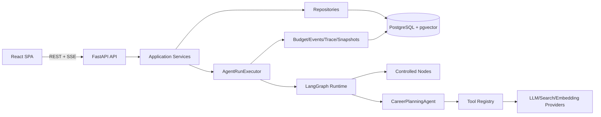
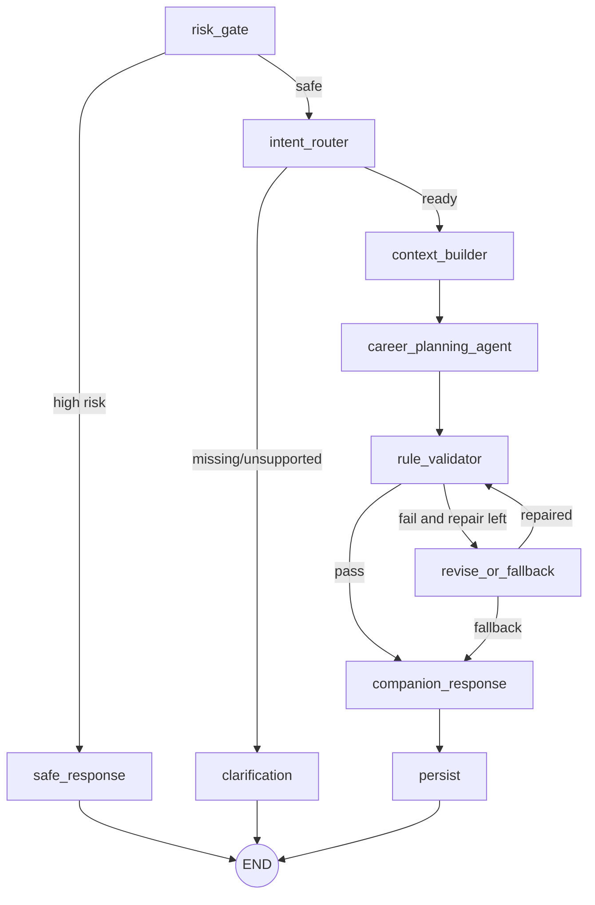

# TDD 技术设计文档 v2.1

## 1. 目标

系统将用户的求职目标和真实执行反馈转成可执行计划，并通过“任务 → 复盘 → 重规划”持续调整。技术重点是：受控 Agent、结构化输出、可恢复 SSE、状态机、Trace、Snapshot 和 Eval。

## 2. 总体架构



## 3. 后端目录

```text
backend/app/
├── api/
│   ├── routers/
│   ├── dependencies.py
│   └── error_handlers.py
├── schemas/
├── services/
├── repositories/
├── models/
├── agent/
│   ├── graph.py
│   ├── state.py
│   ├── routing.py
│   ├── executor.py
│   ├── node_runner.py
│   ├── finalizer.py
│   └── nodes/
├── tools/
│   ├── registry.py
│   ├── contracts.py
│   └── executors/
├── providers/
│   ├── protocols.py
│   ├── llm/
│   ├── search/
│   └── embedding/
├── harness/
│   ├── events.py
│   ├── trace.py
│   ├── budget.py
│   ├── snapshots.py
│   └── replay.py
├── prompts/
├── core/
└── main.py
```

## 4. 分层责任

| 层 | 可以做 | 不可以做 |
|---|---|---|
| API | JWT、HTTP、SSE、DTO、错误映射 | 直接 ORM、核心规则 |
| Service | 用例、事务、幂等、状态机 | 直接使用厂商 SDK |
| Repository | 查询、锁、持久化 | Prompt、HTTP Response |
| Agent Runtime | Graph、节点路由、预算、取消 | 直接写 ORM 实体 |
| Provider | 外部服务适配 | 业务状态机 |
| Tool | 只读能力、输入输出校验 | 写 Plan/Task/Review/Memory |
| Harness | Event、Trace、Snapshot、Budget、Eval | 替代业务 Service |

依赖方向：`api → services → repositories`，`services → agent runtime → providers/tools`。Agent 节点只依赖 DTO、Protocol 和 Service 接口。

## 5. Agent Graph



关键决策：

- 只有 `career_planning_agent` 可自主选择 Tool；
- 修复调用关闭 Tool，修复后回到 validator，不重新执行 Agent Tool 循环；
- `quality_reviewer` Stage 5 默认在 Eval/Replay 中离线 shadow；只有实验 enforce 模式才在持久化前同步运行；
- `distill_evidence` 在成功 Run 后 best-effort 执行，不在主链等待；
- 查询现有计划使用 REST，不属于 Agent 意图。

完整细节见 [`../model-design/agent-runtime/README.md`](../model-design/agent-runtime/README.md)。

## 6. Graph State 与快照

Graph State 使用显式 DTO，区分：

1. 不可变输入：run_id、user_id、message、source_plan_id、goal override；
2. 路由结果：risk、intent、missing slots；
3. 上下文：profile、source plan、近期任务/复盘、completed facts、blockers；
4. Agent 过程：evidence catalog、tool round/count、candidate；
5. 校验过程：validation report、repair count、fallback reason；
6. 终态：result_kind、result_payload、companion。

`context_builder` 后写 `input_snapshot_json`；Run 启动时写 `config_snapshot_json`。Replay 使用快照，不重新读取已变化的画像和配置。

State 中禁止放 ORM Session、SQLAlchemy Model、Provider Client、文件句柄或协程对象。

## 7. Provider Protocol

```python
class LLMProvider(Protocol):
    async def generate_structured(self, request: LLMRequest) -> LLMResult: ...
    async def generate_agent_turn(self, request: AgentTurnRequest) -> AgentTurnResult: ...

class SearchProvider(Protocol):
    async def search(self, query: str, *, limit: int, freshness_days: int | None) -> list[SearchResult]: ...

class EmbeddingProvider(Protocol):
    async def embed(self, texts: list[str]) -> list[list[float]]: ...
```

Mock 和真实实现必须通过同一契约测试。Provider 返回实际 model/provider、usage、latency、request_id，不把 SDK 类型泄漏给上层。

## 8. Tool 系统

Stage 4 开放：

| Tool | 作用 |
|---|---|
| `memory_lookup` | 检索当前用户已确认长期记忆 |
| `rag_retrieve` | 检索当前 goal_type 的经验原子 |
| `web_search` | 获取需要时效性的岗位或技术证据 |

Stage 2/3 Tool 列表为空。`context_summarize` 是内部确定性 helper，不暴露给模型。

统一约束：显式注册、Pydantic 输入输出、意图/Stage 白名单、最多 2 轮、每轮 2 个、总计 4 个、单 Tool 8 秒、结果截断、args/result hash、Replay fixture、用户隔离和 Prompt Injection 防护。详见 [`../model-design/tools/README.md`](../model-design/tools/README.md)。

## 9. Agent Run 执行

```text
POST /agent-runs
  → 校验 JWT、Profile、source plan、幂等与活动 Run
  → 创建 agent_runs(pending) + config snapshot
  → PostgreSQL dispatcher 抢占 pending Run 并取得 lease
  → running
  → NodeRunner 包装每个节点
  → context snapshot
  → CareerPlanningAgent / Tool / validation / repair
  → persist 或 terminal branch
  → completed/degraded/failed/cancelled
```

### Worker 执行边界

- 多个 Worker 通过 `SKIP LOCKED`、lease、heartbeat 和 attempt fencing 竞争执行；
- 进程崩溃或优雅停机后，Run 在 lease 到期/释放后有界 requeue；
- 取消标记持久化，heartbeat 与节点边界都能跨进程传播；
- 当前没有节点级 checkpoint，重试从 Graph 起点开始，LLM 不承诺 exactly-once。

## 10. 预算与失败收敛

- 单 Run默认 Deadline 45 秒；
- Stage 2/3 全局最多 5 次 LLM 调用；Stage 4 最多 7 次；Stage 5 在线 enforce reviewer 时最多 8 次；默认离线 shadow 使用独立 Eval 预算；
- CareerPlanningAgent 自身最多 3 次；
- Tool 最多 2 轮/4 次；
- 结构化格式修复最多 1 次；
- 业务规则修复最多 1 次；
- 所有 terminal 状态只能由 `AgentRunFinalizer` 写一次；persist 通过 Finalizer 的 plan 事务完成；
- Provider/Tool/取消/超时统一映射到稳定错误码；
- 能给出合规模板 Plan、澄清或安全响应时 degraded，否则 failed。

## 11. SSE 与终态结果

`agent_events` 是非 heartbeat 事件事实源：

1. 事务写事件；
2. 提交后唤醒进程内订阅者；
3. SSE 按 sequence 推送；
4. 重连根据 `Last-Event-ID` 回放；
5. terminal event 必须是最后一个持久事件；
6. heartbeat 不持久化、不占 sequence。

`GET /agent-runs/{id}` 返回权威终态：

- `result_kind=plan` + final_plan_id；
- `result_kind=clarification` + 问题；
- `result_kind=safe_response` + 审核响应；
- `result_kind=navigation` + 页面目标与可执行动作；
- failed/cancelled 无 result。

刷新恢复不能只依赖 SSE。

## 12. 数据一致性

关键事务：

- Persist：replan 先在事务内归档旧活跃 Plan，再插入新 Plan，连同 Task、evidence refs、Companion、Run 终态、plan.ready、terminal event 同事务；
- Clarification/Navigation/Safe Response：Run 结果和 terminal event 同事务；
- Task 开始：task pending→in_progress 与 plan generated→active 同事务；
- Review：写 review、统计任务事实、判断 suggested_replan 同事务；
- Replan：旧计划只在“归档旧计划 + 插入新计划 + Run 终态”同一事务成功提交后才算归档；
- Memory confirm：candidate confirmed 与 memory 创建同事务。

## 13. 幂等与并发

- `agent_runs(user_id, idempotency_key)` 唯一；
- 单用户 pending/running Run 使用 PostgreSQL partial unique index；
- Profile、Plan、Task、Memory 使用 version 乐观锁；
- Tool 相同 `run_id + tool_name + args_hash` 可复用；
- Run 取消先写 `cancel_requested_at`；本地 Task 立即取消，远端 owner 由 heartbeat/节点边界观察；
- 终态 Run 不允许再次取消或修改结果。

## 14. 结构化输出

主 Agent 返回 `PlanCandidate`，包含 plan_date/horizon、overall_direction、1~8 条 weekly_focus、summary、rationale、adjustment_reason、assumptions、当天 1~3 个 tasks 和结构化 evidence_refs。

Pydantic Schema 失败时只允许一次格式修复。确定性规则失败交给专用 repair Prompt 一次；仍失败使用程序模板计划并标记 degraded。禁止用正则从自由文本中“捞 JSON”作为主路径。

## 15. 规则校验

稳定检查码至少包括：TASK_COUNT、TIME_BUDGET、STARTER_ACTION、DELIVERABLE、SCHEDULE_DATE、RECENT_DUPLICATE、REPLAN_CONTINUITY、SOURCE_INTEGRITY、GOAL_IMMUTABLE、TEXT_LENGTH、TASK_UNIQUENESS。

验证器只读、不修改 Candidate，修复指令从稳定检查码映射生成。

## 16. Review 和 Replan

Review Service 从数据库计算完成/放弃统计，不信任客户端统计：

```text
创建 Review
  → 读取计划任务事实
  → 应用确定性规则得到 next_plan_action(continue/adjust)
  → 用户确认生成次日计划
  → 新建 Agent Run(hint_intent=replan, source_plan_id, source_review_id)
  → context_builder 生成 planning window/completed facts/blockers
  → 同一事务归档来源计划并创建新版本
```

重规划不得删除或篡改已完成任务历史。

## 17. 记忆、搜索与 RAG

- Profile 是显式业务事实；
- confirmed Memory 是长期偏好/约束；
- recent task/review 是短期上下文，不机械复制为长期记忆；
- context_builder 仅加载少量 pinned memories；
- 其余 Memory/RAG/Search 由 Agent 在 Stage 4 按需调用 Tool；
- 搜索结果先保存为 SearchSource，再把 source_id 交给模型；
- 敏感内容进入 memory_candidates，经用户确认后激活；
- high risk 输入不写 Memory。

## 18. 安全

- 用户身份只取 JWT claim；
- Repository 所有用户资源查询必须含 user_id/归属校验；
- API Key 只来自环境变量；
- Trace 和 Snapshot 字段级脱敏；
- 外部证据一律作为不可信数据；
- Agent 没有写业务表 Tool；
- 高风险分支使用人工审核配置，不让模型生成资源；
- 不对心理、法律、金融问题做专业诊断。

## 19. 前端

核心路由：

```text
/login
/onboarding
/today
/plans
/plans/:id
/reviews
/memories
/dev/runs
```

前端把 SSE 作为实时增强；页面刷新后通过 GET Run/Plan/Task 恢复。不同 `result_kind` 渲染 Plan、Clarification、Navigation 或 Safe Response。

## 20. 测试

- Schema：边界、枚举、extra forbid；
- Service：事务、状态机、幂等、终态唯一；
- Repository：PostgreSQL 集成测试和用户隔离；
- Agent：Mock Provider、路由、预算、Tool、修复、fallback；
- API：JWT、错误码、SSE 续传、取消；
- Snapshot/Replay：配置和输入变化后仍可复现；
- Eval：固定 JSONL Case 与规则 grader。

## 21. 部署

Docker Compose：`frontend + backend + postgres`。MVP 后端只启动 1 个 Worker。健康检查分 liveness/readiness；真实模型不可用时基础 readiness 可通过，但依赖状态在 `/health/dependencies` 展示。
