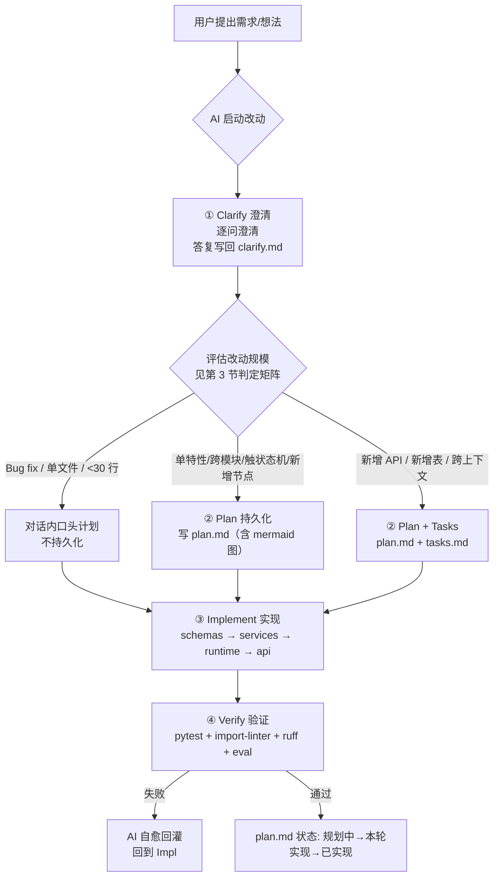
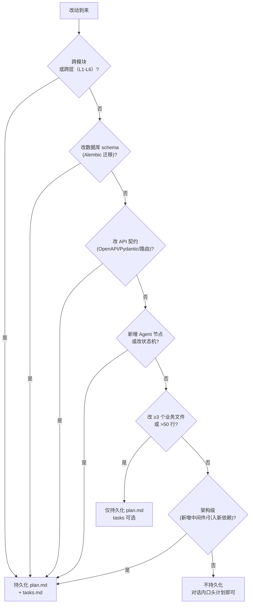
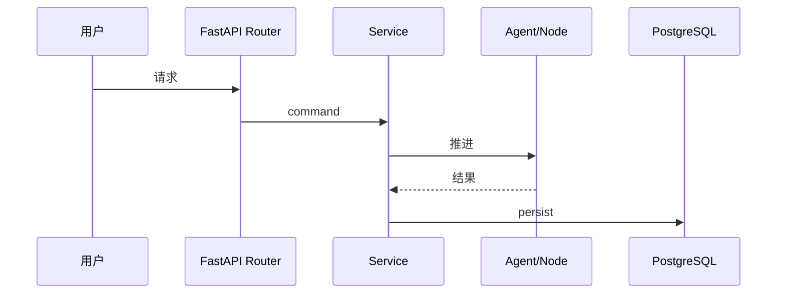
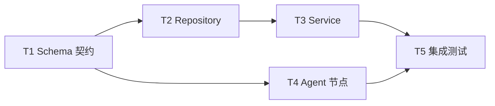

# Spec-Driven 工作流（澄清→计划→任务）

状态：本轮实现。

English summary: The mandatory pre-implementation workflow every AI (and human) MUST run before non-trivial code changes — clarify questions, persist a plan with a mermaid diagram when the change crosses thresholds, and generate tasks for cross-context work. All artifacts live under `docs/requirements/<feature>/`.

本文件是 [AGENTS.md](../../AGENTS.md) `R-Plan1` 的可执行实施物，承接 [governance/AGENTS.md](./AGENTS.md) 第 4 节的五段式。

---

## 适用范围与触发条件

任何使用 AI（或人工）开始一个改动前，**必须**先完成 Clarify 阶段；是否继续进入 Plan 持久化、Tasks 阶段，按第 3 节判定矩阵裁决。

**例外**（无需持久化，但仍需口头澄清一句）：Bug fix < 30 行 + 单模块 + 不触领域状态机 + 不动 schema/API。

---

## 工作流总览（mermaid）



四阶段：

1. **Clarify（澄清）** —— AI 就需求边界、成功条件、隐含假设向用户提问，把答复与未澄清假设登记到 `clarify.md`。
2. **Plan（计划）** —— 输出 `plan.md`，含目标、假设、实现步骤、验证清单、影响面、回滚、以及**必填的 mermaid 交互流程图**。
3. **Tasks（任务）** —— 仅当改动跨上下文/新增表/新增 API/新增节点时生成 `tasks.md`，按依赖关系标 `[P]` 表示可并行。
4. **Implement / Verify** —— 实现 + `pytest` + `import-linter` + `ruff`；失败由 AI 自愈回灌再实现。

---

## 持久化判定

### 决策树（mermaid）



### 判定矩阵

| 改动类型 | Clarify | Plan 文件是否持久化 | Tasks 文件 |
|---|---|---|---|
| Bug fix < 30 行 + 单模块 | 必做（一句话口头确认） | **否**（对话里即可） | 否 |
| 单特性 / 跨模块 / 触状态机 / 新增节点 | 必做 | **是** → `docs/requirements/<feature>/plan.md` | 可选 |
| 跨上下文 / 新增 API / 新增表 | 必做 | **是** | **是** |
| 架构级（引入新中间件、新依赖） | 必做（需评审） | **是**（且状态 `规划中` 转 `已实现` 才能合并） | 是 |
| 实验/探索（不并入主干） | 可省 | 否（或写 `docs/requirements/<feature>/scratch/`） | 否 |

### 决策原则（AI 可执行 if-else）

> 持久化 `docs/requirements/<feature>/plan.md` 当且仅当改动满足任一：① 跨模块/跨层；② 改数据库 schema；③ 改 API 契约；④ 新增 Agent 节点或改状态机；⑤ 改 ≥3 个业务文件或 >50 行；⑥ 架构级决策。否则只做口头澄清，不持久化。

机器校验脚本（`scripts/check-plan.sh`）会用 git diff 量化"≥3 文件或 >50 行"自动裁定。

---

## 产物落位

一个需求的所有澄清、计划、任务、专题文档**全部**落在 `docs/requirements/<feature>/` 单一目录。

```text
docs/requirements/<feature>/
├── README.md                 # 文档地图（可选，feature 内文档多时加）
├── clarify.md                # 澄清问答 + 假设清单（前置）
├── plan.md                   # 实现计划（前置，必含 mermaid 交互流程图）
├── tasks.md                  # 任务清单（可选，带 [P] 并行标记）
├── <专题文档>.md             # 例如 state-machine.md / regression-report-*.md
└── scratch/                  # 实验/探索专用，不并入主干
```

`<feature>` 命名沿用需求主题（如 `agent-runtime-skeleton`、`risk-gate-node`），**禁止数字前缀**（`check-doc-status.sh` 会拒收）。

---

## plan.md 模板

每个 `plan.md` 至少包含以下章节；首部状态行必须满足 `check-doc-status.sh` 约束。

```markdown
# <特性名> 实现计划

状态：规划中。   <!-- 推进中：本轮实现。 收尾后：已实现。 -->

English summary: <一句话英文概述>

## 1. 目标
<本次改动要达成什么、解决什么问题>

## 2. 澄清与假设
<来自 clarify.md 的关键问答摘要、未决假设、外部依赖>

## 3. 交互流程（mermaid）
<!-- 必填。画出主要参与者（用户/Agent/节点/Service/Provider/DB）之间的交互链 -->


## 4. 实现步骤
<按子任务粒度列出，对应 tasks.md 的条目>

## 5. 验证清单
- [ ] `pytest tests/`
- [ ] `bash scripts/check.sh`
- [ ] 受影响的节点 / API 测试
- [ ] import-linter 规则未破

## 6. 影响面与回滚
<触及的层、表、API、Provider；失败时如何回滚>

## 7. 状态流转记录
- 规划中 → 本轮实现（开始编码时改）
- 本轮实现 → 已实现（验证通过、合并后改）
```

**强约束**：第 3 节 ` ```mermaid ` 交互流程图是**必填**项，缺失会被 `scripts/check-plan.sh` 直接 fail。这呼应根 `AGENTS.md` 的 `R-Plan1`。

---

## clarify.md 模板

```markdown
# <特性名> 需求澄清

状态：本轮实现。

## 待澄清问题与答复
<!-- Clarify 阶段逐条登记 -->
- Q: <问题>
  A: <答复/决议>
  来源: <会话用户 / 假设>

## 未决假设
<!-- AI 在无答复时提出的假设，需后续确认 -->
- 假设: <内容>
  风险: <若假设错误的影响>

## 引用
- 上游需求: <link>
- 相关规范：`docs/architecture/<...>.md`、`docs/standards/<...>.md`
```

---

## tasks.md 模板（跨上下文/新增表/API/节点 时才用）

```markdown
# <特性名> 任务清单

状态：本轮实现。

## 任务依赖（mermaid）


## 任务列表
- [ ] 1. <任务>（依赖：无）
- [ ] 2. <任务>（依赖：1）
- [ ] [P] 3. <任务>（与 4 可并行）
- [ ] [P] 4. <任务>（与 3 可并行）
- [ ] 5. <任务>（依赖：3、4）

`[P]` 表示可与同波次其它 `[P]` 任务并行。
```

---

## 状态字段流转

所有 `clarify.md`/`plan.md`/`tasks.md` 都须有 `状态：` 行（`check-doc-status.sh` 强制），取值与生命周期：

| 阶段 | 值 | 含义 |
|---|---|---|
| 刚生成、未开始编码 | `状态：规划中。` | 还在澄清/计划，未写生产代码 |
| 进入实现 | `状态：本轮实现。` | 代码在写/已写未合入主干 |
| 验证通过、合并 | `状态：已实现。` | 收尾；可留作历史 |

---

## 机器校验

`scripts/check-plan.sh`（独立脚本，由 `scripts/check.sh` 调用）：

- 仅当本次提交（git diff）改动 `backend/app/` 业务代码 ≥3 个文件 或 >50 行时触发；否则跳过。
- 一旦触发，遍历改动命中的特性目录：若 `docs/requirements/<feature>/plan.md` 不存在、状态非法、或第 3 节缺少 ` ```mermaid ` → fail。
- 失败时的 stderr 回灌给 AI，触发 self-heal。

---

## 与既有体系的协同

- 与 [check-scripts-spec.md](./check-scripts-spec.md)：本流程产生 `plan.md`，门禁脚本守护流程无法被绕过。
- 与 [development-workflow.md](./development-workflow.md)：本流程是开发流程的**第 0 步**前置（见该文件顶部）。
- 与 [standards/spec-writing-guide.md](../standards/spec-writing-guide.md)：本流程产出的是任务级 plan；spec-writing-guide 管的是节点级 spec（更细）。
