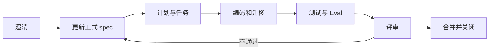

# Spec-Driven 工作流

## 何时需要专题文档

满足任一条件时，在 `docs/requirements/<feature>/` 建目录：新增 API、数据表、Agent 节点、状态机、跨三个以上模块、影响安全或兼容性。

## 三份产物

### clarify.md

记录目标、用户故事、范围、非目标、关键歧义、已确认决策和未决问题。

### plan.md

记录调用链、数据流、事务边界、错误与降级、影响文件、测试策略和回滚方式。

### tasks.md

拆成可验证的工作包，每项包含依赖、映射文档、验收命令和完成状态。

## 状态

专题任务只使用：

```text
proposed → approved → implementing → verified → closed
```

状态代表这次改动，不代表产品功能或数据库状态。

## 执行流程



正式契约必须回写到 `architecture/` 或 `model-design/`，不能只留在临时 plan 中。
