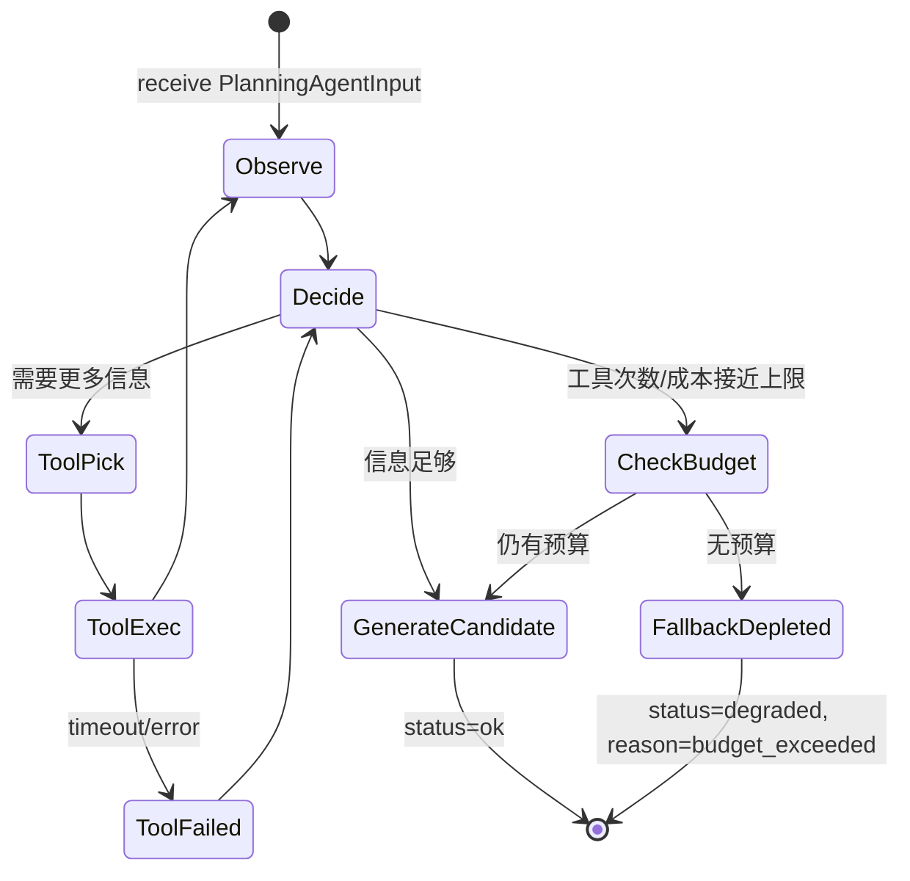

# career_planning_agent.spec.md — 核心规划 Agent

状态：本轮实现。

> **唯一真 Agent**（R-Agent1）。其余节点命名严禁 `<X>Agent`，本节点是例外。

## 0. 节点定位

| 维度 | 内容 |
|---|---|
| 中文名 | 求职规划 Agent |
| 类型 | **真 Agent**（自主选择 Tool + 循环） |
| 工作流位置 | 第 5 步（context_builder 之后） |
| 模型 | DeepSeek V4（ADR-005 主选） |
| 是否可写业务表 | ❌ 不直接写（candidate 输出，写入由 persist 节点） |
| 循环上限 | **2 轮**，单轮 ≤4 工具调用，总计 ≤8 次 |
| 超时 | 30s 总预算 |
| 成本上限 | 单次 ≤ ¥0.15（占 run ¥0.2 的主要部分） |

## 1. 输入 Schema

`app.schemas.agent.PlanningAgentInput`

| 字段 | 类型 | 必填 | 说明 |
|---|---|---|---|
| `run_id` | `str` | ✅ | run 全局 ID |
| `intent` | `Literal["create_plan","replan"]` | ✅ | 意图（query_plan 不走本节点） |
| `planning_context` | `PlanningContext` | ✅ | 来自 context_builder |
| `tool_specs` | `list[ToolSpec]` | ✅ | 已注册 Tool 白名单（见 §6） |
| `budget` | `AgentBudget` | ✅ | 见 §1.1 |

**§1.1 AgentBudget** 字段：

| 字段 | 类型 | 默认 | 约束 |
|---|---|---|---|
| `max_rounds` | `int` | `2` | `Field(ge=1, le=2)` |
| `max_tool_calls_per_round` | `int` | `4` | `Field(ge=1, le=4)` |
| `max_tool_calls_total` | `int` | `8` | `Field(ge=1, le=8)` |
| `max_cost_cny` | `float` | `0.15` | `Field(ge=0.01, le=0.5)` |
| `timeout_seconds` | `int` | `30` | `Field(ge=10, le=60)` |
| `tool_timeout_seconds` | `int` | `10` | `Field(ge=5, le=30)` |

## 2. 输出 Schema

`app.schemas.agent.PlanningAgentResult`

| 字段 | 类型 | 必填 | 约束 |
|---|---|---|---|
| `status` | `Literal["ok","degraded","failed"]` | ✅ | 3 值 |
| `candidate_plan` | `PlanCandidate \| null` | status=ok 时必填 | 见 PlanCandidate 部分定义 |
| `tool_calls_trace` | `list[ToolCallRecord]` | ✅ | 完整工具调用历史 |
| `rounds_used` | `Annotated[int, Field(ge=0, le=2)]` | ✅ | 实际使用轮数 |
| `tool_calls_used` | `Annotated[int, Field(ge=0, le=8)]` | ✅ | 实际调用次数 |
| `total_cost_cny` | `Annotated[float, Field(ge=0)]` | ✅ | 实际成本 |
| `fallback_reason` | `str \| null` | degraded/failed 时必填 | 见 §4 |
| `memory_candidates` | `list[MemoryCandidate]` | ❌ | Agent 提议的记忆候选（默认不写） |

**PlanCandidate 部分**：
| 子字段 | 类型 | 约束 |
|---|---|---|
| `today_tasks` | `list[TaskCandidate]` | `min_length=1, max_length=3` |
| `rationale` | `str` | `max_length=500` | Agent 必须给出计划依据 |
| `assumptions` | `list[str]` | `max_length=5` |

## 3. 不变量

| ID | 不变量 |
|---|---|
| INV-1 | `status == "ok"` → `candidate_plan` 必填 |
| INV-2 | `rounds_used <= max_rounds` |
| INV-3 | `tool_calls_used <= max_tool_calls_total` |
| INV-4 | `total_cost_cny <= max_cost_cny`（超预算触发 degraded） |
| INV-5 | 任一 tool_call 必须属于 `tool_specs` 白名单（防越权） |
| INV-6 | tool_call 选择只能来自 `[web_search, rag_retrieve, memory_lookup, context_summarize]`（4 个 MVP Tool） |
| INV-7 | 涉及写入意图的 tool_call → reject（R-IO2，由 harness 拦截） |
| INV-8 | `today_tasks` 每项必须含 `starter_action`（不可启动性维度 1） |

## 4. 错误边界

| 错误 | 触发 | 响应 | Trace |
|---|---|---|---|
| LLM 超时 | V4 超 5s/次或 30s 总计 | degraded + fallback_reason="llm_timeout" | 1 行 |
| LLM schema 不符 | structured output 验证失败 | 重试 ≤1 → degraded，fallback_reason="agent_schema_invalid" | 1 行 |
| 超轮（≥2 轮仍未收敛） | 信息仍不足 | degraded + fallback_reason="max_rounds_exhausted" | 1 行 |
| 超预算（>¥0.15） | budget checker 触发 | degraded + fallback_reason="budget_exceeded" | 1 行 |
| 危险 tool_call | harness 拦截 | 终止 + security alert + fallback_reason="unauthorized_tool_call" | 1 行 |
| 全部 fail | 多次重试失败 | 路由至 revise_or_fallback | — |

## 5. 状态机（Agent 主循环）



## 6. 依赖与副作用

| 依赖 | 对象 | 说明 |
|---|---|---|
| LLM Provider | `DeepSeekV4Provider` | 唯一，不允许混小模型 |
| LangGraph | StateGraph checkpointer | PostgreSQL backend（断点恢复 R-ADR-009） |
| Tools 白名单 | 4 Tool（web_search / rag_retrieve / memory_lookup / context_summarize） | R-IO1：只读 |
| Harness | `BudgetChecker`、`ToolWhitelistGuard`、`ToolTimeout`、`TraceWriter` | 6 类要件 |
| Prompt 模板 | `prompts/career_planning_agent/v1.py` | System & Task prompt；**critical** |
| DB | ❌ 不直接写 | R-IO2 |
| LangSmith | 可选：调试 Trace | feature flag |

## 7. Trace 字段

每次 Agent 运行写 1 行 agent_steps + 多行 tool_calls：

| 字段 | 示例 |
|---|---|
| `node_name` | `"career_planning_agent"` |
| `prompt_version` | `"career_planning_agent/v1"` |
| `model` | `"deepseek-chat"` |
| `status` | `"ok"`/`"degraded"` |
| `rounds_used` | `1` |
| `tool_calls_used` | `3` |
| `total_tokens_in/out` | `3820`/`1240` |
| `latency_ms` | `22340` |
| `cost_cny` | `0.0452` |
| `fallback_reason` | `null` |
| `candidate_task_count` | `3` |

**tool_calls 子表（多行）**：

| 字段 | 示例 |
|---|---|
| `tool_name` | `"web_search"` |
| `args_hash` | `"sha256:..."`（不存原文 args） |
| `result_token_count` | `620` |
| `latency_ms` | `2840` |
| `success` | `true` |

## 8. 参考实现顺序

1. `schemas/agent.py`：PlanningAgentInput + AgentBudget + PlanningAgentResult + PlanCandidate + TaskCandidate
2. `schemas/intent.py` 已有 MemoryCandidate（如无则加）
3. `schemas/agent.py` 加 ToolCallRecord
4. `providers/llm/mock.py`：happy（带 candidate）/ budget_exceeded / max_rounds / schema_invalid / timeout 5 模式
5. `prompts/career_planning_agent/v1.py`（基础版 system+task+tool 描述）
6. `tools/registry.py` ToolSpec + 白名单 guard
7. `agent/state/plan_state.py` PlanState（TypedDict）
8. `agent/nodes/career_planning_agent.py` 主循环 + harness 调用
9. `tests/agent/test_career_planning_agent.py` 5 case

## 9. Prompt 形状约束（spec-driven 编码时 AI 助手必读）

> **仅约束形状与位置**，不约束 prompt 内容。内容在 Stage 3 真实模型接入后迭代（见 [stage-delivery-definition.md §阶段 3](../../governance/stage-delivery-definition.md)）。
> 本节是 [prompt-versioning-standard.md](../../standards/prompts/prompt-versioning-standard.md) 的位置/结构/起步集补充；版本号铁律仍以该标准为准。

### 9.1 文件位置约定（按 goal_type 分目录）

按 [PRD §3.3 通用化扩展性设计](../../overview/product-overview.md) 的 6 个 `goal_type` 分目录：

```text
backend/app/prompts/
├── _shared/                        跨 goal_type 共享常量
│   ├── system_base.py              角色设定 + 安全边界 + 输出格式（SYSTEM 段公用）
│   ├── few_shot_examples.py        5 维质量评分的 8 个对比样例（good vs bad）
│   └── tool_descriptions.py        4 Tool 的描述文本（注入 SYSTEM 段）
├── ai_backend/                     ← MVP 起步集（Stage 3 写 v1）
│   ├── diagnose_v1.py
│   └── plan_v1.py
├── agent_app/                      ← Stage 4+ 复制 ai_backend 改 ≤20%
├── backend_java/                   ← Stage 4+
├── data_engineer/                  ← Stage 4+
├── fullstack/                      ← Stage 4+
└── other/                          ← goal_type=other 通用兜底（PRD §3.3 day-1 建好）
```

### 9.2 单个 `*_vN.py` 文件四段结构（铁律）

所有 `diagnose_v*.py` / `plan_v*.py` 文件必须导出以下 4 个模块级常量字符串：

```python
# prompts/ai_backend/plan_v1.py
SYSTEM = "..."           # 角色设定、能力边界、安全约束、工具列表
                         # 必须注入 _shared/system_base.py + _shared/tool_descriptions.py
TASK_TEMPLATE = "..."    # 业务任务模板（diagnose 或 plan；含 {placeholders}）
CONSTRAINTS = "..."      # today_tasks 必含 starter_action、禁模糊动词、单任务时长上限...
OUTPUT_FORMAT = "..."    # JSON schema（与 PlanningAgentResult.PlanCandidate Pydantic 对齐）
```

**禁止**：把 prompt 写成单字符串拼接、跨段常量、运行时动态组合。所有四段必须静态可读，便于 Replay diff。

### 9.3 版本号铁律（与 [prompt-versioning-standard.md](../../standards/prompts/prompt-versioning-standard.md) 对齐）

- 第一次写 = `*_v1.py`
- 任何修改 → 新建 `*_v2.py`，旧版保留（不编辑、不删除）
- 禁止编辑已存在的 `vN` 文件
- agent_steps 表的 `prompt_version` 字段写入 `"<goal_type>/<task>/v<N>"`（例 `"ai_backend/plan/v1"`）
- Replay 跑历史 run 时按 `prompt_version` 锁定输入快照，比对 v1 vs v2 输出差异

### 9.4 MVP 起步集（Stage 3 边界）

| 项 | MVP 是否写 | 起步策略 |
|---|---|---|
| `prompts/_shared/system_base.py` | ✅ 写 | 第一份公用常量 |
| `prompts/_shared/few_shot_examples.py` | ✅ 写 | 8 个对比样例（good/bad）转写自 [PRD §7 5 维质量评分](../../overview/product-overview.md) |
| `prompts/_shared/tool_descriptions.py` | ✅ 写 | 4 Tool 描述 |
| `prompts/ai_backend/plan_v1.py` | ✅ 写 | 第一份业务 prompt（首发场景） |
| `prompts/ai_backend/diagnose_v1.py` | ✅ 写 | 第二份（建档阶段用） |
| `prompts/{其它 5 个 goal_type}/*_v1.py` | ❌ 不写 | Stage 4+ 复制 ai_backend 改 ≤20%，不预先写 |
| `prompts/other/*_v1.py` | ✅ 写 | 通用兜底（PRD §3.3 "未支持场景的产品行为"要求 day-1 有兜底模板） |

### 9.5 与 [harness/eval-system.md](../harness/eval-system.md) 的关系（V 层闭环）

- Eval dataset（30 case）必须覆盖每个 goal_type 至少 1 个 case
- Bad Case 回流时，若判断是 prompt 问题 → 触发 `vN+1`，新建版本（不允许原地改）
- Replay 跑 v1 vs v2 时，6 grader 维度的 diff 必须留档

### 9.6 文档约束（写 prompt 前必读）

- prompt **内容** 不入 spec 仓库（属于代码迭代物，归 `backend/app/prompts/`）
- prompt **形状 / 位置 / 版本规则** 由本 §10 约束
- §10.2 四段结构若需结构性修改（如改为 5 段、新增段）→ 必走 [spec-driven-workflow.md](../../governance/spec-driven-workflow.md)，记 ADR
- prompt 内容审阅走 [prompt-review-checklist.md](../../standards/prompts/prompt-review-checklist.md)

---

## 10. 引用

- [ADR-002](../../architecture/adr.md) 单 Agent 范式
- [ADR-005](../../architecture/adr.md) V4 主选
- [ADR-009](../../architecture/adr.md) LangGraph 编排 + Checkpointer
- [TDD §4.1](../../architecture/tdd.md) Agent 定义
- [TDD §6 Tool 系统](../../architecture/tdd.md)
- [TDD §7 上下文工程](../../architecture/tdd.md)
- [TDD §12 Harness 五层](../../architecture/tdd.md)
- [security-and-compliance.md §4 Prompt 注入防护](../../standards/security-and-compliance.md)
