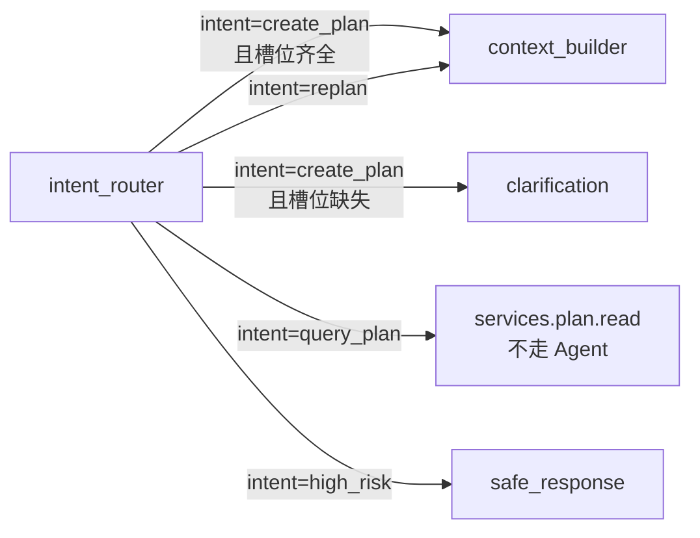

# intent_router.spec.md — 意图分类节点

状态：本轮实现。

> 模板范例：本文件用于验证 [spec-writing-guide.md 七要素](../../standards/spec-writing-guide.md)。写完做模板评估（见末尾"模板评估检查表"），通过后再批量铺其余 10 个节点 spec。

## 0. 节点定位

| 维度 | 内容 |
|---|---|
| 中文名 | 意图分类节点 |
| 类型 | LLM 单次分类节点（**不是 Agent**） |
| 在工作流位置 | LangGraph 第 2 步（risk_gate 之后） |
| 输入来源 | 用户原始请求 + 用户画像摘要 |
| 输出去向 | 路由到 4 个下游分支（clarification / context_builder / query_plan service / safe_response） |
| 模型 | DeepSeek 小模型（ADR-005 §分层调用策略） |
| 是否调 Tool | ❌ 不调 Tool（纯结构化输出） |
| 是否可写业务表 | ❌ 不写（R-IO2） |
| 循环上限 | 0 次（单次 LLM 调用） |
| 超时 | 10s（harness 强制） |

## 1. 输入 Schema

引用 Pydantic：`app.schemas.intent.IntentRequest`

| 字段 | 类型 | 必填 | 约束 | 说明 |
|---|---|---|---|---|
| `user_id` | `str` | ✅ | UUIDv4 字符串 | 用户全局唯一 ID |
| `message` | `str` | ✅ | `min_length=1, max_length=2000` | 用户原始消息 |
| `goal_type` | `GoalType \| null` | ❌ | 枚举 6 值 | 当前用户目标类型（如已有则传） |
| `session_id` | `str` | ✅ | UUIDv4 | 会话 ID（Trace 用） |
| `recent_intents` | `list[Literal["create_plan","replan","query_plan","high_risk"]]` | ❌ | `max_length=3` | 近 3 轮意图（防止抖动） |

**示例输入**：
```json
{
  "user_id": "u-7c3e2f1a",
  "message": "帮我制定 5 周后的 Agent 秋招计划",
  "goal_type": "agent_app",
  "session_id": "s-9f4b",
  "recent_intents": ["query_plan", "create_plan"]
}
```

## 2. 输出 Schema

引用 Pydantic：`app.schemas.intent.IntentResult`

| 字段 | 类型 | 必填 | 约束 | 说明 |
|---|---|---|---|---|
| `intent` | `Literal["create_plan","replan","query_plan","high_risk"]` | ✅ | 4 值封闭枚举 | 路由标签 |
| `confidence` | `Annotated[float, Field(ge=0.0, le=1.0)]` | ✅ | 0.0-1.0 | LLM 置信度 |
| `risk_level` | `Literal["none","low","high"]` | ❌ | 默认 `"none"` | 由 risk_gate 优先标；本节点可降级覆盖 |
| `missing_slots` | `Annotated[list[str], Field(max_length=3)]` | ✅ | 0-3 个槽位名 | 仅 create_plan 时可非空 |
| `needs_clarification` | `bool` | ✅ | True/False | True 时路由到 clarification 节点 |
| `rationale` | `str` | ❌ | `max_length=200` | LLM 必须给出判定理由（审计必备） |

**示例输出**：
```json
{
  "intent": "create_plan",
  "confidence": 0.85,
  "risk_level": "none",
  "missing_slots": [],
  "needs_clarification": false,
  "rationale": "用户明确要求制定计划且 goal_type 已知，无槽位缺失"
}
```

## 3. 不变量（Pydantic + 模型验证器）

所有不变量用 `@model_validator(mode="after")` 编码到 `IntentResult`：

| ID | 不变量 | 违反响应 |
|---|---|---|
| INV-1 | `intent == "high_risk"` 时 **必须** `risk_level == "high"` | `ValidationError` |
| INV-2 | `intent != "create_plan"` 时 **必须** `missing_slots == []` | `ValidationError` |
| INV-3 | `needs_clarification == True` 时 **必须** `len(missing_slots) > 0` | `ValidationError` |
| INV-4 | `needs_clarification == False` 时 **必须** `missing_slots == []` | `ValidationError` |
| INV-5 | `confidence >= 0.65` 时 **必须** `needs_clarification == False`（初值待 spike） | `ValidationError` |

## 4. 错误边界

| 错误类型 | 触发条件 | 节点响应 | HTTP 影响 | Trace 记录 |
|---|---|---|---|---|
| `ValidationError` (schema 不符) | LLM 返回缺字段 / extra 字段 / 数值超界 | 重试 1 次 → 仍失败 → 降级 `query_plan` | 200 OK 但带 `degraded` 标记 | `fallback_reason="intent_schema_invalid"` |
| `asyncio.TimeoutError` | DeepSeek 超过 10s | 降级为 `query_plan`（DB 读最近计划） | 200 OK + degraded | `fallback_reason="llm_timeout"` |
| `LLMBlockedError` | Guardrail 拦截 | 转交 `safe_response` 节点 | 200 OK + safe_response | `fallback_reason="llm_blocked"` |
| `confidence < 0.65` | 边界情形 | 路由 `clarification`，不生成长响应 | 200 OK + clarification | `fallback_reason=null` |

## 5. 状态机

节点本身无内部状态机，但 `IntentResult.intent` 触发 **4 路下游分支**：



## 6. 依赖与副作用

| 依赖类型 | 对象 | 用途 | 写权限 |
|---|---|---|---|
| LLM Provider | `DeepSeekSmallModelProvider` (Protocol) | 单次 structured output 调用，模式 happy/schema_invalid/timeout | 无 |
| 读 DB | `repositories.user.get_by_id` (可选) | 当 `goal_type` 缺失时读用户最近目标 | 无 |
| 写 DB | ❌ 不直接写业务表 | — | 无 |
| Trace 写入 | `harness.Trace.write_step` | 节点执行后写 1 行 agent_steps | 仅 Trace 表 |

**Prompt 模板版本**：`prompts/intent_router/v1.py`（修改 Prompt 必须新增版本号 R-Prompt2，旧版保留供 Replay）。

## 7. Trace 字段

每次调用写一行到 `agent_steps` 表：

| 字段 | 类型 | 示例值 | 说明 |
|---|---|---|---|
| `run_id` | `str` | `"r-2a8f"` | plan_run 全局 ID |
| `session_id` | `str` | `"s-9f4b"` | 会话 ID |
| `user_id` | `str` | `"u-7c3e"` | 用户 ID（脱敏 hash） |
| `node_name` | `str` | `"intent_router"` | 固定值 |
| `prompt_version` | `str` | `"intent_router/v1"` | 引用 Prompt 版本（R-Prompt1） |
| `model` | `str` | `"deepseek-chat"` | 实际调用模型 |
| `tokens_in` | `int` | `430` | 输入 token |
| `tokens_out` | `int` | `62` | 输出 token |
| `latency_ms` | `int` | `1180` | 节点总耗时（含 LLM） |
| `llm_latency_ms` | `int` | `1140` | LLM 调用耗时 |
| `cost_cny` | `float` | `0.0021` | 节点单次成本（token × 单价） |
| `intent` | `str` | `"create_plan"` | 输出意图分类（短 hash 可） |
| `confidence` | `float` | `0.85` | 置信度 |
| `mock_mode` | `str \| null` | `null` | 仅测试时填 "happy"/"invalid"/"timeout" |
| `fallback_reason` | `str \| null` | `null` | 降级时填错误代号；正常 null |
| `success` | `bool` | `true` | false 表示本次未产生有效 IntentResult |
| `error_class` | `str \| null` | `null` | 失败时填 Python 异常类名 |

> ⚠️ **不写**完整 prompt 内容、API Key、用户敏感原文。完整 prompt 文本写到独立 trace_artifacts 表（可选，加密），agent_steps 只存摘要 + prompt_version。

## 8. 参考实现顺序

供 AI 编码顺序（对应 tasks `[ ]`）：

1. `schemas/intent.py` — 写 `IntentRequest` + `IntentResult`（含 5 个 INV-* validator）
2. `tests/schemas/test_intent.py` — 反例测试 ≥5 条（每个 INV-* 至少 1 条 + extra forbidden + 越界）
3. `providers/llm/mock.py` — 加 `mock_mode="invalid"` + `"timeout"` 两个分支
4. `prompts/intent_router/v1.py` — System/Task prompt（基础版）
5. `agent/nodes/intent_router.py` — 节点 async 函数（调 Provider + 重试 1 次 + 降级）
6. `tests/agent/test_intent_router.py` — happy/schema_invalid/timeout/clarification 4 case

## 9. 模板评估检查表（节点 spec 范例用）

写完本文件后必须做的模板评估，通过后再批量铺其余 10 个节点 spec：

| 评估项 | 通过条件 | ✅/❌ |
|---|---|---|
| 七要素齐全 | 第 1-7 节都有 | _评审填_ |
| Pydantic 类可直接照抄 | 第 1+2 节字段表能 1:1 翻译 Pydantic | _评审填_ |
| 反例可翻译成 pytest | 第 3 节 INV-* 和第 4 节错误边界能直接写测试 | _评审填_ |
| Trace 字段够用 | 第 7 节能支撑 Replay 重跑 | _评审填_ |
| 不依赖 AI"脑补" | 第 6+8 节描述自动化程度到文件级 | _评审填_ |

## 10. 与各文档的引用关系

- [ADR-005](../../architecture/adr.md#adr-005) LLM 分层调用 → 本节点用小模型
- [ADR-002](../../architecture/adr.md#adr-002) 单 Agent 立场 → 本节点是 node 不是 Agent
- [TDD §5](../../architecture/tdd.md) 意图识别与路由（设计依据）
- [TDD §4.3](../../architecture/tdd.md) 节点表第 2 行
- [python-coding-standards.md §3](../../standards/python-coding-standards.md) Pydantic 进阶写法
- [security-and-compliance.md §13](../../architecture/tdd.md) 风险分流路径（high_risk 路由）
