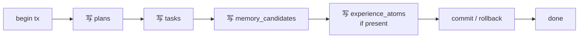

# persist.spec.md — 持久化节点

状态：本轮实现。

## 0. 节点定位

| 维度 | 内容 |
|---|---|
| 中文名 | 持久化节点 |
| 类型 | 事务节点（不调 LLM） |
| 工作流位置 | 第 11 步（最后，校验通过后） |
| 责任 | 受控写入业务表 + 长期记忆候选池 |
| 写权限 | ✅ 通过 Service 事务写（唯一可写持久化的节点） |

## 1. 输入 Schema

`app.schemas.persist.PersistInput`

| 字段 | 类型 | 必填 |
|---|---|---|
| `run_id` | `str` | ✅ |
| `user_id` | `str` | ✅ |
| `validated_bundle` | `ValidatedBundle` | ✅ |
| `memory_candidates` | `list[MemoryCandidate]` | ❌ |
| `experience_atoms` | `list[EvidenceAtom]` | ❌ |

`ValidatedBundle`：通过校验的最终计划 + 任务 + companion_message + 校验报告。

## 2. 输出 Schema

`app.schemas.persist.PersistResult`

| 字段 | 类型 | 必填 |
|---|---|---|
| `plan_id` | `str \| null` | 校验全 pass 时必填 |
| `task_ids` | `list[str]` | 同上 |
| `memory_candidate_ids` | `list[str]` | ✅ |
| `transaction_status` | `Literal["committed","rolled_back"]` | ✅ |

## 3. 不变量

| ID | 不变量 |
|---|---|
| INV-1 | 任一写入失败 → transaction_status="rolled_back"（单次 plan_run 一个事务） |
| INV-2 | 校验未 pass 不得写入 plans/tasks 表 |
| INV-3 | 敏感记忆（sensitivity=sensitive）必须先入候选池，**不得**直接激活 |
| INV-4 | 用户未确认的记忆候选池 7 天后清理（[ADR-006](../../architecture/adr.md)） |

## 4. 错误边界

| 错误 | 处理 |
|---|---|
| 事务死锁 | 重试 1 次 → 仍失败 → rolled_back + run 状态 fail |
| 唯一约束冲突（task_id 已存在） | rollback + trace alert |
| 部分写入被外键约束拒 | 全回滚 |

## 5. 状态机（事务级）

## 6. 依赖

| 依赖 | 用途 |
|---|---|
| Repository | `repositories.plan.insert_plan`、`repositories.task.insert_tasks`、`repositories.memory.insert_candidates`、`repositories.evidence.insert_atoms` |
| Service | `services.persist.persist_plan_run`（事务边界包裹） |
| 锁 | 乐观锁 `plan.version` 字段 |

## 7. Trace 字段

| 字段 | 示例 |
|---|---|
| `node_name` | `"persist"` |
| `transaction_status` | `"committed"` |
| `plan_id` | `"p-9e2a"` |
| `task_count` | `3` |
| `memory_candidate_count` | `2` |
| `tx_duration_ms` | `320` |

## 8. 实现顺序

1. `schemas/persist.py` PersistInput + PersistResult + ValidatedBundle
2. `repositories/plan.py` Repository Protocol + 实现
3. `repositories/task.py`、`repositories/memory.py`、`repositories/evidence.py`
4. `services/persist.py` 事务编排
5. `agent/nodes/persist.py`
6. `tests/repositories/test_plan.py`（testcontainers postgres）+ `tests/repositories/test_persist_e2e.py`

## 9. 引用

- [ADR-006](../../architecture/adr.md) 记忆系统分层
- [ADR-004](../../architecture/adr.md) 数据事务边界
- [security-and-compliance.md §3 敏感记忆](../../standards/security-and-compliance.md)
