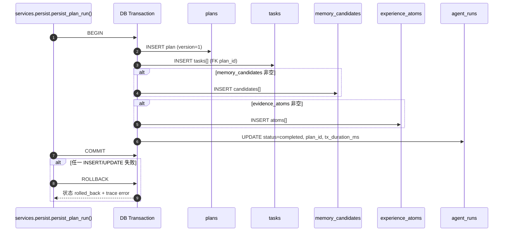
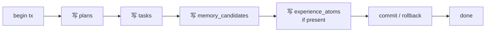

# persist.spec.md — 持久化节点

| 版本 | v1.1 |
|---|---|
| 日期 | 2026-07-24 |
| 状态 | 本轮实现 |
| v1.0 → v1.1 | 新增 §3 副作用清单：把原散落在 §1/§2/§5/§6 的写入动作聚合为施工快查表（按 SDD "AI 可 1:1 翻译"标准）|

## 0. 节点定位

| 维度 | 内容 |
|---|---|
| 中文名 | 持久化节点 |
| 类型 | 事务节点（不调 LLM） |
| 工作流位置 | 第 11 步（最后，校验通过后） |
| 责任 | 受控写入业务表 + 长期记忆候选池 |
| 写权限 | ✅ 通过 Service 事务写（唯一可写持久化的节点） |

## 1. 输入 Schema

`app.schemas.persist.PersistInput`

| 字段 | 类型 | 必填 |
|---|---|---|
| `run_id` | `str` | ✅ |
| `user_id` | `str` | ✅ |
| `validated_bundle` | `ValidatedBundle` | ✅ |
| `memory_candidates` | `list[MemoryCandidate]` | ❌ |
| `experience_atoms` | `list[EvidenceAtom]` | ❌ |

`ValidatedBundle`：通过校验的最终计划 + 任务 + companion_message + 校验报告。

## 2. 输出 Schema

`app.schemas.persist.PersistResult`

| 字段 | 类型 | 必填 |
|---|---|---|
| `plan_id` | `str \| null` | 校验全 pass 时必填 |
| `task_ids` | `list[str]` | 同上 |
| `memory_candidate_ids` | `list[str]` | ✅ |
| `transaction_status` | `Literal["committed","rolled_back"]` | ✅ |

## 3. 不变量

| ID | 不变量 |
|---|---|
| INV-1 | 任一写入失败 → transaction_status="rolled_back"（单次 plan_run 一个事务） |
| INV-2 | 校验未 pass 不得写入 plans/tasks 表 |
| INV-3 | 敏感记忆（sensitivity=sensitive）必须先入候选池，**不得**直接激活 |
| INV-4 | 用户未确认的记忆候选池 7 天后清理（[ADR-006](../../architecture/adr.md)） |

## 3a. 副作用清单（施工快查表）

> 本节聚合 §1/§2/§5/§6 中散落的写动作，让 AI 写 `repositories/persist.py` 时不用跨节推断"写哪几张表、什么顺序、什么条件"。**所有写入在同一事务内**（INV-1），任一失败全回滚。

### 表写入顺序（按依赖排）

| # | 操作 | 表 | Repository 方法 | 触发条件 | 失败行为 |
|---|---|---|---|---|---|
| 1 | `INSERT` | `plans` | `repositories.plan.insert_plan()` | 规则校验 + 5 维评分**全 pass** | rollback + `transaction_status=rolled_back` |
| 2 | `INSERT` 多行 | `tasks` | `repositories.task.insert_tasks()` | 同 #1（每个 task FK→ #1 写出的 plan_id） | rollback |
| 3 | `INSERT` 多行 | `memory_candidates` | `repositories.memory.insert_candidates()` | `validated_bundle.memory_candidates` 非空 | rollback |
| 4 | `INSERT` 多行 | `experience_atoms` | `repositories.evidence.insert_atoms()` | `validated_bundle.evidence_atoms` 非空 | rollback |
| 5 | `UPDATE` | `agent_runs` | `repositories.agent_run.update_status()` | 事务 commit 前最后写：`status=completed` + `plan_id` + `tx_duration_ms` | rollback |
| 6 | `UPDATE`（trace） | `agent_steps` / `tool_calls` | `repositories.agent_run.write_step()` | 由 `@with_harness` 装饰器记录 persist 节点自身的 step（已写 trace 表，与业务表分库事务隔离） | 单独事务，不影响业务 commit |

### transaction boundary

### 关键约束（对应不变量）

| 约束 | 落地方式 |
|---|---|
| INV-1 单事务 | `services.persist.persist_plan_run` 用 `async with session.begin()` 包整段 |
| INV-2 校验未 pass 不写 plans/tasks | persist 节点入口检查 `validated_bundle.validation_report.all_pass`——不通过直接返回 `transaction_status=skipped`（不写） |
| INV-3 敏感记忆不直接激活 | `repositories.memory.insert_candidates` 只写 `status=pending`；敏感候选由 companion_response 节点后续用 MemoryReview API 让用户确认 |
| INV-4 候选 7 天过期 | 后台 job（`scripts/cleanup_memory_candidates.py`，Stage 5 落地）独立清理；不在本节点处理 |

### 不在 persist 节点写的事

明确列出"看似相关但不应在本节点写入"——防止 AI 写代码时顺手加无关副作用：

| 不写 | 理由 |
|---|---|
| `agent_runs` 创建（status=running） | 由 `AgentRunService.invoke()` 在 plan_run 开始时写（见 `intent_router.spec.md` 流程图） |
| `agent_steps` 各节点 trace | 由 `@with_harness` 装饰器在每个节点入口写，不经 persist 节点 |
| `tool_calls` 子表 | 由 Tool 执行后由 `tools/middleware.py` 立即写（不入业务事务） |
| `replay_runs` / `eval_*` 表 | 离线 harness 反馈层写入，绝不进 plan_run 同步路径（见 [`harness/implementation-structure.md` §5 evals-isolation](../harness/implementation-structure.md)） |
| `reviews` 表 | 用户**事后**对 plan 的反馈 API 写（见 [`api-spec/reviews.md`](../api-spec/reviews.md)），不在 plan_run 内 |
| `search_sources` 表 | web_search tool 执行时自己写（不入业务事务）|
| `experience_atoms` 自动蒸馏 | distill_evidence 节点产生 → persist 受控写；**但不允许 persist 自己调用 LLM 蒸馏**（persist 是纯事务节点，不调 LLM）|

---

## 4. 错误边界

| 错误 | 处理 |
|---|---|
| 事务死锁 | 重试 1 次 → 仍失败 → rolled_back + run 状态 fail |
| 唯一约束冲突（task_id 已存在） | rollback + trace alert |
| 部分写入被外键约束拒 | 全回滚 |

## 5. 状态机（事务级）

## 6. 依赖

| 依赖 | 用途 |
|---|---|
| Repository | `repositories.plan.insert_plan`、`repositories.task.insert_tasks`、`repositories.memory.insert_candidates`、`repositories.evidence.insert_atoms` |
| Service | `services.persist.persist_plan_run`（事务边界包裹） |
| 锁 | 乐观锁 `plan.version` 字段 |

## 7. Trace 字段

| 字段 | 示例 |
|---|---|
| `node_name` | `"persist"` |
| `transaction_status` | `"committed"` |
| `plan_id` | `"p-9e2a"` |
| `task_count` | `3` |
| `memory_candidate_count` | `2` |
| `tx_duration_ms` | `320` |

## 8. 实现顺序

1. `schemas/persist.py` PersistInput + PersistResult + ValidatedBundle
2. `repositories/plan.py` Repository Protocol + 实现
3. `repositories/task.py`、`repositories/memory.py`、`repositories/evidence.py`
4. `services/persist.py` 事务编排
5. `agent/nodes/persist.py`
6. `tests/repositories/test_plan.py`（testcontainers postgres）+ `tests/repositories/test_persist_e2e.py`

## 9. 引用

- [ADR-006](../../architecture/adr.md) 记忆系统分层
- [ADR-004](../../architecture/adr.md) 数据事务边界
- [security-and-compliance.md §3 敏感记忆](../../standards/security-and-compliance.md)
