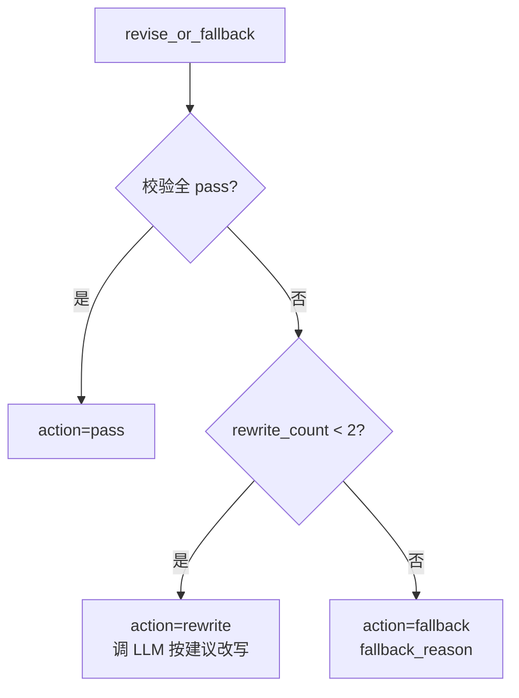

# revise_or_fallback.spec.md — 改写/降级路由节点

状态：本轮实现。

## 0. 节点定位

| 维度 | 内容 |
|---|---|
| 中文名 | 改写/降级路由节点 |
| 类型 | 路由节点（程序判定 + 必要时调 LLM 改写） |
| 工作流位置 | 第 9 步（校验后） |
| 责任 | 控制重写 ≤2 次；超过则降级 |

## 1. 输入 Schema

`app.schemas.validation.ReviseRequest`

| 字段 | 类型 | 必填 |
|---|---|---|
| `candidate` | `PlanCandidate` | ✅ |
| `validation_report` | `ValidationReport` | ✅ |
| `review_result` | `ReviewResult \| null` | ❌ |
| `rewrite_count` | `Annotated[int, Field(ge=0, le=2)]` | ✅ |

## 2. 输出 Schema

`app.schemas.validation.ReviseDecision`

| 字段 | 类型 | 必填 |
|---|---|---|
| `action` | `Literal["rewrite","pass","fallback"]` | ✅ |
| `revised_candidate` | `PlanCandidate \| null` | action="rewrite" 时必填 |
| `fallback_reason` | `str \| null` | action="fallback" 时必填 |

## 3. 路由判定

## 4. 不变量

| ID | 不变量 |
|---|---|
| INV-1 | rewrite_count 达 2 后，下一次必然 action=fallback |
| INV-2 | 校验全 pass → action=pass（即使 rewrite_count=0） |

## 5. 错误边界

| 错误 | 处理 |
|---|---|
| 改写调 LLM 超时 | 退化为 fallback |
| 改写后校验仍 fail | rewrite_count++，回 career_planning_agent 重生成 OR 直接 fallback |

## 6. 依赖

| 依赖 | 用途 |
|---|---|
| LLM Provider (Small) | 改写时调 1 次 |
| Prompt | `prompts/revise/v1.py` |
| LangGraph 状态机 | 触发回边到 agent / persist |

## 7. Trace 字段

| 字段 | 示例 |
|---|---|
| `node_name` | `"revise_or_fallback"` |
| `action` | `"rewrite"` |
| `rewrite_count_after` | `1` |
| `fallback_reason` | `null` |
| `latency_ms` | `1820` |

## 8. 实现顺序

1. `schemas/validation.py` 加 ReviseDecision
2. `prompts/revise/v1.py`
3. `agent/nodes/revise_or_fallback.py`
4. `tests/agent/test_revise_or_fallback.py` 3 case

## 9. 引用

- [TDD §8 五维质量评分](../../architecture/tdd.md)
- [PRD §7](../../overview/product-overview.md) 降级路径
