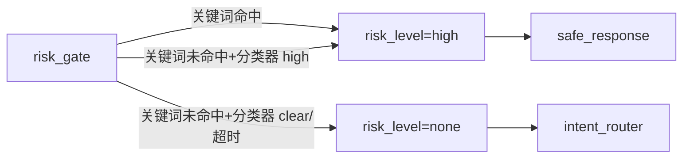

# risk_gate.spec.md — 风险分流节点

状态：本轮实现。

## 0. 节点定位

| 维度 | 内容 |
|---|---|
| 中文名 | 风险分流节点 |
| 类型 | 规则节点（**不是 Agent**） |
| 工作流位置 | LangGraph 第 1 步（intent_router 之前） |
| 来源 | 用户原始请求 + 用户画像 |
| 输出去向 | `risk_level=high` → safe_response；else → intent_router |
| 是否调 LLM | ⚠️ 双重：关键词词表（同步）+ LLM 分类器（异步补足） |
| 是否可写业务表 | ❌ 不写 |

## 1. 输入 Schema

`app.schemas.risk.RiskRequest`

| 字段 | 类型 | 必填 | 约束 | 说明 |
|---|---|---|---|---|
| `user_id` | `str` | ✅ | UUIDv4 | 用户 ID |
| `message` | `str` | ✅ | `max_length=2000` | 用户原始消息 |
| `profile_summary` | `str \| null` | ❌ | `max_length=500` | 用户画像摘要（最近目标/情绪/敏感字段） |

## 2. 输出 Schema

`app.schemas.risk.RiskAssessment`

| 字段 | 类型 | 必填 | 约束 |
|---|---|---|---|
| `risk_level` | `Literal["none","low","high"]` | ✅ | 3 值封闭 |
| `matched_keywords` | `list[str]` | ✅ | `max_length=5`；命中词脱敏输出（如 `***医***`） |
| `classifier_result` | `Literal["clear","suspicious","high"] \| null` | ❌ | LLM 分类器输出（异步） |
| `assessment_method` | `Literal["keyword_only","classifier_only","both"]` | ✅ | DB 记录用 |

## 3. 不变量

| ID | 不变量 | Pydantic |
|---|---|---|
| INV-1 | 命中"心理危机/医疗/法律/金融/自伤"任一关键词 → risk_level="high" | validator |
| INV-2 | risk_level="high" → matched_keywords 非空 OR classifier_result="high" | validator |
| INV-3 | classifier_result="high" → risk_level="high"（分类器覆盖关键词决策） | validator |
| INV-4 | matched_keywords 字段值必须脱敏（不得存原文） | self-check |

## 4. 错误边界

| 错误 | 触发 | 处理 |
|---|---|---|
| 关键词词表加载失败 | 配置错误 | 节点 fail；不进入工作流，触发运维告警 |
| LLM 分类器超时 (>5s) | DeepSeek 异常 | 仅用关键词词表（`assessment_method="keyword_only"`） | 
| LLM 分类器返回非 schema | API 异常 | 同上降级 + trace 记 `fallback_reason="risk_classifier_failure"` |

## 5. 状态机（gate 分析）

## 6. 依赖与副作用

| 依赖 | 对象 | 用途 |
|---|---|---|
| 配置 | `core/keywords/risk_keywords.py` | 关键词词表（Feature Flag 控制） |
| LLM Provider | `DeepSeekSmallModelProvider` | 异步分类（**不写原文到 prompt**，预脱敏处理） |
| Prompt 模板 | `prompts/risk_gate/v1.py` |
| 读 DB | 无 |
| 写 DB | 仅 Trace 表 agent_steps 一行；**不写普通长期记忆**（R-IO2 + 安全策略） |

## 7. Trace 字段

| 字段 | 类型 | 示例 |
|---|---|---|
| `run_id/session_id/user_id` | `str` | （同通用） |
| `node_name` | `str` | `"risk_gate"` |
| `risk_level` | `str` | `"high"` |
| `matched_keywords` | `list[str]` | `["***自杀***"]` |
| `assessment_method` | `str` | `"both"` |
| `latency_ms`/`llm_latency_ms` | `int` | `60`/`180` |
| `cost_cny` | `float` | `0.0008` |
| `fallback_reason` | `str \| null` | `null` |
| `success` | `bool` | `true` |

> ⚠️ 关键词原文不入 Trace，只入脱敏后的词表 ID。

## 8. 参考实现顺序

1. `schemas/risk.py`（含 4 INV-* + 脱敏字段序列化）
2. `core/keywords/risk_keywords.py`（关键词词表）
3. `prompts/risk_gate/v1.py`
4. `agent/nodes/risk_gate.py`（同步关键词 + 异步分类器 + 超时降级）
5. `tests/agent/test_risk_gate.py`（happy/high/llm_timeout/keyword_miss 4 case）

## 9. 与各文档引用

- [TDD §13.1](../../architecture/tdd.md) 风险分流路径（架构层）
- [security-and-compliance.md §1](../../standards/security-and-compliance.md) 高风险识别双重机制
