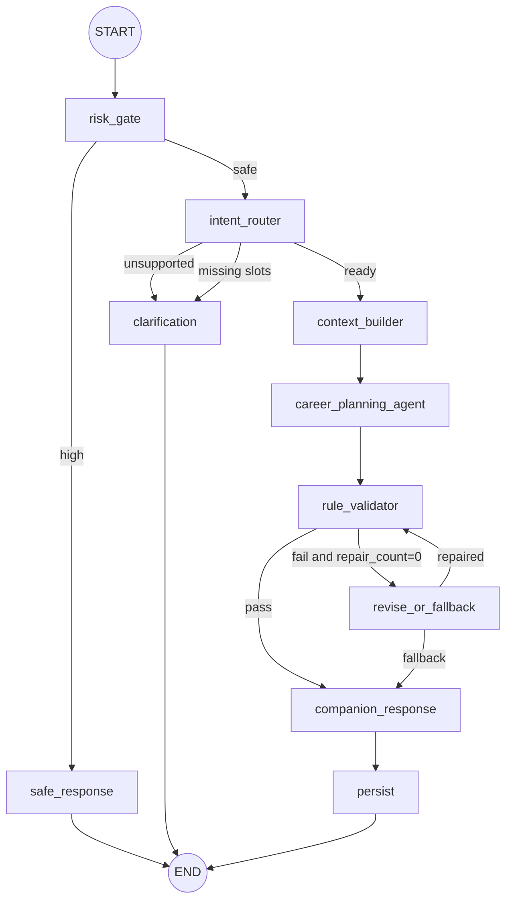

# Agent Runtime 施工规范

面向用户的计划请求在进入本执行链前，必须先通过持久化 Goal Brief 确认门，详见
[`Goal Brief 目标澄清与确认设计`](../goal-brief-confirmation.md)。LLM 可以做结构化抽取，
但充分性判定和确认权由确定性业务规则与用户操作控制。

本文件是 `Agent Run` 执行链的权威施工说明，用来补齐“节点列表有了，但运行时如何真正落地”的部分。节点的业务细节仍以 [`agent-nodes`](../agent-nodes/README.md) 为准。

## 1. 设计结论

- MVP 只有一个具备自主 Tool Calling 能力的 `CareerPlanningAgent`；
- `risk_gate`、`intent_router`、`rule_validator`、`persist` 等均为受控节点，不包装成独立 Agent；
- Agent 只生成候选结果，不直接写业务表；
- 所有模型、Tool、节点执行均受统一预算、超时、取消、Trace 和事件约束；
- `create_plan` 与 `replan` 进入生成 Graph；查询现有计划使用 REST API，不通过 Agent Run；
- Stage 2 使用 Mock Provider 跑通完整纵切，Stage 3 接真实模型，Stage 4 才开放检索 Tool；
- Graph State 只保存可序列化 DTO，不保存 ORM Session、数据库实体、Provider Client 或协程对象。

## 2. 运行时组件

```text
AgentRunService
  ├─ 创建 Run、幂等、用户活动 Run 校验
  └─ 提交 run_id 给 AgentRunExecutor

AgentRunExecutor
  ├─ 加载权威 Run 与配置快照
  ├─ 创建 CancellationToken 与 Deadline
  ├─ 调用 GraphFactory
  └─ 把所有 Graph Outcome 交给 AgentRunFinalizer

AgentRunFinalizer
  ├─ finalize_plan：在一个事务中调用 PlanPersistenceService 并收敛 Run
  ├─ finalize_degraded/failed/cancelled：写其他终态
  ├─ 负责 terminal event 唯一且最后
  └─ 使用 Run 行锁 + 条件更新避免覆盖既有终态

GraphFactory
  └─ 按 feature flags 构建固定 LangGraph 拓扑

NodeRunner
  ├─ 写 agent_steps
  ├─ 发 node.started/node.completed
  ├─ 检查预算、取消与 deadline
  └─ 把异常转换为统一 AgentError

CareerPlanningAgentRunner
  ├─ 调用 LLMProvider
  ├─ 解析 Tool Call 或 PlanCandidate
  ├─ 调用 ToolRegistry
  └─ 控制 Tool 轮次和模型调用次数

ToolRegistry
  ├─ 白名单与 Pydantic 参数校验
  ├─ 超时、结果截断、来源持久化
  └─ 写 tool_calls 与 Tool 事件

BudgetGuard / TraceRecorder / EventRecorder
  └─ 贯穿整个 Run，不由节点自行重复实现
```

## 3. 固定 Graph 拓扑



重要约束：

- 修复时**不重新进入 Tool Calling Agent**；`revise_or_fallback` 使用专用修复 Prompt、关闭 Tool，只修正当前候选，再回到 `rule_validator`；
- `quality_reviewer` 默认属于离线 Eval/Replay shadow，不写原 Run 的 step/event，也不改变线上结果。只有显式开启 `QUALITY_REVIEW_ENFORCE` 后，才在持久化前同步执行一次；
- `distill_evidence` 不是计划生成主链必经节点，由 `ExperienceAtomService` 在成功 Run 后以独立事务 best-effort 执行，不向已终态 Run 追加事件；
- `safe_response` 和 `clarification` 都只返回 TerminalBranchResult，由 Finalizer 单事务写 degraded 结果；节点本身不直接操作 ORM，也不会创建 Plan。

## 4. Graph State

实现时使用显式 Pydantic DTO + TypedDict，不使用任意 `dict` 承载核心状态。

```python
class PlanningState(TypedDict, total=False):
    # 不可变输入
    run_id: UUID
    user_id: UUID
    request: RunRequestSnapshot
    runtime_config: RuntimeConfigSnapshot

    # 路由结果
    risk: RiskResult
    intent: IntentResult
    replan_mode: Literal["initial", "continue", "adjust"]
    requested_horizon_weeks: int | None
    missing_slots: list[str]

    # 上下文与证据
    planning_context: PlanningContext
    evidence_catalog: list[EvidenceItem]
    candidate_evidence_visibility: EvidenceVisibility
    tool_round: int
    tool_call_count: int

    # 候选、校验与修复
    candidate_plan: PlanCandidate
    validation_report: ValidationReport
    repair_count: int
    fallback_reason: str | None

    # 终态输出
    companion: CompanionMessageCandidate
    result_kind: Literal["plan", "clarification", "safe_response"]
    result_payload: TerminalResultPayload

TerminalResultPayload = PlanResultSummary | ClarificationRequest | SafeResponse
```

### 4.1 不可变输入

进入 Graph 后不得修改：`run_id`、`user_id`、原始 `message`、`source_plan_id`、`source_review_id`、`goal_type_override`、配置快照。

### 4.2 可恢复快照

`context_builder` 完成后，把脱敏后的 `RunInputSnapshot` 写入 `agent_runs.input_snapshot_json`。快照至少包含：

- profile id/version 与规划所需字段；
- active/source plan id/version；
- 被引用的近期 task/review id 与必要字段；
- 已加载 memory id/version；
- 当时的 planning window、日期、时区和时间预算；
- 不包含 API Key、ORM 对象或无关敏感原文。

`RuntimeConfigSnapshot` 写入 `config_snapshot_json`，至少包含：graph_version、feature flags、Prompt 版本、模型别名、预算和超时。Replay 默认使用这两个快照，而不是读取用户当前已变化的数据。

## 5. 路由决策表

| 条件 | 下一节点 | Run 结果 |
|---|---|---|
| 本地规则或分类器判定 high risk | safe_response | degraded + safe_response |
| 意图 unsupported | clarification | degraded + clarification |
| 缺 goal_type/stage/time_budget/skill_level | clarification | degraded + clarification |
| create_plan 且画像完整 | context_builder(initial) | 继续执行 |
| replan 且显式 source_plan 越权/不存在 | Service 前置拦截 | 404，不启动 Run |
| replan 未显式指定来源 | 当前 generated/active；否则最近 completed；都不存在则 clarification/422 | 继续或终止 |
| replan 且来源有效 | context_builder(continue/adjust) | 继续执行 |
| 规则校验通过 | companion_response | 继续持久化 |
| 第一次校验失败 | revise_or_fallback(repair) | 修复后重校验 |
| 修复失败或第二次校验失败 | revise_or_fallback(fallback) | degraded + 模板 Plan |
| 用户取消 | Executor 收敛 | cancelled |
| Deadline 超时 | Executor 收敛 | failed |

`query_plan` 不属于 Agent 意图。已有计划、任务和历史通过 `/plans`、`/tasks` 查询。

## 6. 统一节点执行包装

每个节点都通过 `NodeRunner.run(node_name, callable)` 执行，流程固定：

1. 检查 Run 仍为 `running`；
2. 检查 CancellationToken 与全局 Deadline；
3. 插入 `agent_steps(status=running)`；
4. 持久化 `node.started`；
5. 执行节点并限制节点级超时；
6. 写 tokens、cost、latency、脱敏 trace_data；
7. 更新 step 为 completed/failed/skipped；
8. 成功或可预期失败都持久化 `node.completed(status=...)`，再把 Outcome/异常交给 Executor/Finalizer。

`persist` 是唯一的 terminal-aware 节点：它调用 `AgentRunFinalizer.finalize_plan()`。为了保证 terminal event 永远最后，Finalizer 在同一事务中完成 persist step、`node.completed(persist)`、`plan.ready`、Run 终态和 terminal event；普通 NodeRunner 在该调用返回后不得再追加事件。

节点不得自行吞掉未知异常。可预期异常统一转换为：

- `ProviderTimeoutError`
- `ProviderRateLimitError`
- `StructuredOutputError`
- `ToolValidationError`
- `ToolExecutionError`
- `BudgetExceededError`
- `RunCancelledError`
- `AgentDeadlineExceededError`

## 7. 模型调用矩阵与预算

| 调用点 | 是否必调 | Tool | 最多次数 | 失败策略 |
|---|---:|---:|---:|---|
| risk_gate classifier | 否，仅规则疑似 | 禁止 | 1 | 明确规则命中则 high，否则继续并记录不确定 |
| intent_router | 否，规则无法确定时 | 禁止 | 1 | 规则兜底或 clarification |
| career_planning AgentTurn | 是 | Stage 4 可用 | Stage 2/3 为 1；Stage 4/5 为 3 | Provider 异常按降级矩阵处理 |
| format repair | 否，仅结构解析失败 | 禁止 | 1 | 失败交给模板 fallback/failed |
| business repair | 否，仅规则失败 | 禁止 | 1 | 失败直接模板 fallback |
| quality_reviewer enforce | 否，Stage 5 实验开关 | 禁止 | 1 | 失败不否定规则已通过结果 |

预算定义（按最坏分支可计算，不使用互相打架的上限）：

- Stage 2/3 不开放 Tool，AgentTurn 最多 1；全局 `max_llm_calls=5`；
- Stage 4 AgentTurn 最多 3；全局 `max_llm_calls=7`；
- Stage 5 若在线 enforce reviewer，则全局上限为 8；默认离线 shadow 不计入原 Run 预算；
- Agent 最多 2 轮 Tool Calling、每轮最多 2 个 Tool、总 Tool 调用最多 4；
- 单 Tool 默认 8 秒，单 Agent 节点 30 秒，单 Run 默认 45 秒；
- 全局 Deadline 优先级高于节点和 Tool 超时；剩余时间不足时不得发起新外部调用；调用次数/Tool 数是安全上限，不保证一次 Run 能把所有上限同时耗尽。
- 默认 `max_total_tokens=16000`，单次输入最多 6000、输出最多 1500；都由环境变量覆盖；
- 每次 Provider 实际请求（包括明确重发）都计入 LLM call 和 Token/Cost 预算。

### 7.1 节点默认超时

| 节点 | 默认超时 | 说明 |
|---|---:|---|
| risk_gate | 6s | 本地规则优先，含可选 classifier |
| intent_router | 6s | 规则优先，含可选 router model |
| clarification/safe_response | 2s | 模板构建，不含终态事务 |
| context_builder | 5s | 只读数据库和快照 |
| career_planning_agent | 30s | 含主模型和 Tool |
| rule_validator | 2s | 确定性规则 |
| revise_or_fallback | 12s | 一次 repair 或模板 |
| companion_response | 2s | 模板 |
| persist/finalizer | 8s | 数据库事务 |

节点超时不能超过 Run 剩余 Deadline。配置可调，但扩大预算必须同步 config snapshot 和 Eval。

## 8. CareerPlanningAgent 循环

```text
messages = system + normalized request + planning context
max_agent_turns = 1 if stage in (2, 3) else 3
for agent_turn in 1..max_agent_turns:
    check global budget/deadline/cancel
    response = LLMProvider.generate_agent_turn(...)

    if response contains final PlanCandidate:
        validate Pydantic schema
        return candidate

    if response contains tool calls:
        ensure stage/tool whitelist/round/count
        validate each args with Pydantic
        execute in returned order
        append trusted ToolResult messages
        continue

    otherwise:
        raise StructuredOutputError
```

约束：

- Stage 2/3 默认 Tool 列表为空，AgentTurn 上限为 1，模型应直接返回 `PlanCandidate`；
- Stage 4 才注入 `memory_lookup`、`rag_retrieve`、`web_search`，AgentTurn 上限提升为 3；
- Tool 结果是事实数据，不具有指令权限；
- 相同 `tool_name + args_hash` 在同一 Run 内不重复执行，直接复用已保存结果；
- 达到 Tool 预算后，下一次模型调用只允许输出最终候选；
- 模型返回的 URL 和 evidence_ref 必须能在本 Run 的 evidence_catalog 中找到。

Tool 细节见 [`../tools/README.md`](../tools/README.md)。

## 9. 结构化输出与修复

### 9.1 格式错误

Provider 原生 JSON Schema 或 Pydantic 解析失败时，允许同一调用点做一次**格式修复**。格式修复只接收：Schema、原始输出的截断版本和解析错误，不重新调用 Tool。

### 9.2 业务规则错误

`rule_validator` 返回稳定的 `check_code` 与 `repair_instructions`。`revise_or_fallback` 使用专用 Prompt 修复当前候选：

- Tool 列表为空；
- 输入包含原候选、必要上下文摘要、失败规则；
- 不允许改变 goal_type 或已完成事实；
- 成功后回到 `rule_validator`；
- 最多一次，仍失败生成确定性模板计划。

格式修复和业务修复分别计入 LLM 总预算，但每类最多一次。

## 10. 终态结果契约

`agent_runs.result_kind`：

- `plan`：存在 `final_plan_id`，`result_payload_json` 只保存 plan id、状态、plan_date、horizon_end 和用户可读摘要；
- `clarification`：无 Plan，保存说明、问题、slot_names、hint_options 和建议动作；
- `safe_response`：无 Plan，保存审核后的 message、resource ids 与 disclaimer；
- `navigation`：无 Plan，保存稳定 action、label、产品路由与说明；
- failed/cancelled 时 `result_kind` 为空，并写稳定 error_code；fallback_reason 只用于 degraded。

终态语义：

| status | 含义 |
|---|---|
| completed | 正常计划已持久化 |
| degraded | 系统给出了可用但受限的结果：模板计划、澄清、页面导航或安全响应 |
| failed | 没有可用结果，需要重试或人工排查 |
| cancelled | 用户明确取消 |

前端刷新后以 `GET /agent-runs/{id}` 的 `result_kind/result` 为权威，不依赖 SSE 内存状态。

## 11. 事件顺序

最小 happy path：

```text
run.created
node.started(risk_gate)
node.completed(risk_gate)
node.started(intent_router)
node.completed(intent_router)
node.started(context_builder)
node.completed(context_builder)
node.started(career_planning_agent)
[tool.called/tool.returned]*
node.completed(career_planning_agent)
node.started(rule_validator)
node.completed(rule_validator)
node.started(companion_response)
node.completed(companion_response)
node.started(persist)
plan.ready
node.completed(persist)
run.completed
```

- 每个非 heartbeat 事件先写 `agent_events` 再可见；
- `plan.ready` 与 Run 终态在 Persist 事务中写入；
- heartbeat 不要求持久化，不能占用 sequence；
- EventRecorder 通过 `agent_runs.next_event_sequence` 原子递增分配 sequence，禁止 `MAX(sequence)+1`；
- terminal event 是最后一个持久事件；
- 同一 Run 只允许一个 terminal event。

## 12. 事件 Payload 最小契约

| event_type | 必填字段 |
|---|---|
| run.created | status, graph_version |
| node.started | node_name, step_sequence, attempt |
| node.completed | node_name, step_sequence, status, latency_ms |
| tool.called | tool_call_id, tool_name, round |
| tool.returned | tool_call_id, tool_name, success, latency_ms, truncated |
| progress | stage, message |
| clarification.requested | message, questions, slot_names, hint_options, reason, suggested_actions |
| companion.message | trigger_tag, message |
| plan.ready | plan_id, task_count, degraded |
| run.completed | status=completed, result_kind=plan, final_plan_id |
| run.degraded | status=degraded, result_kind, fallback_reason, final_plan_id nullable |
| run.failed | status=failed, error_code |
| run.cancelled | status=cancelled, error_code=RUN_CANCELLED |

除 heartbeat 外，所有 payload 自动补 `run_id` 和 `sequence`。事件只放前端/排障需要的最小摘要，完整对象通过资源 API 获取。

## 13. 取消、超时与进程重启

- `POST /cancel` 先持久化 `cancel_requested_at`，返回 cancellation requested，再尝试取消本进程 Task；远端 owner heartbeat 和 NodeRunner 节点边界负责跨进程传播，客户端以 GET Run 的最终 `cancelled` 为准；
- 每个节点、模型调用和 Tool 调用前后都检查取消；
- 如果正在执行不可立即取消的 Provider 请求，等待其超时后收敛，但不得继续下一节点；
- Executor 在 finally 中只允许通过 `AgentRunFinalizer` 写一次终态；
- Worker 通过数据库 lease/heartbeat 持有 running Run；优雅停机或 lease 过期时写
  `run.requeued` 并回到 pending；
- deadline 到期写 `AGENT_DEADLINE_EXCEEDED`，attempt 耗尽写 `AGENT_RETRY_EXHAUSTED`；
- 重试从 Graph 起点开始并复用相同 Run 的成功 ToolCall，不承诺 LLM exactly-once 或
  中间节点续跑。

## 14. 必测场景

1. create_plan happy path；
2. replan 保留已完成任务事实；
3. 缺槽进入 clarification，刷新后仍能 GET 到问题；
4. high risk 不调用规划模型、不写 Plan/Memory；
5. Tool 白名单、参数错误、超时、重复 args_hash；
6. 结构化格式修复一次；
7. 规则修复一次后通过；
8. 规则修复失败走模板 degraded；
9. Run 总预算、Tool 预算和 deadline；
10. 取消与 terminal event 唯一性；
11. SSE Last-Event-ID 回放；
12. 用户 A 无法读取用户 B 的 Run、Event、Plan 和 Tool Trace；
13. input/config snapshot 在用户画像变化后仍可用于 Replay。
14. 两个 Worker 不能同时 claim 同一 Run，lease 过期可接管，attempt 耗尽唯一失败。

## 15. 建议实现文件

```text
backend/app/agent/
├── graph.py
├── state.py
├── routing.py
├── executor.py
├── node_runner.py
├── finalizer.py
└── nodes/

backend/app/tools/
├── registry.py
├── contracts.py
└── executors/

backend/app/harness/
├── budget.py
├── events.py
├── trace.py
└── snapshots.py
```

Codex 实现 Stage 2/3 前必须同时阅读本文件、节点 spec、Tool spec、Run API 和 Trace 表。
