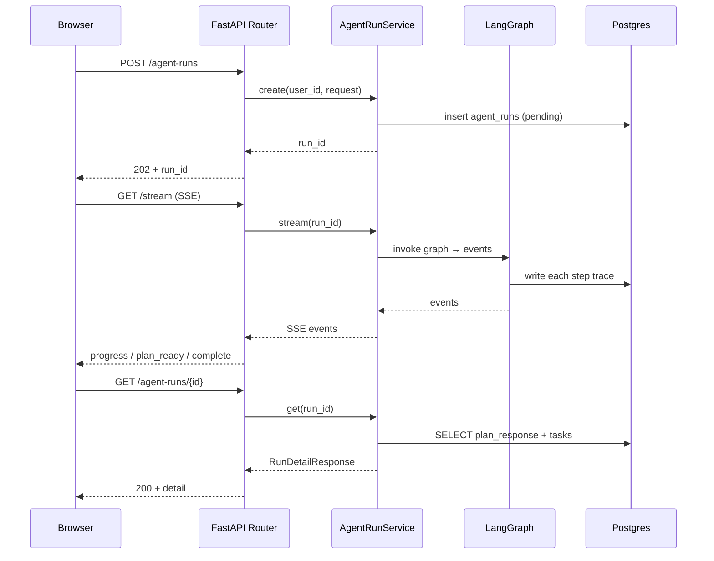

# agent-runs.md — Agent Run 端点（最复杂）

状态：本轮实现。

> 这是阶段 2 纵切骨架的目标端点。POST 创建 plan_run → 异步执行 → SSE 推进度 → GET 拉最终结果。

## 端点：POST /api/v1/agent-runs

启动一次 plan_run。

**请求头**：
- `Authorization: Bearer <jwt>`（必填）
- `Idempotency-Key: <uuid>`（必填，R-Contract1）

**请求 Schema** `CreateRunRequest`（`app.schemas.agent_run`）：
| 字段 | 类型 | 必填 | 约束 |
|---|---|---|---|
| `message` | `str` | ✅ | min 1, max 2000 |
| `goal_type_override` | `GoalType \| null` | ❌ | 默认从 profile 读 |

**成功响应 202** `CreateRunResponse`：
| 字段 | 类型 |
|---|---|
| `run_id` | `str`（UUIDv4） |
| `status` | `Literal["pending"]` |
| `stream_url` | `str` |

**示例**：
```http
POST /api/v1/agent-runs
Idempotency-Key: idem-9af2
{"message":"帮我制定 5 周后的 Agent 秋招计划"}
```
```json
{
  "run_id": "r-2a8f-...",
  "status": "pending",
  "stream_url": "/api/v1/agent-runs/r-2a8f-.../stream"
}
```

**错误**：
| HTTP | code | 触发 |
|---|---|---|
| 401 | AUTH_TOKEN_EXPIRED | —— |
| 422 | VALIDATION_RUN_INVALID | message 空或超长 |
| 409 | STATE_RUN_ALREADY_ACTIVE | 同用户已有 pending/running run |
| 429 | RATE_LIMITED_RUN_PER_USER | 单用户 > 5 runs/min |

## 端点：GET /api/v1/agent-runs/{run_id}/stream

SSE 流，推 plan_run 中间态。

**Accept: text/event-stream**

**事件类型**：
| event | data | 触发 |
|---|---|---|
| `progress` | `{"step":"intent_router","status":"ok"}` | 每节点完成 |
| `progress` | `{"step":"career_planning_agent","tools_used":2}` | Agent 工具调用 |
| `progress` | `{"step":"rule_validator","dim_1":"pass"}` | 校验完成 |
| `plan_ready` | `{"plan_id":"p-9e2a","tasks":[...]}` | plan 持久化完成 |
| `degraded` | `{"fallback_reason":"budget_exceeded"}` | 降级路径 |
| `error` | `{"code":"AGENT_RUN_FAILED"}` | fail |
| `complete` | `{}` | END |

**Last-Event-Id** 支持断线重连游标。

**浏览器示例**：
```js
const es = new EventSource(`/api/v1/agent-runs/${runId}/stream`);
es.addEventListener("progress", (e) => setProgress(JSON.parse(e.data)));
es.addEventListener("plan_ready", (e) => setPlan(JSON.parse(e.data)));
es.addEventListener("complete", () => es.close());
```

## 端点：GET /api/v1/agent-runs/{run_id}

拉取 run 的最终状态（权威，SSE 仅实时增强）。

**成功响应 200** `RunDetailResponse`：
| 字段 | 类型 |
|---|---|
| `run_id` | `str` |
| `status` | `Literal["completed","failed","degraded"]` |
| `plan` | `Plan \| null` |
| `tasks` | `list[Task]` |
| `companion_message` | `str \| null` |
| `fallback_reason` | `str \| null` |
| `cost_cny` | `float` |
| `trace` | `TraceSummary \| null`（仅 dev 路径返回详尽 trace） |

## 路由层调用关系



## Router 实现要点

- `@router.post("/agent-runs", status_code=202)`
- 创建 Service 注入用 `Depends(get_agent_run_service)`
- SSE 用 `StreamingResponse` + `async generator`
- 错误统一抛 `HTTPException` 由 Router 错误映射（R-Layer3）

## 关联

- 节点：所有 11 节点都被 AgentRunService 编排
- 表：[agent_runs / agent_steps / tool_calls](../data-models/trace-tables.md)
- 状态机：[state-machines/run-status.mmd](../state-machines/run-status.mmd)
- 通用协议：[architecture/api-and-data-contracts.md §6](../../architecture/api-and-data-contracts.md)
- ADR-007 async + SSE
