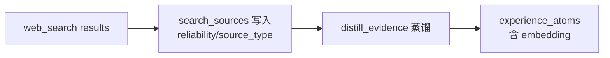

# experience_atoms.md — 经验原子（pgvector + goal_type 索引）

状态：本轮实现。

## 字段

| 字段 | 类型 | NULL | 默认 | 约束 | 说明 |
|---|---|---|---|---|---|
| id | `uuid` | NO | `gen_random_uuid()` | PK | —— |
| goal_type | `varchar(32)` | NO | — | CHECK ∈ {`ai_backend`,`agent_app`,`backend_java`,`data_engineer`,`fullstack`,`other`} | **必填**，按方向索引 |
| title | `text` | NO | — | max 100 | 经验标题 |
| body | `text` | NO | — | max 2000 | 经验内容 |
| source_url | `text` | NO | — | FK 引用 search_sources.url（软引用，不强约束） | 出处 URL |
| source_snapshot_id | `uuid` | YES | NULL | FK→search_sources.id | 对应 search_sources 快照 ID |
| embedding | `vector(1024)` | NO | — | —— | **DeepSeek Embedding 严格 1024 维** |
| reliability | `float` | NO | `0.5` | CHECK between 0 and 1 | 可靠度（来自 source） |
| sensitivity | `varchar(16)` | NO | `'none'` | CHECK ∈ {`none`,`sensitive`} | 敏感标记 |
| created_at | `timestamptz` | NO | `now()` | —— | —— |
| expires_at | `timestamptz` | YES | NULL | —— | 归档时间，搜索用 WHERE expires_at IS NULL |

## 索引

| 名 | 字段 | 类型 | 用途 |
|---|---|---|---|
| idx_atoms_goal_created | (goal_type, created_at DESC) | btree | 时间倒序 |
| idx_atoms_embedding | embedding USING ivfflay | **ivfflat** (vector_cosine_ops) | **余弦相似度检索**（参 rag_retrieve Tool） |
| idx_atoms_goal_embedding | (goal_type, embedding) 复合 | ivfflat | 按方向过滤 + 向量召回（用 partial ivf 多列组合） |

## 外键

- `source_snapshot_id → search_sources.id ON DELETE SET NULL`

## 示例行

```sql
INSERT INTO experience_atoms (id, goal_type, title, body, source_url, embedding, reliability)
VALUES ('ea-1c2d-...', 'agent_app',
        'Anthropic 推荐：从单次 LLM 起步，需要再上 Agent',
        'Anthropic 工程博客《Building Effective Agents》...', 
        'https://www.anthropic.com/engineering/building-effective-agents',
        '[0.012, -0.34, ...]'::vector(1024),
        0.95);
```

## 严格约束

- `embedding` 维度必须 == 1024（[evidence_atom schema validator](../../architecture/tdd.md)）
- 任何 source_url 引用必须真实可访问（distiller 节点负责核查）
- 敏感 atom 不直接入库（先入候选池）

## 与 search_sources 关系



## 关联

- PRD §3.3 经验原子沉淀（产品护城河）
- TDD §11.3 数据架构
- [distill_evidence.spec.md](../agent-nodes/distill_evidence.spec.md)
- 阶段 4 上线 30-50 条手工录入
