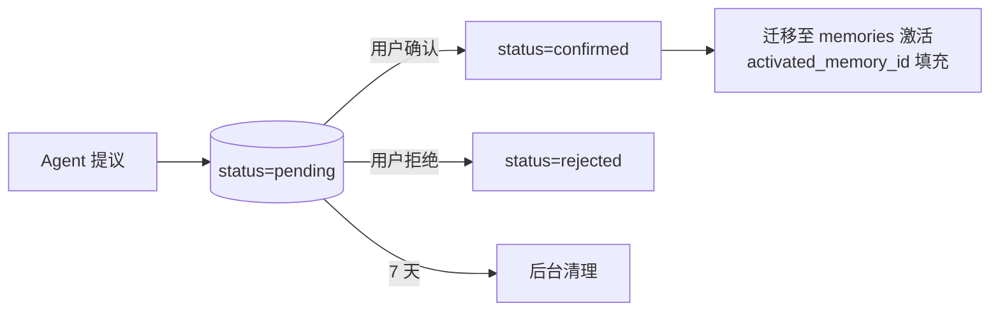

# memory_candidates.md — 记忆候选池

状态：本轮实现。

> 与 [memories.md](./memories.md) 区别：本表只存待用户确认的候选记忆（默认敏感）；用户确认后才迁入 memories 表激活。

## 字段

| 字段 | 类型 | NULL | 默认 | 约束 | 说明 |
|---|---|---|---|---|---|
| id | `uuid` | NO | `gen_random_uuid()` | PK | —— |
| user_id | `uuid` | NO | — | FK→users.id | —— |
| memory_type | `varchar(32)` | NO | — | CHECK ∈ {`profile_fact`,`stable_preference`,`execution_pattern`,`sensitive_content`} | —— |
| content_json | `jsonb` | NO | — | —— | —— |
| sensitivity | `varchar(16)` | NO | `'sensitive'` | CHECK ∈ {`sensitive`,`highly_sensitive`} | 默认敏感 |
| status | `varchar(16)` | NO | `'pending'` | CHECK ∈ {`pending`,`confirmed`,`rejected`} | 状态机 |
| proposed_by_run_id | `uuid` | YES | NULL | FK→agent_runs.id | 提议此候选的 run |
| proposed_at | `timestamptz` | NO | `now()` | —— | —— |
| expires_at | `timestamptz` | NO | `now() + interval '7 days'` | —— | **7 天后未确认清理**（[ADR-006](../../architecture/adr.md)） |
| confirmed_at | `timestamptz` | YES | NULL | —— | 用户确认时间 |
| activated_memory_id | `uuid` | YES | NULL | FK→memories.id | 确认后激活迁入 memories 时的 ID |

## 索引

| 名 | 字段 | 用途 |
|---|---|---|
| idx_candidates_user_pending | (user_id, status, expires_at) WHERE status='pending' | 用户确认列表 |
| idx_candidates_expired | (expires_at) WHERE status='pending' | TTL 清理后台任务 |

## 外键

- `user_id → users.id ON DELETE CASCADE`
- `proposed_by_run_id → agent_runs.id`
- `activated_memory_id → memories.id`

## 示例行

```sql
INSERT INTO memory_candidates (id, user_id, memory_type, content_json, sensitivity, status, expires_at)
VALUES ('mc-7c1d-...', 'u-7c3e2f1a-...', 'sensitive_content',
        '{"category":"health","note":"用户提到焦虑问题"}',
        'sensitive', 'pending', now() + interval '7 days');
```

## 生命周期


