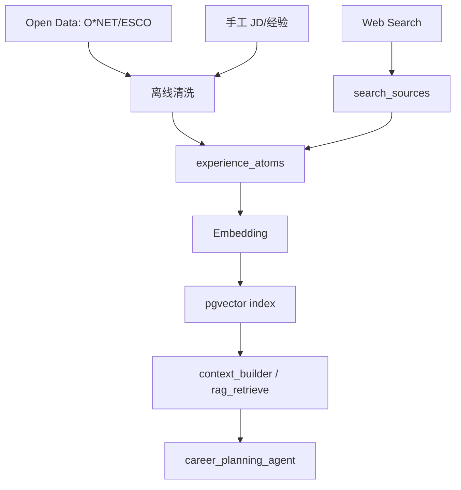
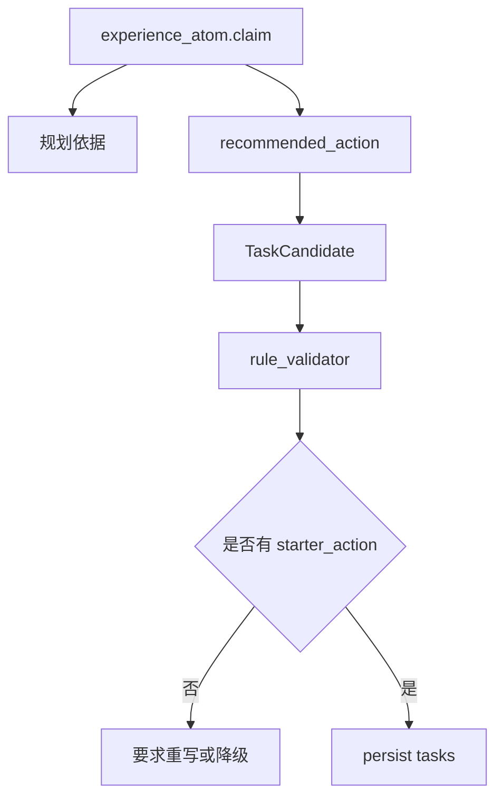

# 知识库 / 数据设计说明

| 项目 | 内容 |
|---|---|
| 版本 | v1.0 |
| 状态 | 本轮实现 |
| 面向对象 | 数据工程师、AI 工程师、后端开发者、评审者 |
| 定位 | 定义 Dazi MVP 的数据来源、知识库内容、种子数据、经验原子、RAG 输入、数据质量和更新策略 |

English summary: Data and knowledge-base design for Dazi. It defines open data sources, manual seed data, experience atoms, RAG ingestion, quality controls, and data-to-table mapping.

---

## 1. 设计目标

Dazi 的数据设计目标不是一开始收集最大规模岗位数据，而是用可追踪、可评测、可迭代的数据支撑首发场景：计算机学生 AI / 后端 / Agent 应用方向求职准备。

MVP 数据必须支持：

- 生成可执行的今日任务；
- 解释任务依据；
- 按 `goal_type` 检索经验原子；
- 支撑 RAG 和 Eval；
- 区分 mock、manual、open_data、web_search 等来源；
- 避免把不可靠或过期数据当作确定事实。

## 2. 数据分层

| 层级 | 内容 | 用途 | 存储 |
|---|---|---|---|
| 用户业务数据 | profile、plans、tasks、reviews、memories | 个性化规划和闭环 | PostgreSQL 业务表 |
| Trace 数据 | agent_runs、agent_steps、tool_calls | 可观测、Replay、Eval | PostgreSQL Trace 表 |
| 经验原子 | 求职路径、技能建议、项目包装经验 | RAG 和规划依据 | `experience_atoms` + pgvector |
| 来源快照 | 搜索结果、岗位样本、职业技能标准 | 证据追踪 | `search_sources` |
| Eval 数据 | 固定 case、grader 结果、bad case | AI 质量评测 | eval 相关表/fixtures |
| Mock 数据 | 固定 Provider 响应和前端样例 | 纵切联调和 CI | fixtures，标记 mock |

## 3. 推荐数据源

### 3.1 职业与技能 taxonomy

| 数据源 | 用途 | MVP 使用方式 |
|---|---|---|
| O*NET | 职业、任务、技能、知识、软件技能 | 抽取技能 taxonomy 和任务描述参考 |
| ESCO | 欧盟职业/技能/资格分类 | 补充技能层级和同义词 |
| 国家职业分类大典 | 中文职业分类参考 | 手工映射中文职业术语 |

使用原则：

- O*NET/ESCO 用作 taxonomy，不直接等价于中国招聘市场。
- 中文职业分类用于本土语境补充，不强求自动化全量导入。
- 所有外部来源必须记录 source、license、retrieved_at。

### 3.2 岗位样本

| 数据源 | 用途 | MVP 使用方式 |
|---|---|---|
| LinkedIn/Kaggle 岗位数据 | 技能热度、岗位标题、描述样本 | 离线分析和 Eval 样例 |
| 手工收集 JD | 首发场景岗位特征 | 小规模高质量样本 |
| Web Search | 动态事实和近期信息 | Stage 4 接入 SearchProvider |

原则：

- 不把爬虫数据直接作为生产事实源。
- 不保存不明授权的大规模原文。
- 岗位样本优先用于技能归纳和评测，不用于承诺式结论。

### 3.3 手工经验原子

MVP 最重要的数据是 30-50 条高质量经验原子。

经验原子示例：

```json
{
  "goal_type": "agent_app",
  "stage": "project_packaging",
  "title": "Agent 项目需要展示 Trace 能力",
  "claim": "面试中展示 Agent 的 step/tool/cost trace，比只展示聊天效果更能体现工程化能力。",
  "recommended_action": "为最近一次 plan_run 增加 Trace 页面截图，并准备解释 risk_gate、intent_router、career_planning_agent、persist 的职责。",
  "source_type": "manual",
  "confidence": 0.8,
  "tags": ["agent", "trace", "portfolio", "interview"]
}
```

## 4. 核心数据对象

### 4.1 experience_atoms

用途：可检索的经验单元，支持规划时 RAG。

关键字段建议：

| 字段 | 说明 |
|---|---|
| `goal_type` | 适用方向，例如 `ai_backend`、`agent_app` |
| `stage` | 适用阶段，例如建档、项目包装、面试准备 |
| `claim` | 可复用经验判断 |
| `recommended_action` | 可转成任务的行动建议 |
| `source_type` | manual/open_data/web_search/eval_bad_case |
| `source_id` | 对应 `search_sources` 或人工来源 |
| `confidence` | 可信度 |
| `embedding` | 向量检索 |
| `data_origin` | mock/manual/open_data/production |

### 4.2 search_sources

用途：保存外部来源快照，支撑可解释性。

关键字段：

| 字段 | 说明 |
|---|---|
| `url` | 来源链接 |
| `title` | 标题 |
| `summary` | 摘要 |
| `source_type` | official/job_post/blog/dataset/manual |
| `retrieved_at` | 抓取时间 |
| `reliability_score` | 来源可靠度 |
| `content_hash` | 内容哈希，避免重复 |

### 4.3 memory_candidates / memories

用途：将用户长期有用信息用于个性化，但避免敏感内容自动入库。

规则：

- Agent 只能生成候选；
- 敏感候选需用户确认；
- 高风险内容不进入候选；
- 用户可关闭和删除记忆。

### 4.4 Eval 数据

Eval case 至少包含：

| 字段 | 说明 |
|---|---|
| `case_id` | 固定 ID |
| `goal_type` | 场景 |
| `input_profile` | 用户画像 |
| `user_message` | 用户请求 |
| `expected_behavior` | 期望行为 |
| `risk_label` | 风险标签 |
| `must_have` | 必须出现的结构 |
| `must_not_have` | 禁止出现的问题 |

## 5. 数据进入系统的路径



## 6. 种子数据计划

Stage 2 Mock 纵切：

| 数据 | 数量 | 用途 |
|---|---|---|
| mock users/profile | 1-3 | 前端和后端联调 |
| mock plans/tasks | 3-5 | 今日任务展示 |
| mock agent_runs/steps | 3 | Trace 页面 |
| mock experience_atoms | 5-10 | RAG 接口形状 |

Stage 4 证据增强：

| 数据 | 数量 | 用途 |
|---|---|---|
| manual experience_atoms | 30-50 | 首发场景规划依据 |
| search_sources | 30+ | 来源展示 |
| Eval cases | 30 | 质量评测 |
| JD 样本 | 20-50 | 技能趋势参考 |

## 7. 数据质量规则

| 规则 | 说明 |
|---|---|
| 必须标记来源 | 每条经验原子必须有 source_type/data_origin |
| mock 不进真实统计 | mock 数据必须标记 `data_origin="mock"` |
| 来源可追踪 | 外部来源记录 URL/hash/retrieved_at |
| 过期可识别 | 动态岗位信息必须带时间 |
| 敏感内容隔离 | 用户敏感内容进入 candidate 确认流程 |
| 可回放 | Eval 和 Replay 使用固定输入快照 |

## 8. RAG 检索策略

MVP 检索输入：

- `goal_type`
- 当前阶段
- 用户请求
- 近期复盘摘要
- 今日可用时间

检索过滤：

| 过滤 | 说明 |
|---|---|
| goal_type 优先 | 命中目标方向的经验原子 |
| stage 匹配 | 优先当前阶段 |
| confidence 阈值 | 低可信来源不进核心上下文 |
| top_k 限制 | 控制 token 和噪声 |

检索输出必须包含：

- atom id；
- claim；
- recommended_action；
- source_type；
- confidence；
- summary。

## 9. 数据到任务的映射



规则：

- 经验原子不能直接变成任务，必须经过 Agent 结合用户上下文。
- 任务必须有起步动作。
- 如果来源不足，任务应降低确定性措辞。

## 10. 数据安全与生命周期

| 数据 | 保留策略 |
|---|---|
| profile | 用户删除/注销时清除 |
| tasks/reviews | MVP 长期保留，后续可归档 |
| memories | 用户可关闭/删除，敏感确认后 90 天复核 |
| memory_candidates | 未确认 7 天清理 |
| trace | 默认 90 天 |
| search_sources | 可按 hash 去重，过期后重新抓取 |
| eval fixtures | 随版本保留 |

## 11. 开放 TODO

| TODO | 阶段 |
|---|---|
| 明确首批 30-50 条 experience_atoms 的人工编写模板 | Stage 4 |
| 选择 Embedding Provider 与向量维度 | Stage 1/3 |
| 固定 30 个 Eval cases | Stage 5 |
| 补 JD 样本清洗脚本 | Stage 4 |
| 明确 open data license 记录字段 | Stage 4 |

## 12. 关联文档

- [数据模型 spec](./data-models/README.md)
- [AI 场景与风险分析](../architecture/ai-scenario-and-risk-analysis.md)
- [TDD 技术设计](../architecture/tdd.md)
- [安全、审计与合规](../standards/security-and-compliance.md)
- [Eval 系统](./harness/eval-system.md)
