# End-to-End Runtime Flow — 端到端运行流程

| 项目 | 内容 |
|---|---|
| 版本 | v1.0 |
| 状态 | 本轮实现 |
| 面向对象 | 开发者、AI 编程助手、评审者 |
| 定位 | 把分散在 PRD、API spec、节点 spec、数据模型、状态机、feature-flows 中的内容串成一条可执行的系统运行链路 |

English summary: Developer-facing end-to-end runtime flow for Dazi. It explains startup, first entry, onboarding, plan runs, SSE events, task execution, reviews, memories, safety routing, state changes, and persistence boundaries.

---

## 1. 本文定位

本文回答“系统从启动到用户完整使用一轮，前端、后端、Agent Graph、数据库分别做什么”。

本文不替代以下文档：

| 文档 | 负责内容 |
|---|---|
| [product-overview.md](../overview/product-overview.md) | 产品目标和业务范围 |
| [tdd.md](../architecture/tdd.md) | 六层架构和关键技术设计 |
| [api-spec/](./api-spec/README.md) | 单端点请求/响应字段 |
| [agent-nodes/](./agent-nodes/README.md) | 单节点输入、输出、不变量、错误边界 |
| [data-models/](./data-models/README.md) | 单表字段、索引、约束 |
| [feature-flows/](./feature-flows/README.md) | 单业务模块的跨层流程 |
| [user-manual.md](../overview/user-manual.md) | 用户能看懂的使用说明 |

## 2. 系统启动流程

当前仓库仍处于 Pre-Stage 0，`backend/`、`frontend/`、`infra/`、`scripts/` 尚未创建。以下是 Stage 0 完成后应成立的启动链路。

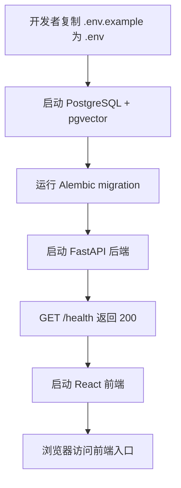

Stage 0 的最低工程验收：

| 能力 | 验收 |
|---|---|
| 后端 | FastAPI 可启动，`/health` 返回 200 |
| 前端 | React 空骨架可启动 |
| 数据库 | PostgreSQL 16 + pgvector 可连接 |
| 迁移 | Alembic 初始化完成 |
| 门禁 | `scripts/check.sh` 可运行 |
| 架构 | import-linter 配置就位 |

## 3. 首次进入系统

前端加载后，先查询当前用户和档案状态。MVP 可以使用 guest 用户，但后端仍应通过统一用户上下文处理。

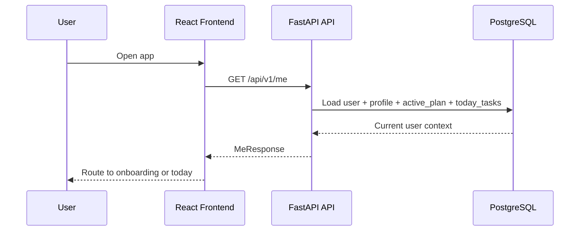

路由决策：

| 条件 | 前端进入 |
|---|---|
| 没有 profile 或关键槽位缺失 | 首次建档页 |
| 有 profile 且有今日任务 | 今日任务页 |
| 有 profile 但无今日任务 | 首页/规划入口 |
| 有未完成 run | 规划进度页或恢复 SSE |

## 4. 首次建档链路

首次建档收集最少可用信息。建档本身不是 Agent 自主写入，写入由 API/Service 控制。

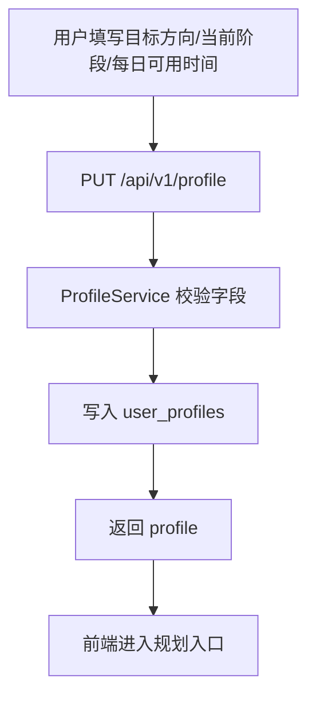

如果用户直接在对话页发起规划，但档案信息不足，则规划链路应进入澄清分支：

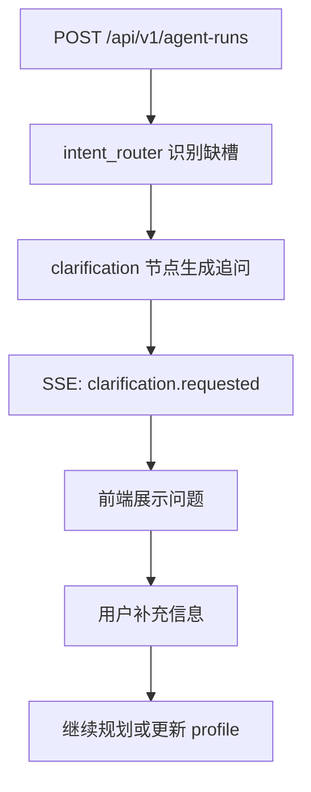

## 5. 生成规划链路

生成规划是系统核心纵切。前端发起一次 run，后端异步执行 Agent Graph，并通过 SSE 推送进度。

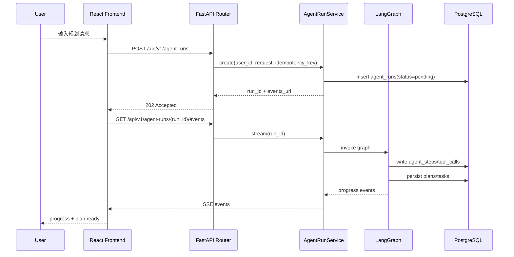

## 6. Agent Graph 节点顺序

规划工作流由 1 个真 Agent 和多个受控节点组成。

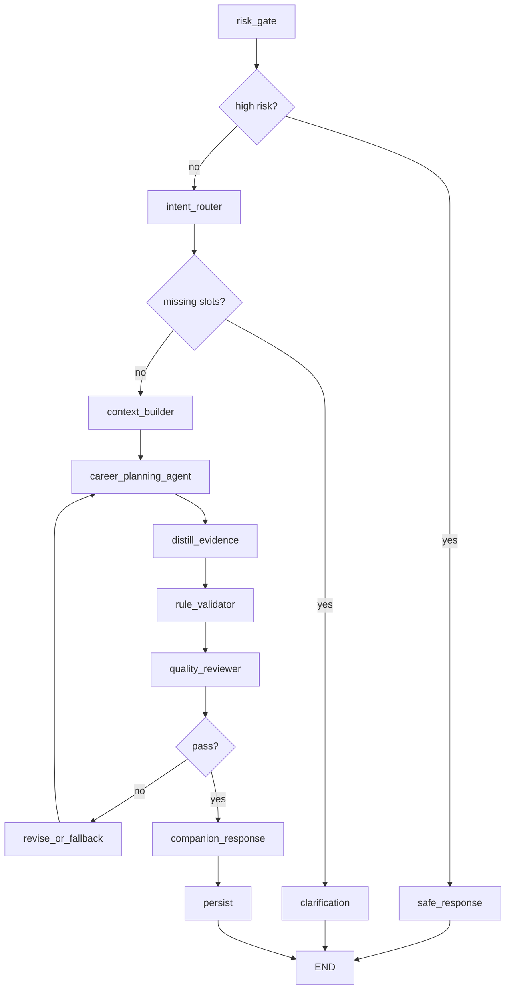

节点职责摘要：

| 节点 | 职责 | 是否可写业务表 |
|---|---|---|
| risk_gate | 高风险分流 | 否 |
| intent_router | 识别 create_plan/replan/query_plan 和缺槽 | 否 |
| clarification | 生成追问 | 否 |
| context_builder | 拼接 profile、历史任务、复盘、记忆、来源 | 否 |
| career_planning_agent | 唯一真 Agent，自主选择只读工具并生成候选计划 | 否 |
| distill_evidence | 整理来源和经验原子 | 否 |
| rule_validator | 程序化校验任务质量和约束 | 否 |
| quality_reviewer | LLM Judge 评分 | 否 |
| revise_or_fallback | 决定重写或降级 | 否 |
| companion_response | 生成陪伴话术 | 否 |
| persist | 事务化保存最终结果 | 是，通过 Service |
| safe_response | 高风险固定响应 | 否 |

## 7. SSE 事件流

前端不应轮询节点内部状态，而应消费 SSE 事件并在结束后拉取最终详情。

最小事件序列：

```text
run.created
node.started
node.completed
progress
companion.message
plan.ready
run.completed
```

异常和分支事件：

| 事件 | 触发 |
|---|---|
| `clarification.requested` | 缺少关键信息，需要用户补充 |
| `tool.called` | Agent 调用只读工具 |
| `tool.returned` | 工具返回 |
| `degraded` | 超时、超预算、质量不达标或 Provider 失败 |
| `run.failed` | 不可恢复失败 |

前端推荐处理方式：

| 前端状态 | 事件来源 |
|---|---|
| 规划中 | `run.created` / `node.started` / `progress` |
| 等待用户补充 | `clarification.requested` |
| 显示中间陪伴反馈 | `companion.message` |
| 展示计划结果 | `plan.ready` 后再 GET run detail 或 active plan |
| 显示降级说明 | `degraded` |
| 错误态 | `run.failed` |

## 8. 状态变化总览

### 8.1 Run 状态

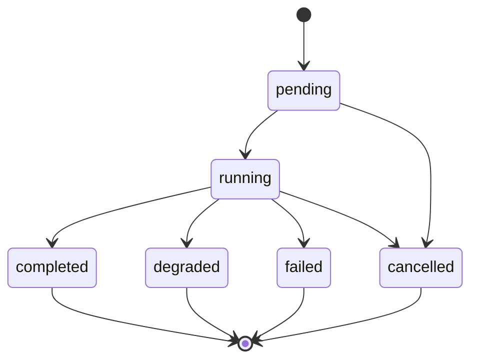

### 8.2 Plan 与 Task 关系

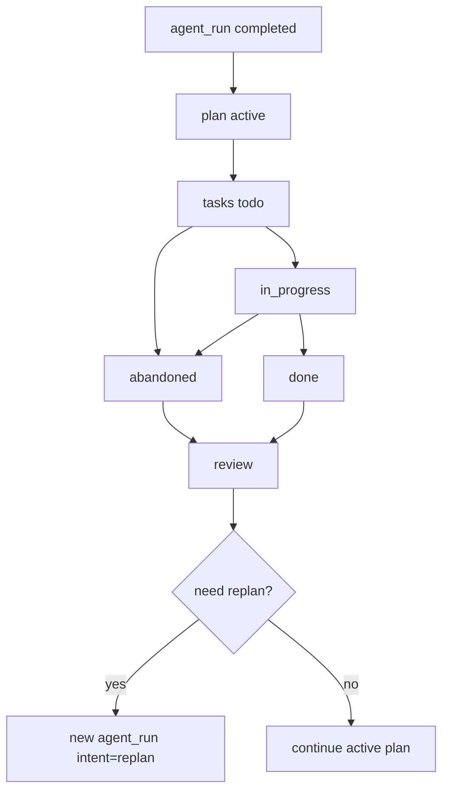

## 9. 数据落表总览

| 业务动作 | 主要表 | 写入方 |
|---|---|---|
| 创建用户 | `users` | Auth/Profile Service |
| 建档 | `user_profiles` | Profile Service |
| 创建规划 run | `agent_runs` | AgentRunService |
| 节点执行 | `agent_steps` | Harness/TraceWriter |
| 工具调用 | `tool_calls` | Harness/TraceWriter |
| 保存计划 | `plans` | persist 节点经 Service |
| 保存今日任务 | `tasks` | persist 节点经 Service |
| 保存来源 | `search_sources` | distill/persist 相关流程 |
| 保存经验原子 | `experience_atoms` | distill/persist 相关流程 |
| 保存复盘 | `reviews` | Review Service |
| 保存陪伴话术 | `companion_messages` | Companion/Persist 相关流程 |
| 生成候选记忆 | `memory_candidates` | persist 节点 |
| 确认记忆 | `memories` | Memory Service |

约束：Agent 和普通节点不得直接写业务表。所有业务写入必须由受控 Service 或 persist 节点完成。

## 10. 今日任务执行链路

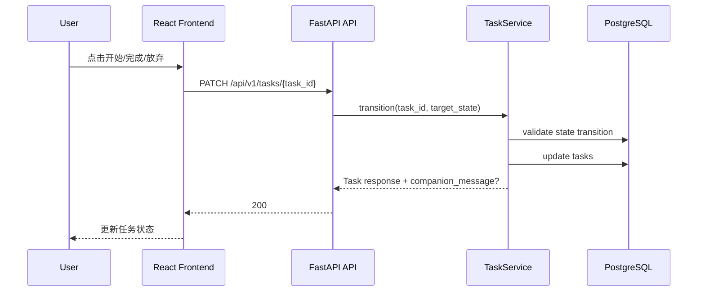

任务状态必须遵守 [task-state.mmd](./state-machines/task-state.mmd)，不得由前端自由决定。

## 11. 每日复盘与重规划链路

```mermaid
flowchart TD
    A[用户提交每日复盘] --> B[POST /api/v1/reviews]
    B --> C[ReviewService 保存 reviews]
    C --> D{规则判断是否建议调整}
    D -->|否| E[返回 review + 次日续上信息]
    D -->|是| F[返回 suggested_replan]
    F --> G[用户确认调整]
    G --> H[POST /reviews/{id}/accept-replan]
    H --> I[创建 agent_run intent=replan]
    I --> J[进入生成规划链路]
```

重规划的输入应包含：

- 原计划；
- 近期任务完成情况；
- 当日复盘；
- 用户新约束；
- 相关记忆；
- 必要的来源或经验原子。

## 12. 记忆管理链路

```mermaid
flowchart TD
    A[Agent/Persist 生成 memory_candidate] --> B[用户在记忆管理页查看]
    B --> C{用户操作}
    C -->|确认| D[POST /memory-candidates/{id}/confirm]
    C -->|拒绝| E[POST /memory-candidates/{id}/reject]
    D --> F[写入 memories]
    E --> G[候选标记 rejected]
    F --> H[后续 context_builder 可读取]
```

长期记忆使用规则：

| 规则 | 说明 |
|---|---|
| 敏感候选需确认 | 不直接保存敏感信息 |
| 用户可关闭或删除 | 用户对记忆有控制权 |
| context_builder 只读 | 记忆读取用于上下文，不直接改写 |
| 高风险内容不入记忆 | 安全分流内容不得进入长期记忆 |

## 13. 安全分流链路

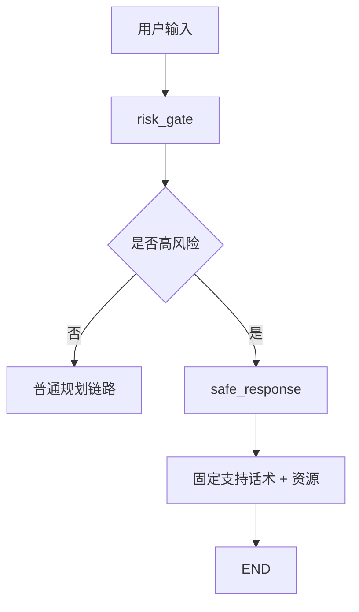

安全分流要求：

- 不进入 `career_planning_agent`；
- 不生成普通求职计划；
- 不写入长期记忆；
- 返回用户可见的固定支持话术；
- Trace 记录风险分类和分流结果。

## 14. Mock 阶段与真实 Provider 阶段差异

Mock 阶段不是演示捷径，而是工程验证阶段。Mock 与真实 Provider 必须共享同一套 API、Schema、状态机和 Trace。

| 层面 | Mock 阶段 | 真实阶段 |
|---|---|---|
| LLM | MockLLMProvider 返回固定结构化结果 | DeepSeek Provider 返回真实结构化结果 |
| Search | MockSearchProvider 返回固定来源 | Tavily 或其他 SearchProvider |
| RAG | Mock retriever 返回固定经验原子 | pgvector 检索 |
| Agent 节点 | 固定 happy/degraded/failed case | 按真实模型输出和工具结果运行 |
| 前端 | 消费真实 API + 假业务数据 | 消费真实 API + 真实业务数据 |
| 验收重点 | 契约、状态流、SSE、DB、Trace | 质量、成本、稳定性、Eval |

推荐推进顺序：

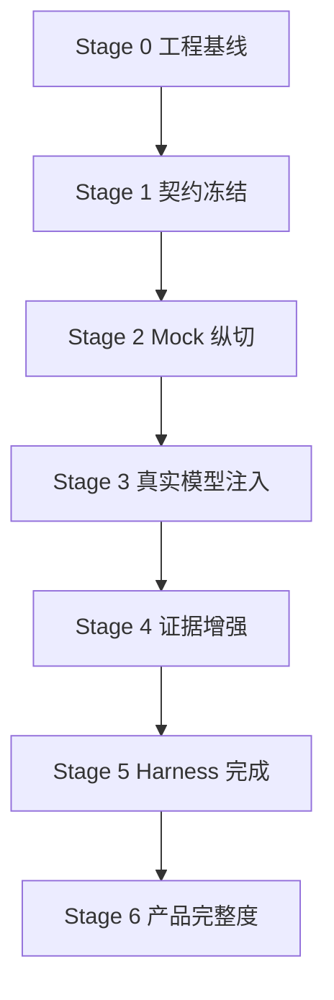

## 15. 最小端到端验收场景

Stage 2 Mock 纵切至少应支持以下验收：

1. 用户打开前端，`GET /me` 返回 guest 用户。
2. 用户填写 profile，`PUT /profile` 成功。
3. 用户在对话页发起规划，`POST /agent-runs` 返回 202。
4. 前端连接 SSE，能看到 `run.created`、`progress`、`plan.ready`、`run.completed`。
5. 后端写入 `agent_runs`、`agent_steps`、`plans`、`tasks`。
6. 前端展示 1-3 个今日任务。
7. 用户点击开始和完成，任务状态合法变化。
8. 用户提交每日复盘，`reviews` 写入成功。
9. 开发者 Trace 页能查看本次 run 的节点摘要。
10. `scripts/check.sh` 通过。

## 16. 关联文档

- [用户使用说明书](../overview/user-manual.md)
- [阶段化交付定义](../governance/stage-delivery-definition.md)
- [功能流程总览](./feature-flows/README.md)
- [Agent 节点 spec](./agent-nodes/README.md)
- [API 端点 spec](./api-spec/README.md)
- [数据模型 spec](./data-models/README.md)
- [状态机 spec](./state-machines/README.md)
