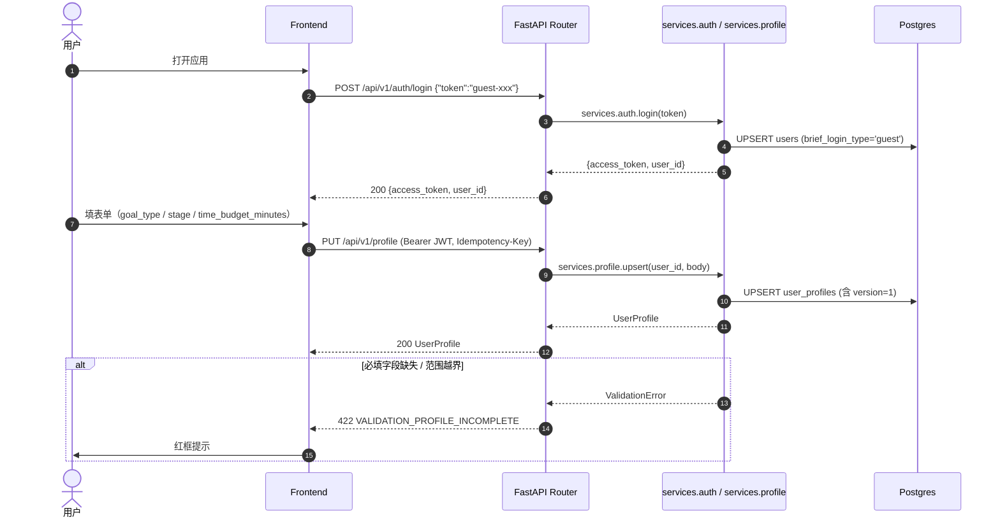
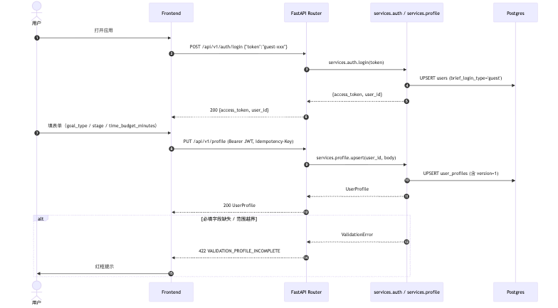
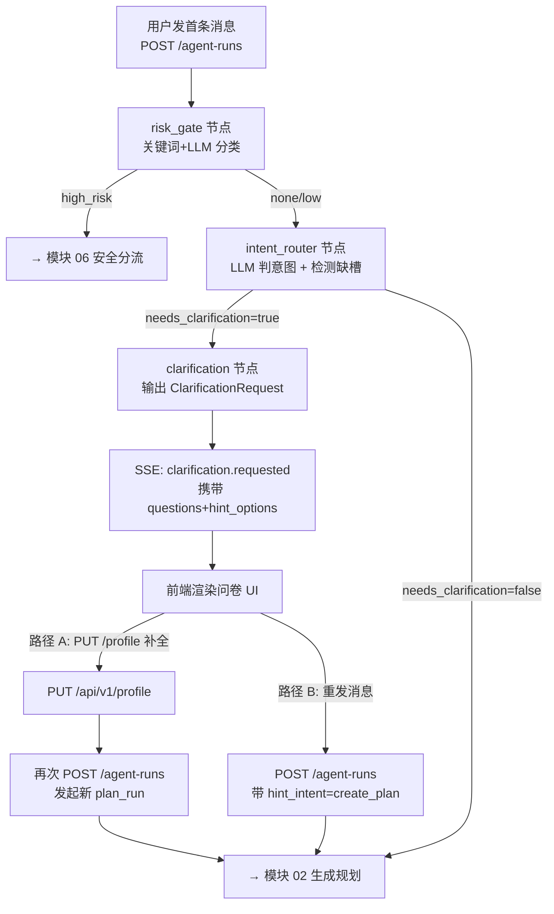
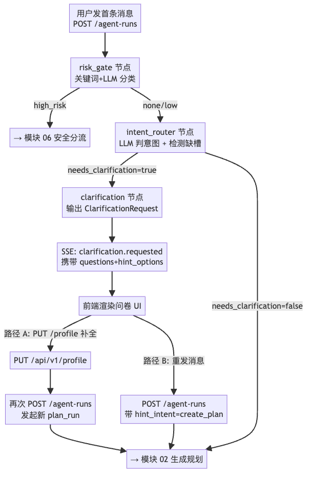
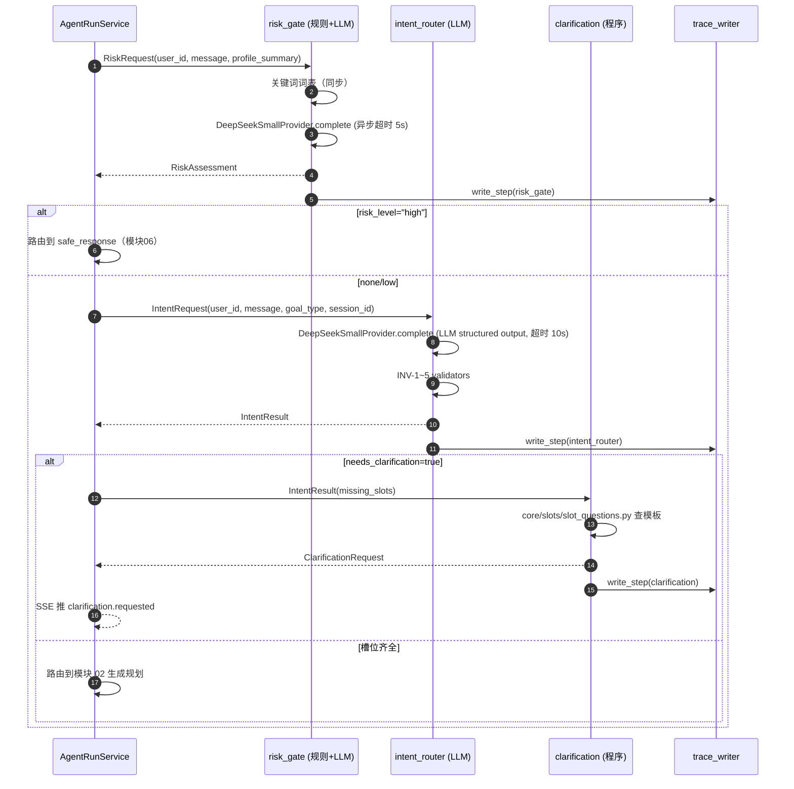
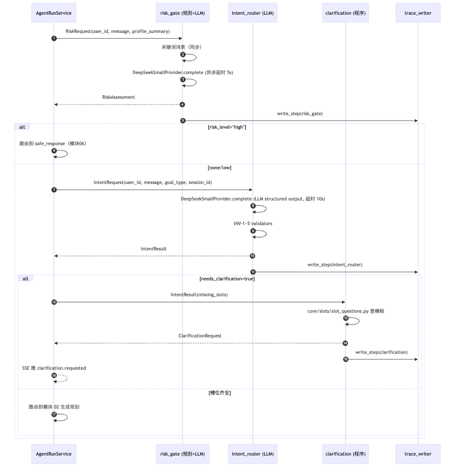

# 01-onboarding-profile.md — 功能模块：首次建档

| 项目 | 内容 |
|---|---|
| 模块编号 | FM-01 |
| 业务定位 | 用户首次进入系统的"建档 + 澄清补齐"链路 |
| PRD §6 出处 | "首次建档：goal_type/stage/available_minutes 采集" + "首次建档：追问补齐"（P0 两行） |
| 用户旅程出处 | [PRD §5.1 Happy Path](../../overview/product-overview.md) "首次进入"段 |
| 涉及端点 spec | [auth.md](../api-spec/auth.md)、[profile.md](../api-spec/profile.md)、[clarification.md](../api-spec/clarification.md)、[agent-runs.md](../api-spec/agent-runs.md) |
| 涉及表 | `users`、`user_profiles` |
| 涉及节点 | `risk_gate`（消息分流）、`intent_router`（缺槽检测）、`clarification`（追问补齐） |
| 涉及 Provider | LLMProvider（DeepSeek 小模型，仅 intent_router 用）；不调 Search/Embedding |

---

## A. 模块概览

本模块覆盖用户从"打开应用 → 登录 → 画像录入 → 缺槽补齐"的完整首启流程，是后续 plan_run 的前置。流程上有**两个并行入口**：

1. **表单入口**：用户主动走 PUT /profile 表单录入（推荐）
2. **聊天入口**：用户直接发首条消息 POST /agent-runs → 系统检测 profile 不完整 → 通过 SSE `clarification.requested` 回推问卷

两个入口都用同一份数据模型（user_profiles 表，[user_profiles.md](../data-models/user_profiles.md)）。

关键约束：
- PRD §5.2 规定"3 必填，其余可后补"（goal_type / stage / time_budget_minutes）
- 不强制用户必须填完才能发消息（降低进入摩擦，匹配流失路径策略 PRD §5.2 表"建档（摩擦）"行）
- 拒绝接受前端传 `user_id`，统一从 JWT 提取（决策 1.x）

---

## B. 业务流程图（3.1）

### B.1 表单入口主流程



**渲染图**：

### B.2 聊天入口主流程（含 clarification）



**渲染图**：

---

## C. 接口与请求字段清单（3.2）

| # | 业务动作 | HTTP / 路径 | 必填 Request 字段 | Request 示例 | 触发时机 |
|---|---|---|---|---|---|
| 1 | 登录 | POST /api/v1/auth/login | `token` | `{"token":"guest-7c3e2f1a"}` | 用户打开应用首次 |
| 2 | GET 当前用户摘要（次日续上） | GET /api/v1/me | Authorization header | 仅 header | 应用启动 / 进入主屏 |
| 3 | 表单录入/upsert 画像 | PUT /api/v1/profile | header `Authorization` + `Idempotency-Key`；body：`goal_type / stage / time_budget_minutes / skill_level`（必填）+ `skill_summary / employment_status / deadline / preferences`（可选） | 见下 | 用户完成注册向导 |
| 4 | 增量补字段（"可后补"场景） | PATCH /api/v1/profile | header `Authorization` + `Idempotency-Key` + `If-Match-Version`；body：任意字段子集 + `version` | 见下 | 用户后续修改偏好 |
| 5 | 通过消息触发 plan_run（含 clarification 流程） | POST /api/v1/agent-runs | header 同上；body：`message`（必填）+ `goal_type_override / hint_intent / source_plan_id`（可选） | `{"message":"帮我制定秋招计划"}` | 用户直接发首条消息 |
| 6 | SSE 订阅 | GET /api/v1/agent-runs/{run_id}/events | header `Accept: text/event-stream` | —— | 启动 run 后 |

### 示例

**PUT /api/v1/profile**（首次建档表单提交）
```http
PUT /api/v1/profile
Authorization: Bearer eyJhb...
Idempotency-Key: idem-9af2-bc11
Content-Type: application/json

{
  "goal_type": "agent_app",
  "stage": "mid",
  "time_budget_minutes": 180,
  "skill_level": "intermediate",
  "skill_summary": "熟悉 FastAPI/Postgres/LangChain，做过 2 个 RAG 项目",
  "deadline": "2026-10-31",
  "preferences": { "target_companies": ["字节","蚂蚁"], "preferred_time_slot": "morning" }
}
```

**PATCH /api/v1/profile**（后续补字段）
```http
PATCH /api/v1/profile
Authorization: Bearer eyJhb...
Idempotency-Key: idem-a41f
If-Match-Version: 3

{"preferences": {"target_companies": ["字节","蚂蚁","美团"]}}
```

**POST /api/v1/agent-runs**（聊天入口）
```http
POST /api/v1/agent-runs
Authorization: Bearer eyJhb...
Idempotency-Key: idem-c2d1

{"message":"我准备秋招，方向后端，看怎么准备"}
```
SSE 响应可能：
```
event: clarification.requested
data: {"run_id":"r-2a8f","questions":["你希望秋招的目标方向是？"],"slot_names":["goal"],"hint_options":{"goal":["AI 后端","Agent 应用","数据分析"]}}
```

---

## D. 数据表与 CRUD 矩阵（3.3）

| # | 接口 | 影响表 | CRUD | 关键字段 | 状态机/版本 |
|---|---|---|---|---|---|
| 1 | POST /auth/login | `users` | C 或 U（首次 UPSERT） | `brief_login_type='guest'`、`is_active=true` | 无 |
| 2 | GET /me | `user_profiles` + `plans`（active）+ `tasks`（今日） | R | 摘要组装 | 无 |
| 3 | PUT /api/v1/profile | `user_profiles` | U 或 C（upsert） | `goal_type/stage/time_budget_minutes/skill_level/skill_summary/employment_status/deadline/profile_preferences` | version 初始 1；re-upsert 时 +1 |
| 4 | PATCH /api/v1/profile | `user_profiles` | U | 子集字段 | version +1（必须带旧 version 做乐观锁）|
| 5 | POST /api/v1/agent-runs（仅建档触发链路） | `agent_runs`（C，pending）→ `agent_steps`（C，risk_gate/intent_router/clarification 各 1 行） | C | `status='pending'` → 后续 `running`/`degraded` | 见 [run-status.mmd](../state-machines/run-status.mmd) |
| 6 | SSE clarification.requested | 不写表 | R（读 agent_steps 内 clarification 节点输出） | triggers 不持久，只发事件 | —— |

### 关键状态机/不变量

- `users.is_active=true` 默认；软删除走 `deleted_at` (15 个工作日清除)
- `user_profiles` 的 `version` 必须每次 PUT/PATCH 时 +1
- `user_profiles.deadline` 的索引 `idx_profiles_goal_deadline` 由 [data-models/user_profiles.md](../data-models/user_profiles.md) 定义

---

## E. 后端组件依赖（3.4）

### E.1 节点工作流序列（仅聊天入口）



**渲染图**：

### E.2 涉及组件清单（代码引用）

| 节点 / 组件 | 代码路径（建议） | Protocol / 接口 | 作用 |
|---|---|---|---|
| `risk_gate` 节点 | `agent/nodes/risk_gate.py` | 输出 `RiskAssessment`，调 `LLMProvider.complete()` | 双重风险检测：词表同步 + DeepSeek 异步分类（[risk_gate.spec.md](../agent-nodes/risk_gate.spec.md)） |
| `intent_router` 节点 | `agent/nodes/intent_router.py` | 调 `LLMProvider.complete(messages, schema=IntentResult)` 结构化输出 | LLM 单次分类意图 + 输出 missing_slots（[intent_router.spec.md](../agent-nodes/intent_router.spec.md)） |
| `clarification` 节点 | `agent/nodes/clarification.py` | 纯 Python 查 `core/slots/slot_questions.py` | 由 slot_names 取模板问题（[clarification.spec.md](../agent-nodes/clarification.spec.md)） |
| LLM Provider | `providers/llm/deepseek.py` + `providers/llm/mock.py` | [`LLMProvider` Protocol](../../../../DaZi/backend/app/providers/protocols.py)：`async complete(messages, schema, tools, budget) -> LLMResponse` | 唯一外部 LLM 入口；强制 structured output；.mock 模式有 happy/schema_invalid/timeout 三态供单测 |
| JWT 鉴权 | `api/dependencies/auth.py`（建议） | `Depends(get_current_user) → user_id` | 从 Bearer 推 user_id，绝不信任前端传值 |
| Trace 写入 | `harness/trace.py`（@with_harness 装饰器） | `write_step(node_name, ...) → INSERT agent_steps` | 每节点入/出/异常落一行 trace（[persist.spec.md §3a](../agent-nodes/persist.spec.md)） |

### E.3 不调用的组件（边界说明）

- 本模块**不调 Search / Embedding**：建档阶段无需联网检索或向量召回
- 不写长期记忆（persist INV-3，敏感内容不写主表；user_profiles 也不是 Agent 写的，是用户 API 直接 PUT）
- 不调用 `CareerPlanningAgent`（该节点是模块 02 才进入）
- Cache / Storage Provider（[protocols.py](../../../../DaZi/backend/app/providers/protocols.py)）此模块不参与（仅 plan_run 路径可能用 Storage 存 trace artifacts）

---

## F. 模块边界与已知缺口

| 边界 | 描述 |
|---|---|
| 电子邮件 / OAuth | MVP 仅 guest token；email/oauth_wechat/oauth_github 字段已预留（[users.md](../data-models/users.md)），登录流程远期上线（[auth.md](../api-spec/auth.md)） |
| 多账号合并 | 本模块不处理；远期上线（ADR-001 路径） |
| 用户删除请求 | 走运行时删除流程（[ADR-006](../../architecture/adr.md)），不在建档模块 |

### 待用户确认的开放项（与 gap-analysis 表对齐）

- **决策点 10**：stage 术语映射已建议（early=大三/研一、mid=大四/研二、late=临近 offer、unknown=未提供）。需在 [PRD §3.3](../../overview/product-overview.md) 增加术语表条目——列为阶段五 TODO。
- **决策点 11**："次日续上"已通过本模块 GET /me 端点承接（决策已纳入 [api-and-data-contracts.md §4.1](../../architecture/api-and-data-contracts.md)）。
