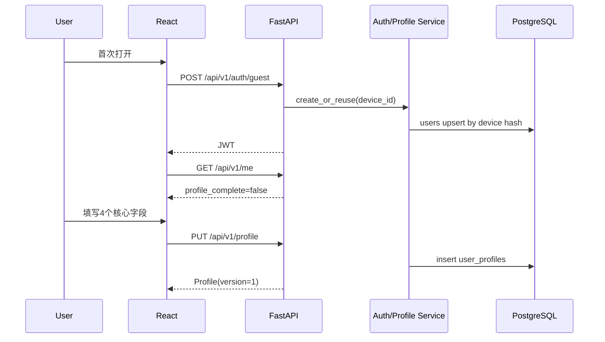

# FM-01：Guest 登录与首次建档

```mermaid
sequenceDiagram
    participant U as User
    participant FE as React
    participant API as FastAPI
    participant SVC as Auth/Profile Service
    participant DB as PostgreSQL
    U->>FE: 首次打开
    FE->>API: POST /api/v1/auth/guest
    API->>SVC: create_or_reuse(device_id)
    SVC->>DB: users upsert by device hash
    API-->>FE: JWT
    FE->>API: GET /api/v1/me
    API-->>FE: profile_complete=false
    U->>FE: 填写4个核心字段
    FE->>API: PUT /api/v1/profile
    SVC->>DB: insert user_profiles
    API-->>FE: Profile(version=1)
```

## 验收

- device_id 原文不入库；
- Profile 四个核心字段完整；
- JWT 用户隔离通过；
- 未建档时 `/me` 正常返回引导状态；
- PATCH version 冲突返回 409。
