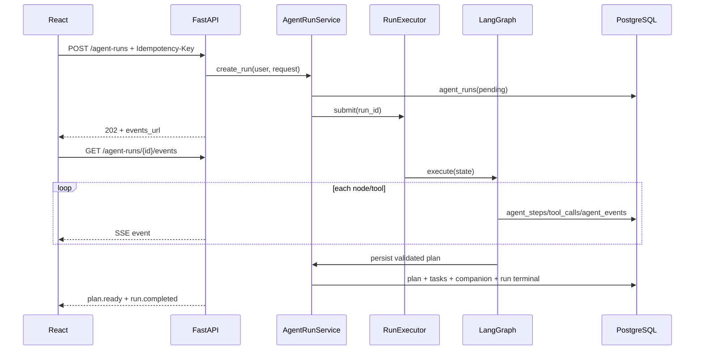

# FM-02：生成计划

## 关键失败路径

- Profile 缺字段：clarification.requested + Run degraded；
- 高风险：safe_response + Run degraded；
- 模型格式错：修复一次；
- 规则不通过：修复一次后模板降级；
- 超时：Run failed，写终态事件；
- 用户取消：Task cancel + Run cancelled。

## 验收

- 一个 Run 只产生一个 final_plan_id；
- 每个 SSE 事件已在 agent_events 持久化；
- 新计划 1~3 个今日任务且总时间不超预算；
- 同用户不能并发两个活动 Run。
