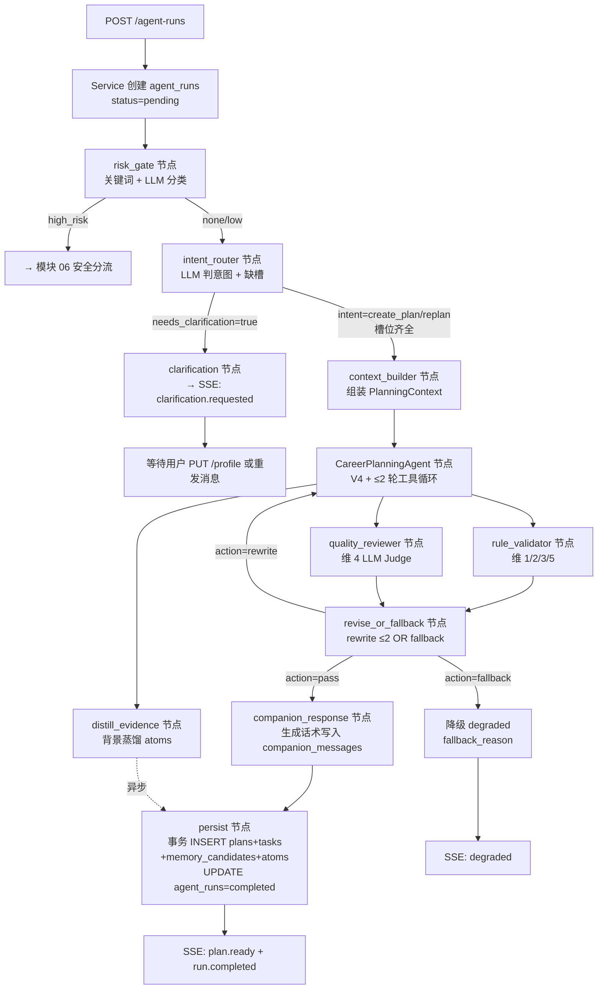
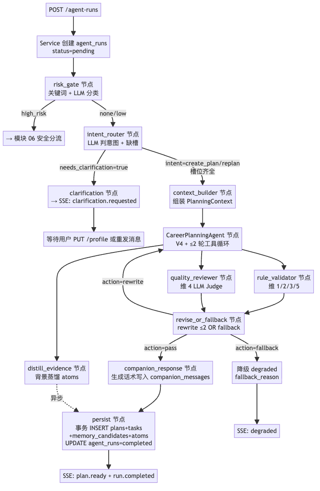
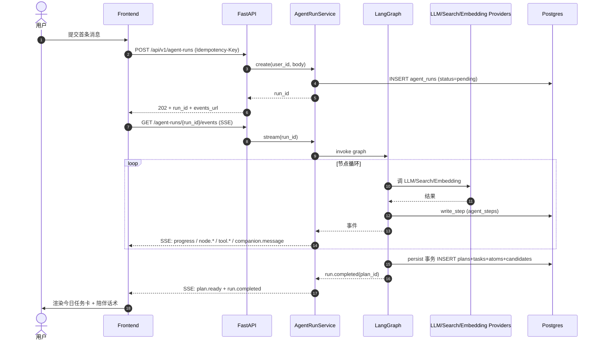
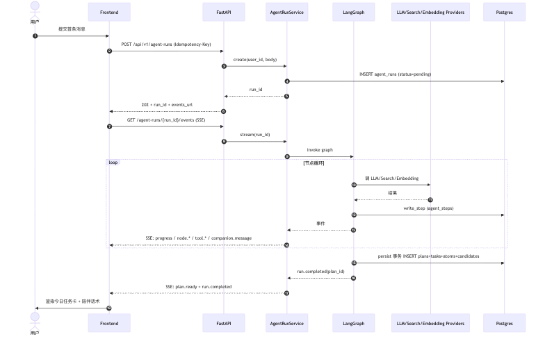
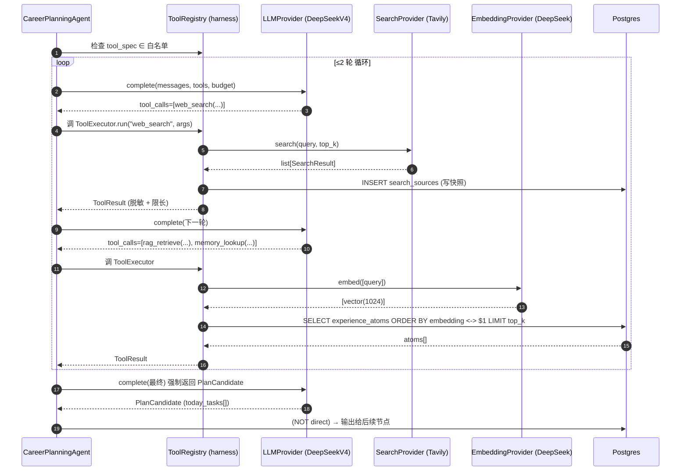
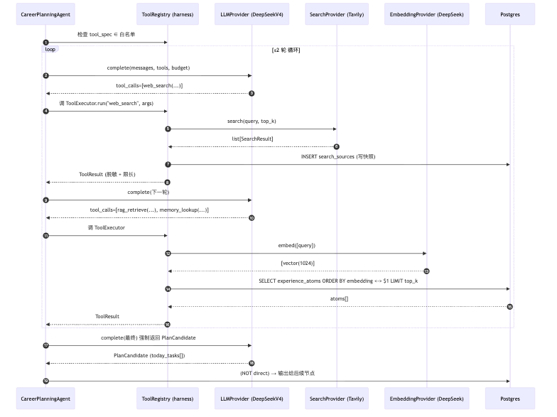

# 02-plan-run.md — 功能模块：生成规划（plan_run）

| 项目 | 内容 |
|---|---|
| 模块编号 | FM-02 |
| 业务定位 | 单核心 Agent 工作流：用户消息 → 11 节点链路 → 5 维质量评分 → 受控写入 → plan 落库 + SSE 推进度 |
| PRD §6 出处 | "生成规划：整体方向 + 本周重点 + 今日任务"、"动态事实联网核查 + 来源标注"、"5 维质量评分 + 校验降级" 三行 P0 |
| 用户旅程出处 | [PRD §5.1 Happy Path](../../overview/product-overview.md) "生成规划（Plan Run）" 段 |
| 涉及端点 spec | [agent-runs.md](../api-spec/agent-runs.md)、[plans.md](../api-spec/plans.md) |
| 涉及表 | `users`、`user_profiles`、`plans`、`tasks`、`agent_runs`、`agent_steps`、`tool_calls`、`search_sources`、`experience_atoms`、`memory_candidates`、`companion_messages` |
| 涉及节点 | 11 节点全部：`risk_gate / intent_router / clarification / context_builder / career_planning_agent / rule_validator / quality_reviewer / revise_or_fallback / companion_response / persist / distill_evidence / safe_response`（其中 safe_response 是分支而非主路径） |
| 涉及 Provider | LLMProvider（V4 + 小模型分层）、SearchProvider（Tavily）、EmbeddingProvider（DeepSeek 1024）、CacheProvider、ObjectStorageProvider |

---

## A. 模块概览

这是项目的**核心复杂度承担模块**。一条 plan_run 从 POST /agent-runs 进入，走 LangGraph StateGraph 的 11 节点链路，期间通过 SSE 推进度，最终在 persist 节点 commit 由候选转正式 plan + tasks。该模块对应 PRD §4.3"单核心 Agent + 受控节点"产品决策。

关键设计原则：
- **只有 1 个真 Agent** = `CareerPlanningAgent`（[career_planning_agent.spec.md](../agent-nodes/career_planning_agent.spec.md)），其余为规则/LLM/程序/事务节点
- **业务写入唯一通道** = `persist` 节点（[persist.spec.md §3a](../agent-nodes/persist.spec.md) INV-1，事务 commit all-or-nothing）
- **5 维质量评分** 双层实现：维度 1/2/3/5 走 `rule_validator`（程序）、维度 4 走 `quality_reviewer`（LLM Judge）
- **降级路径**：`revise_or_fallback` 控制重写 ≤2 次，超阈值走 degraded

入口路径有 3 种：

1. 主动 create_plan（hint_intent 缺省或 create_plan）
2. 主动 replan（hint_intent=replan + source_plan_id）
3. 间接 replan（reviews 副作用 → POST /reviews/{id}/accept-replan 模块 04）

高风险分支在模块 06 单独承接。

---

## B. 业务流程图（3.1）

### B.1 plan_run 完整工作流（11 节点主路径）



**渲染图**：

### B.2 请求/响应时序（前端-后端-SSE-DB）



**渲染图**：

---

## C. 接口与请求字段清单（3.2）

| # | 业务动作 | HTTP / 路径 | 必填 Request 字段 | Request 示例 | 触发时机 |
|---|---|---|---|---|---|
| 1 | 发起 plan_run | POST /api/v1/agent-runs | header `Authorization` + `Idempotency-Key`；body：`message`（必填）+ `goal_type_override / hint_intent / source_plan_id`（可选）| `{"message":"秋招准备"}` | 用户点击"开始规划" |
| 2 | 订阅 SSE | GET /api/v1/agent-runs/{run_id}/events | header `Accept: text/event-stream` + `Last-Event-Id`（重连时） | —— | run 启动后立即 |
| 3 | 取消未完成 run | POST /api/v1/agent-runs/{run_id}/cancel | header 同步骤 1；body：`reason`（可选） | `{"reason":"user_abort"}` | 用户主动取消 |
| 4 | 查询最终状态 | GET /api/v1/agent-runs/{run_id} | header `Authorization` | —— | SSE 完成后权威读 |
| 5 | 读活跃 plan | GET /api/v1/plans/active | header `Authorization` | —— | run 完成后展示 plan |
| 6 | 读 plan 详情 | GET /api/v1/plans/{plan_id} | header `Authorization` | —— | 翻阅详情 |
| 7 | 读 plan 来源 | GET /api/v1/plans/{plan_id}/sources | header `Authorization` | —— | 查看引用 |
| 8 | 翻历史 | GET /api/v1/plans?status=...&cursor=... | Query + header | —— | 历史规划列表 |

### Request 示例

```http
POST /api/v1/agent-runs
Authorization: Bearer eyJhb...
Idempotency-Key: idem-c2d1

{"message":"我准备秋招，方向 Agent 应用，看怎么准备这 4 周"}
```

replan 触发：
```http
POST /api/v1/agent-runs
Authorization: Bearer eyJhb...
Idempotency-Key: idem-e5f6

{"message":"昨天太累了，今天调整一下","hint_intent":"replan","source_plan_id":"p-9e2a-..."}
```

---

## D. 数据表与 CRUD 矩阵（3.3）

| # | 触发节点 / 步骤 | 影响表 | CRUD | 关键字段 | 状态机 |
|---|---|---|---|---|---|
| 1 | Service 创建 run | `agent_runs` | C | status='pending'，session_id 由 server 注入 | run-status pending |
| 2 | Worker 接管 → running | `agent_runs` | U | status='running'，started_at=now() | run-status pending→running |
| 3 | 每个节点入口/出口 | `agent_steps` | C | run_id、node_name、node_index、prompt_version、model | — |
| 4 | Agent 工具调用 | `tool_calls` | C | step_id（指向 career_planning_agent 步骤）、tool_name（白名单）、args_hash | — |
| 5 | `web_search` Tool | `search_sources` | C | run_id、url、title、snippet、source_type、reliability | — |
| 6 | `distill_evidence` 节点产出 | `experience_atoms` | U 或 C（先前存在则更新）| goal_type、title、body、source_url、embedding(1024)、reliability | — |
| 7 | `CareerPlanningAgent` 输出候选 | （内存对象，不直接写表）| —— | `PlanCandidate.today_tasks[].starter_action/deliverable` | — |
| 8 | `companion_response` 节点输出 | `companion_messages` | C | user_id、run_id、plan_id（暂用 NULL 完成事务后 UPDATE）、trigger_tag、tone、message | — |
| 9 | `persist` 节点 commit（**核心事务**） | `plans` | C | status='active'、content_json="rationale/assumptions/..." 、version=1 | plan-status pending→active |
| 10 | （同事务）| `tasks` | C 多行 | plan_id FK、order_index（0-2）、state='pending'、starter_action、deliverable、estimated_minutes、rationale | task-state pending（初始） |
| 11 | （同事务，可选）| `memory_candidates` | C 多行 | sensitivity='sensitiveHIGH*、status='pending'、expires_at=now()+7d | candidate pending |
| 12 | （同事务，可选）| `experience_atoms` | C 多行 | 与步骤 6 一致 | — |
| 13 | （事务结束前）| `agent_runs` | U | status='completed/degraded'、final_plan_id、finished_at、total_cost_cny、total_tokens_*  | run-status running→completed/degraded |
| 14 | 取消 run | `agent_runs` | U | status='cancelled'、finished_at | run-status pending/running→cancelled |

### 事务边界（来自 [persist.spec.md §3a](../agent-nodes/persist.spec.md)）

`services.persist.persist_plan_run()` 用 `async with session.begin()` 包整段：plans INSERT → tasks INSERT → memory_candidates INSERT → experience_atoms INSERT → agent_runs UPDATE status。任一失败全回滚（INV-1）。`agent_steps/tool_calls/search_sources` 各自单独事务，不进业务事务。

---

## E. 后端组件依赖（3.4）

### E.1 节点工作流总览（按节点编号）

| # | 节点 | 类型 | 输入 | 输出 | Provider | 作用 |
|---|---|---|---|---|---|---|
| 1 | `risk_gate` | 规则+LLM | RiskRequest | RiskAssessment | LLMProvider（小模型）| 双重风险检测（词表 + 异步分类器）|
| 2 | `intent_router` | LLM 单次 | IntentRequest | IntentResult | LLMProvider（小模型）+ 结构化 schema | 4 路意图分类；missing_slots 检测 |
| 3 | `clarification` | 程序 | IntentResult | ClarificationRequest | 无 | 路径 A 的 SSE 事件来源 |
| 4 | `context_builder` | 程序+Tool | BuildContextRequest | PlanningContext | EmbeddingProvider（via memory_lookup）、SearchProvider（via web_search）| 按 token 预算组装上下文 |
| 5 | `career_planning_agent` ⭐ | 真 Agent | PlanningAgentInput (+ budget) | PlanningAgentResult | LLMProvider（V4） + 4 Tool | 单核心 Agent；2 轮循环上限；预算守 |
| 6 | `distill_evidence` | LLM 后处理 | DistillRequest | DistillResult | LLMProvider（V4）| 把搜索文档蒸馏成 experience_atoms |
| 7 | `rule_validator` | 程序 | PlanCandidate | ValidationReport | 无 | 维度 1/2/3/5 机器判定（动词白名单等） |
| 8 | `quality_reviewer` | LLM Judge | ReviewRequest | ReviewResult | LLMProvider（小模型）| 维度 4 连续性 + 0.7 阈值 |
| 9 | `revise_or_fallback` | 路由 | ReviseRequest | ReviseDecision | LLMProvider（小模型，仅 rewrite 时） | 决定 rewrite ≤2 / pass / fallback |
| 10 | `companion_response` | LLM | CompanionInput | CompanionMessage | LLMProvider（小模型）+ fallback 模板 | 生成 6 触发时刻话术 |
| 11 | `persist` | 事务 | PersistInput | PersistResult | DB Repository | 唯一受控业务写入入口 |
| 12 | `safe_response`（分支） | 程序 | SafeResponseInput | SafeResponse | 无 | 高风险固定话术（详见模块 06）|

### E.2 Provider 调用详解（每个组件代码引用）



**渲染图**：

### E.3 Provider Protocol 引用（来自 [protocols.py](../../../../DaZi/backend/app/providers/protocols.py)）

```python
class LLMProvider(Protocol):
    async def complete(self, messages, schema=None, tools=None, budget=None) -> "LLMResponse": ...

class LLMResponse(Protocol):
    content: str
    structured_output: dict | None  # intent_router/career_planning_agent 用
    tool_calls: list                  # 仅 Agent 节点用
    tokens_in: int
    tokens_out: int
    finish_reason: str

class SearchProvider(Protocol):
    async def search(self, query: str, top_k: int = 5) -> list: ...

class EmbeddingProvider(Protocol):
    async def embed(self, texts: list[str]) -> list: ...

class CacheProvider(Protocol):  # 用于 prompts/atoms 缓存，本模块可能用
    async def get(self, key: str) -> bytes | None: ...
    async def set(self, key: str, value: bytes, ttl: int | None = None) -> None: ...

class ObjectStorageProvider(Protocol):  # 存完整 prompt artifacts
    async def upload(self, key: str, data: bytes) -> str: ...
    async def download(self, key: str) -> bytes: ...
```

### E.4 Harness 组件（来自 [persist.spec.md §3a](../agent-nodes/persist.spec.md)）

| Harness 件 | 路径（建议） | 作用 |
|---|---|---|
| ToolRegistry | `tools/registry.py` | ToolSpec 注册 + 白名单 Guard（防越权） |
| ToolExecutor | `tools/executor.py` | 包装 Tool 调用：超时控制 + 脱敏 + 限长 + trace.write_tool_call |
| BudgetChecker | `harness/budget.py` | 单节点预算 + 全 run 累计预算 |
| TraceWriter | `harness/trace.py` | `@with_harness` 装饰器 |
| LangGraph StateGraph | `agent/graph.py` | 节点编排 + checkpointer（Postgres 通道）|

---

## F. 模块边界与已知缺口

| 边界 | 描述 |
|---|---|
| 用户取消时机 | 仅在 waiting 状态可取消；running 中途取消需 worker 协作（worker 监控取消位） |
| 多用户并发 | 单用户限制 ≤5 runs/min（rate_limit），同用户同时仅 1 个 pending/running（[agent-runs.md `STATE_RUN_ALREADY_ACTIVE`](../api-spec/agent-runs.md)）|
| 每个 run 仅 1 plan | 一个 run 不产多个 plan；replan 的 source_plan_id 仅作引用 |

### 待办（与 gap-analysis 对齐）

- agent_runs.replay_of_run_id 字段（dev-runs.md replay 用）需补到 [trace-tables.md](../data-models/trace-tables.md) —— 阶段五 TODO
- eval_* 四张表的 schema 定义尚未写（dev-evals.md 依赖）—— 阶段五 TODO
