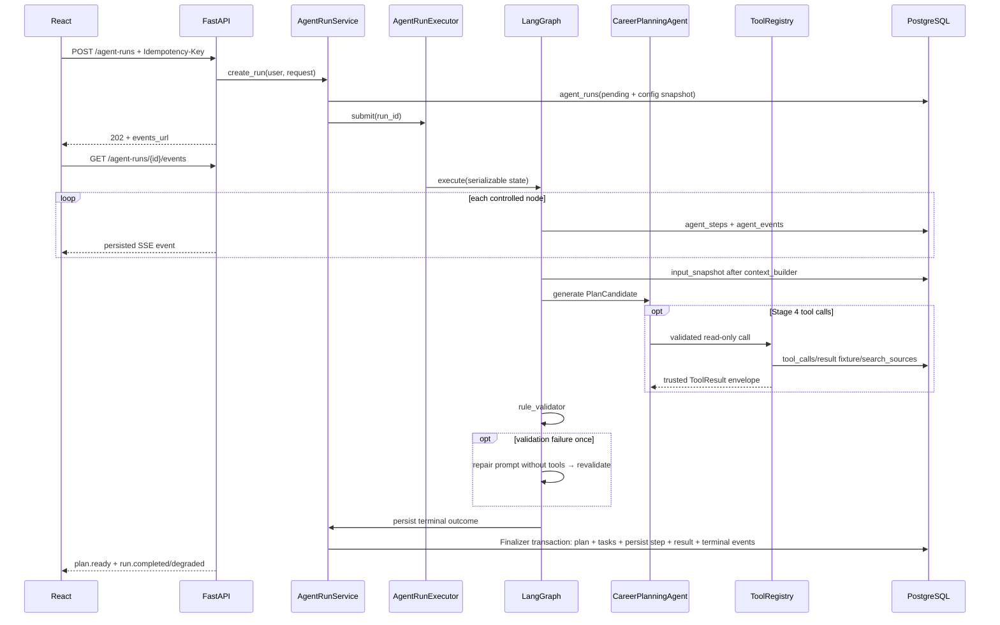

# FM-02：生成计划

## 关键分支

- Profile 缺字段：result_kind=clarification + Run degraded；
- 高风险：result_kind=safe_response + Run degraded；
- 模型格式错：格式修复一次，不重跑 Tool；
- 规则不通过：专用 repair 一次，不重新进入 Agent Tool 循环；
- repair 仍失败：模板 Plan + result_kind=plan + Run degraded；
- Deadline：Run failed；
- 用户取消：cancel_requested_at + Run cancelled；
- SSE 断线：使用 Last-Event-ID 回放。

## 验收

- 一个 Run 最多产生一个 final_plan_id；
- completed 必须有 Plan，degraded 必须有 result_kind；
- 每个非 heartbeat SSE 事件已在 agent_events 持久化；
- 每个 Run 只有一个 terminal event；
- 新计划包含 1~8 周方向/weekly_focus，并展开从 planning_date 开始的 7 天执行表；每天默认 1 个关键任务；
- 同用户不能并发两个活动 Run；
- input/config snapshot 可用于 Replay；
- Stage 3 无 Tool，Stage 4 Tool 预算和白名单生效。
