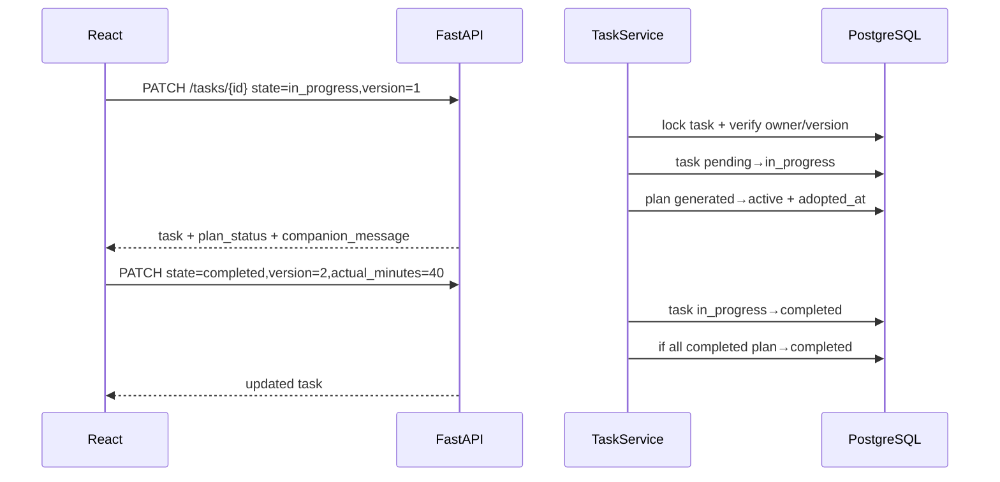

# FM-03：任务执行

```mermaid
sequenceDiagram
    participant FE as React
    participant API as FastAPI
    participant SVC as TaskService
    participant DB as PostgreSQL
    FE->>API: PATCH /tasks/{id} state=in_progress,version=1
    SVC->>DB: lock task + verify owner/version
    SVC->>DB: task pending→in_progress
    SVC->>DB: plan generated→active + adopted_at
    API-->>FE: task + plan_status + companion_message
    FE->>API: PATCH state=completed,version=2,actual_minutes=40
    SVC->>DB: task in_progress→completed
    SVC->>DB: if all completed plan→completed
    API-->>FE: updated task
```

放弃路径要求 abandoned_reason；other 时要求 reason_text。expired 只能由系统 Job 写入。
