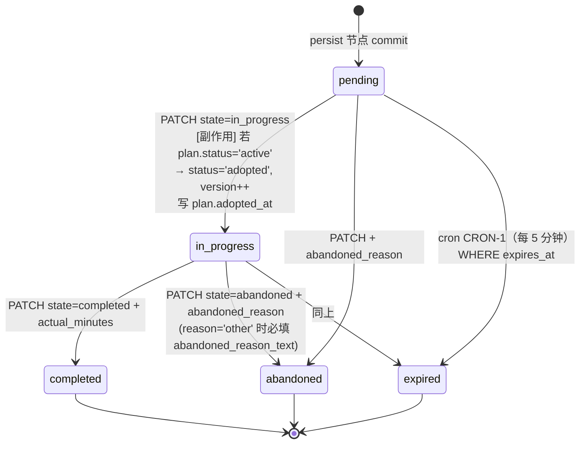
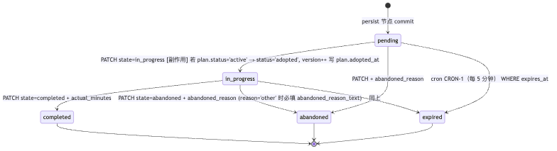
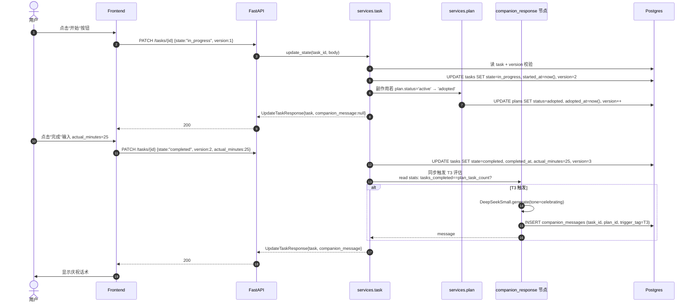
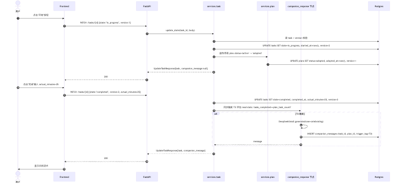
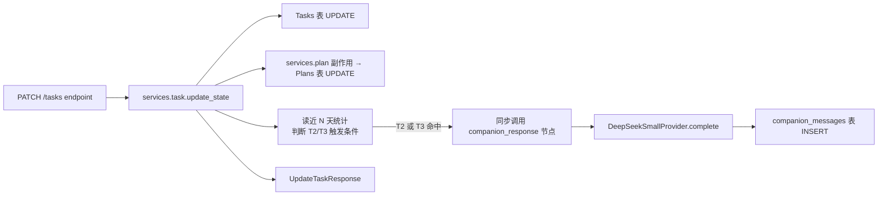
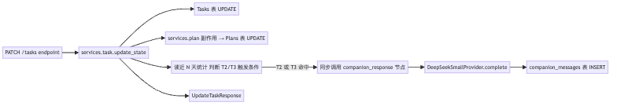

# 03-task-execution.md — 功能模块：今日任务推进

| 项目 | 内容 |
|---|---|
| 模块编号 | FM-03 |
| 业务定位 | 用户对今日任务卡的操作：开始 / 完成 / 放弃 + 自动过期 |
| PRD §6 出处 | "今日任务卡：开始/完成/放弃"（P0） |
| 用户旅程出处 | [PRD §5.1 Happy Path](../../overview/product-overview.md) "今日任务卡" 段 |
| 涉及端点 spec | [tasks.md](../api-spec/tasks.md)、[plans.md](../api-spec/plans.md) |
| 涉及表 | `tasks`、`plans`、`companion_messages`、`agent_steps`（仅监控字段关联） |
| 涉及节点 | `companion_response`（用于完成/放弃触发 T2/T3 时刻） |
| 涉及 Provider | LLMProvider（小模型，仅 companion）；不调 Search/Embedding |

---

## A. 模块概览

本模块的核心是把"任务卡的 3 个用户动作"驱动任务状态机和 plan 状态机联动：

- **start** (pending → in_progress)：副作用触发 plan.status=adopted（决策 2，[plan-status.mmd](../state-machines/plan-status.mmd)）
- **complete** (in_progress → completed)：必填 `actual_minutes`；可能触发 T3 庆祝话术
- **abandon** (pending/in_progress → abandoned)：必填 `abandoned_reason` + 当 reason='other' 时必填 `abandoned_reason_text`；可能触发 T2 减量共情
- **expire**：逾期自动转 expired（cron CRON-1，[cron-and-workers.md](../../architecture/cron-and-workers.md)）

每个 task 操作都要返回完整的 task 对象 + 可选 companion_message（[tasks.md UpdateTaskResponse](../api-spec/tasks.md) 新字段）。

---

## B. 业务流程图（3.1）

### B.1 任务状态机及副作用



**渲染图**：

### B.2 用户操作时序



**渲染图**：

---

## C. 接口与请求字段清单（3.2）

| # | 业务动作 | HTTP / 路径 | 必填 Request 字段 | Request 示例 | 触发时机 |
|---|---|---|---|---|---|
| 1 | 查今日任务 | GET /api/v1/tasks/today | header `Authorization`；无 body | —— | 进主屏 |
| 2 | 查任务列表（带筛选）| GET /api/v1/tasks | Query：`date/status/plan_id/cursor/limit` | `?date=2026-07-26&status=completed&limit=20` | 历史 |
| 3 | 开始任务 | PATCH /api/v1/tasks/{task_id} | header `Authorization` + `Idempotency-Key`；body：`state="in_progress"` + `version` | `{"state":"in_progress","version":1}` | 用户点开始 |
| 4 | 完成任务 | PATCH /api/v1/tasks/{task_id} | body：`state="completed"` + `version` + `actual_minutes` | `{"state":"completed","version":2,"actual_minutes":25}` | 用户点完成 |
| 5 | 放弃任务 | PATCH /api/v1/tasks/{task_id} | body：`state="abandoned"` + `version` + `abandoned_reason` + （reason='other' 时）`abandoned_reason_text` | `{"state":"abandoned","version":2,"abandoned_reason":"no_time"}` | 用户点放弃 |
| 6 | 触发后台过期（系统）| cron CRON-1（无外部 API） | —— | —— | 每 5 分钟 |

### Request 示例（关键）

```http
PATCH /api/v1/tasks/t-1a8b
Authorization: Bearer eyJhb...
Idempotency-Key: idem-8b3c
Content-Type: application/json

{"state":"abandoned","version":2,"abandoned_reason":"other",  "abandoned_reason_text":"今天临时加班，回到宿舍已经 11 点"}
```

```http
GET /api/v1/tasks/today
Authorization: Bearer eyJhb...
```

**Response**（UpdateTaskResponse）
```json
{
  "task": {
    "id": "t-1a8b", "plan_id": "p-9e2a", "order_index": 0,
    "state": "completed", "actual_minutes": 25,
    "started_at": "2026-07-26T01:00:00Z",
    "completed_at": "2026-07-26T01:25:00Z",
    "version": 3
  },
  "companion_message": "你已经完成了第 1 个任务，做得很扎实。这是后续面试讲故事的关键素材。"
}
```

---

## D. 数据表与 CRUD 矩阵（3.3）

| # | 接口 | 影响表 | CRUD | 关键字段 | 状态机 / version |
|---|---|---|---|---|---|
| 1 | GET /tasks/today | `tasks` + JOIN `plans` | R | `tasks.user_id=current_user AND created_at::date=today` | — |
| 2 | GET /tasks | `tasks` | R | 按 query 过滤 + cursor 分页 | — |
| 3 | PATCH state=in_progress | `tasks` + `plans` | U（同一事务）| `tasks.started_at/state/version`；`plans.status='adopted'/adopted_at/version` | task pending→in_progress；plan active→adopted（首次触发时） |
| 4 | PATCH state=completed | `tasks` + 可能写 `companion_messages` | U + C | `tasks.state/completed_at/actual_minutes/version`；T3 时 `companion_messages.plan_id+task_id=T3+celebrating` | task in_progress→completed |
| 5 | PATCH state=abandoned | `tasks` + 可能写 `companion_messages` | U + C | `tasks.state/abandoned_at/abandoned_reason/abandoned_reason_text/version`；T2 触发写 `companion_messages` | task →abandoned（pending/in_progress 均可）|
| 6 | PUT /reviews（联动；不在本模块）| —— | —— | T3/T2 的判断依赖 `tasks` 连续完成数等 | 见模块 04 |

### 不变量

- task.version 与请求带 version 必须等值（乐观锁）；不等返 `409 STATE_VERSION_CONFLICT`
- 完成态/终态（completed/abandoned/expired）→ 任何更新：`409 STATE_TASK_INVALID_TRANSITION`（[task-state.mmd 非法转移](../state-machines/task-state.mmd)）

---

## E. 后端组件依赖（3.4）

### E.1 节点工作流

本模块的 LLM 节点只有一处：`companion_response`（生成 T2/T3 话术）。其余均为 Service 层纯程序逻辑。



**渲染图**：

### E.2 组件清单

| 组件 / 节点 | 代码路径（建议） | Protocol / 接口 | 作用 |
|---|---|---|---|
| `tasks` repositories | `repositories/task.py` | `update_state(task_id, body) → Task` | 含 `WHERE id=? AND version=?` SQL |
| `plans` repositories | `repositories/plan.py` | `mark_adopted_if_active(plan_id) → Plan \| None` | 同事务内的副作用调用 |
| `companion_response` 节点（同步）| `agent/nodes/companion_response.py` | `CompanionInput → CompanionMessage`，调 `LLMProvider.complete(schema=CompanionMessage)` | 输出 T2/T3 话术；LLM 失败用 `core/companion_templates.py` 兜底 |
| LLM Provider | `providers/llm/deepseek.py` + `providers/llm/mock.py` | `LLMProvider.complete()` | 仅供 companion 这一调用用，不调 V4 |
| T2/T3 触发判定 | `services/companion.py::evaluate_trigger_tag(stats)` | 读 reviews.consecutive_abandoned / consecutive_completed + 当前操作上下文 | 决定是否触发，是哪种 trigger_tag |
| TraceWriter | `harness/trace.py` | 写一行 `agent_steps` 仅在 companion 触发时（同步独立的 trace）；非 trace 节点（task/plan 的 UPDATE）不入 agent_steps |

### E.3 不调用的组件

- 不调 `CareerPlanningAgent`、不调 Search/Embedding
- 不调 persist 节点（它是 plan_run 的写入入口；task 的更新走自己的 Service）

---

## F. 模块边界与已知缺口

| 边界 | 描述 |
|---|---|
| 自动完成 | 用户长时间不操作不会自动 complete；只会 expire |
| 同步 vs 异步 companion | 当前 spec 同步调 companion_response；如 V4 LLM 延迟高可考虑后续异步（先返 task，稍后 patch companion_message）—— 阶段五 TODO 评估性能 |
| 多任务并发 | 用户可同时多 task in_progress（不强制串行） |

### 待办

- T3/T2 判定依赖 `reviews.consecutive_abandoned/consecutive_completed`——但 reviews 表是用户提交复盘后才写。**首次完成任务（无 review）**时该字段读取默认 0，逻辑上是 OK 的；但 spec 应明示。
