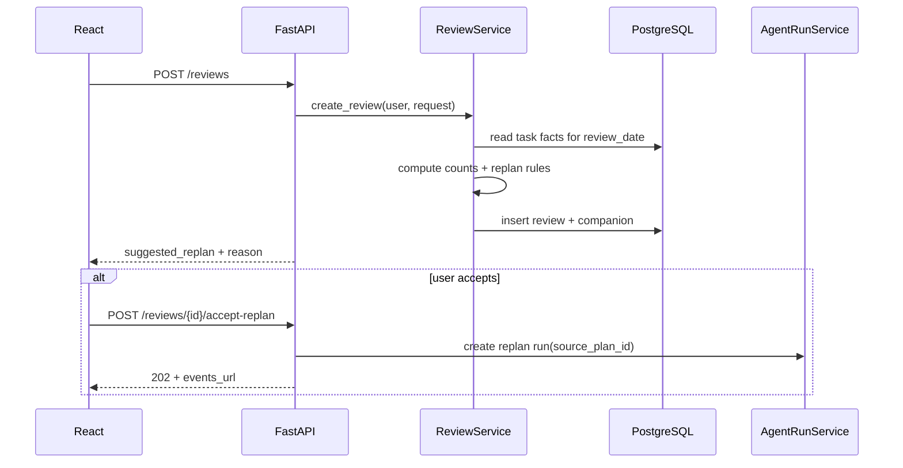

# FM-04：复盘与重规划

```mermaid
sequenceDiagram
    participant FE as React
    participant API as FastAPI
    participant RS as ReviewService
    participant DB as PostgreSQL
    participant AR as AgentRunService
    FE->>API: POST /reviews
    API->>RS: create_review(user, request)
    RS->>DB: read task facts for review_date
    RS->>RS: compute counts + replan rules
    RS->>DB: insert review + companion
    API-->>FE: suggested_replan + reason
    alt user accepts
      FE->>API: POST /reviews/{id}/accept-replan
      API->>AR: create replan run(source_plan_id)
      API-->>FE: 202 + events_url
    end
```

旧计划只在新计划成功持久化后归档。新 Run 失败时旧计划保持可用。
