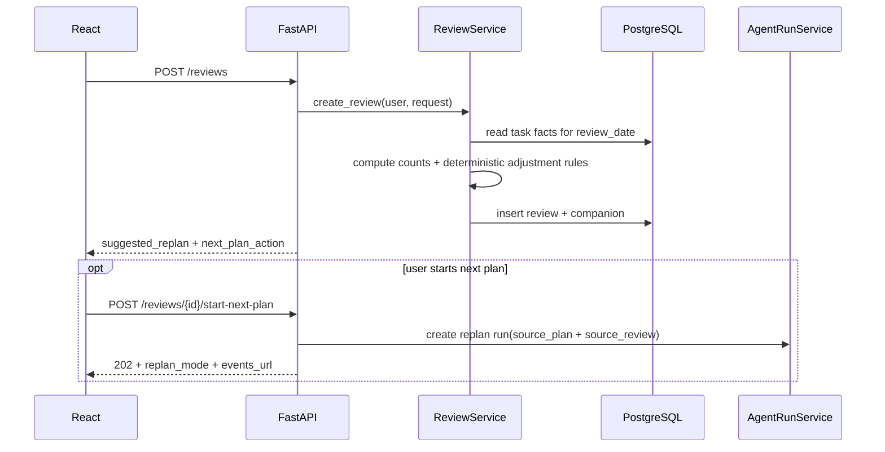

# FM-04：复盘、次日续接与调整

## 两种 next plan

### continue

适用于方向和节奏无需明显调整：

- 保留 overall_direction；
- 延续 weekly_focus，推进下一可执行步骤；
- 读取昨天 completed/abandoned facts；
- 从下一 planning_date 开始滚动生成未来七天行动表；
- 不需要伪造 adjustment_reason。

### adjust

适用于时间变化、持续阻碍、方向确认变化或用户明确要求：

- 保留已完成事实；
- 可修改后续 weekly_focus，但不能未经确认改变 goal_type；
- 必须给出 adjustment_reason；
- 仍只滚动生成从下一 planning_date 开始的七天行动表。

## 约束

- 每条 Review 最多创建一个 next_plan_run_id；
- 无论 continue 还是 adjust，都需要用户点击确认；
- 旧计划只在新计划事务成功提交后归档；
- 新 Run 失败时旧计划保持可查询；
- Review 的任务统计来自数据库，不信任客户端；
- completed Plan 可以作为 next plan 的来源。
- 用户在画像设置页选择“保存并重新规划”时，以显式确认替代 Review 确认：先保存新画像，再用当前 Plan 发起 adjust Run；Run 上下文仍必须读取已完成、进行中和放弃事实。
