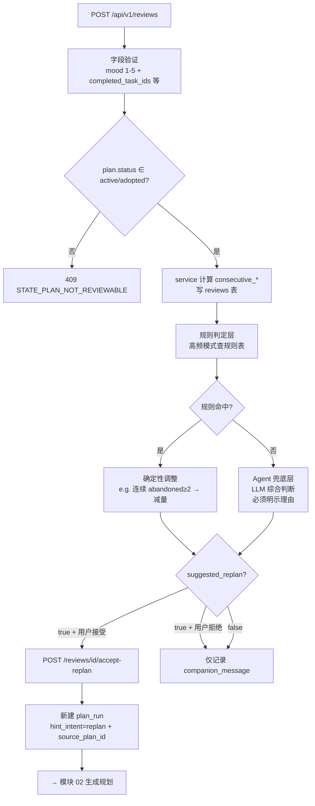
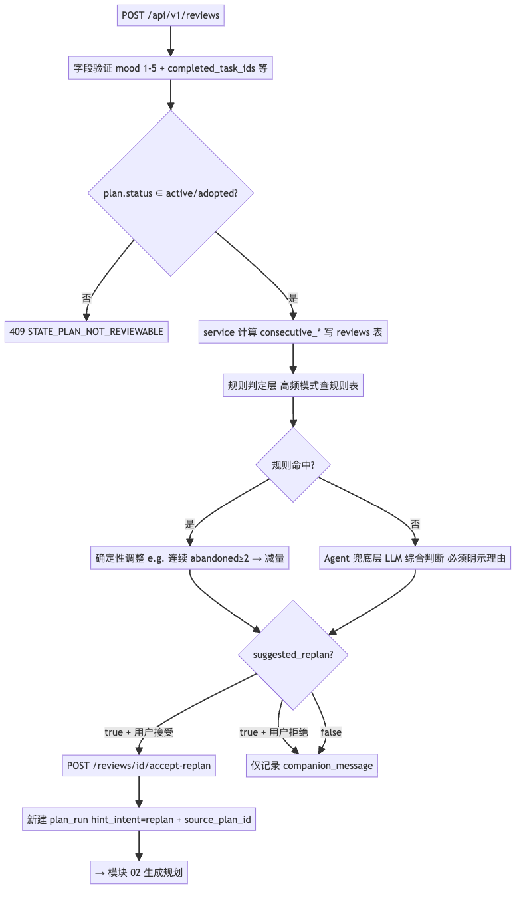
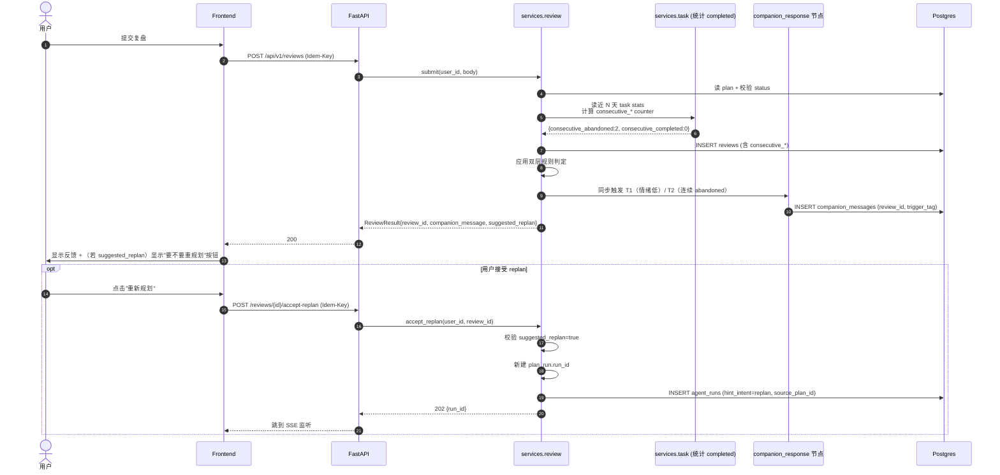
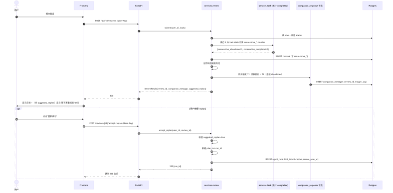
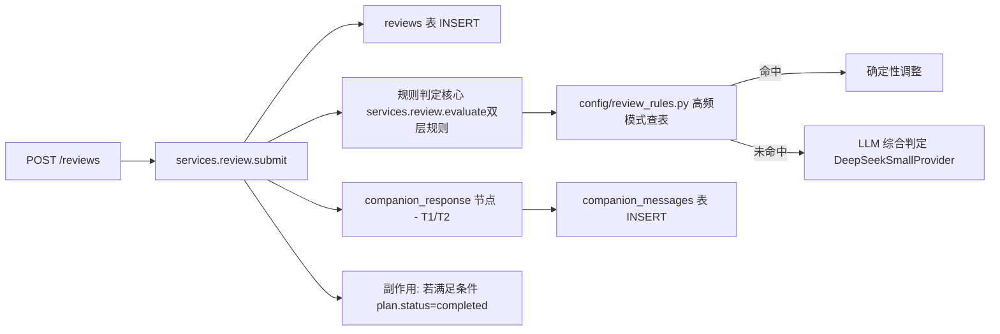
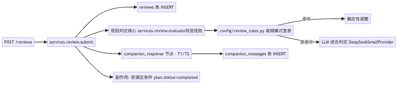

# 04-review-replan.md — 功能模块：每日复盘 + 复盘-调整闭环

| 项目 | 内容 |
|---|---|
| 模块编号 | FM-04 |
| 业务定位 | 用户对当前 plan 的复盘 → 4 项数据采集 → 双层调整判定（规则+Agent 兜底）→ 可选触发 replan |
| PRD §6 出处 | "每日复盘：完成情况/情绪/阻碍/调整"、"复盘-调整：规则驱动+Agent 驱动双层"（P0 两行） |
| 用户旅程出处 | [PRD §5.1 Happy Path](../../overview/product-overview.md) "每日复盘" + "次日续上" 段 |
| 涉及端点 spec | [reviews.md](../api-spec/reviews.md) |
| 涉及表 | `reviews`、`plans`、`tasks`、`companion_messages`、`agent_runs`（如触发 replan） |
| 涉及节点 | `companion_response`（同步）+ 通过模块 02 重启 plan_run |
| 涉及 Provider | LLMProvider（小模型，companion + 规则判定的可选 Agent 兜底） |

---

## A. 模块概览

复盘是 PRD §8 "复盘-调整双层规则（闭环核心）" 的关键。一次复盘流程做 4 件事：

1. **采集 4 项数据**：完成情况（completed/abandoned task_ids）、情绪（mood 1-5）、阻碍（blockers）、调整请求（adjustment_request，决策 16 新字段）
2. **统计连续性**：service 计算 `consecutive_abandoned / consecutive_completed`（决策 18：server-computed）
3. **判断调整策略**：双层判定—— 优先规则驱动（高频模式），不覆盖时由 Agent 兜底（限于 LLM）
4. **回复建议**：返回 `suggested_replan` + companion_message；如 suggested_replan=true 且用户接受 → accept-replan 端点新建 plan_run（决策 12 双路径）

红线（PRD §8.2）：不擅自加量 / 不擅自改方向 / 单日任务量 ±2 / 连续完成不奖励加量 / 连续放弃触发降级而非催促。

---

## B. 业务流程图（3.1）

### B.1 复盘主流程（含双层判定 + replan 触发）



**渲染图**：

### B.2 复盘动作时序



**渲染图**：

---

## C. 接口与请求字段清单（3.2）

| # | 业务动作 | HTTP / 路径 | 必填 Request 字段 | Request 示例 | 触发时机 |
|---|---|---|---|---|---|
| 1 | 提交复盘 | POST /api/v1/reviews | header + `Idempotency-Key`；body：`plan_id` + `mood (1-5)` + `completed_task_ids` + `abandoned_task_ids` + 可选 `blockers` / `adjustment_request` / `free_text` | 见下 | 用户填完问卷 |
| 2 | 列表 | GET /api/v1/reviews | header + Query：`plan_id` / `cursor` / `limit` | `?plan_id=p-9e2a&limit=20` | 历史复盘列表 |
| 3 | 接受建议的 replan | POST /api/v1/reviews/{review_id}/accept-replan | header + `Idempotency-Key`；无 body | —— | suggested_replan=true 时显示按钮 |

### Request 示例

```http
POST /api/v1/reviews
Authorization: Bearer eyJhb...
Idempotency-Key: idem-7d4e

{
  "plan_id": "p-9e2a-...",
  "mood": 2,
  "blockers": "下班太累不想做需要动脑的任务",
  "completed_task_ids": ["t-1a8b-..."],
  "abandoned_task_ids": ["t-2c9d-..."],
  "adjustment_request": "希望明天任务能更短一点"
}
```

```http
POST /api/v1/reviews/rv-3b4f-.../accept-replan
Authorization: Bearer eyJhb...
Idempotency-Key: idem-f8g9
```

---

## D. 数据表与 CRUD 矩阵（3.3）

| # | 接口 | 影响表 | CRUD | 关键字段 | 状态机 / 联动 |
|---|---|---|---|---|---|
| 1 | POST /reviews | `reviews` | C | `user_id` (JWT) / `plan_id` / `mood` / `blockers` / `completed_task_ids`/`abandoned_task_ids` (uuid[]) / `adjustment_request` / `free_text` / `consecutive_*` (server-computed) | — |
| 2 | （同事务）可能 | `plans` | U | 若所有 task 完成 → `status='completed', completed_at=now(), version++` | plan active/adopted→completed（[plan-status.mmd](../state-machines/plan-status.mmd)）|
| 3 | （同事务）| `companion_messages` | C | review_id FK + trigger_tag (T1/T2) + tone + message | — |
| 4 | GET /reviews | `reviews` | R | 按 user_id + plan_id + cursor 分页 | — |
| 5 | POST /accept-replan | `agent_runs` | C | status='pending'，hint_intent=replan，source_plan_id 注入；同时 `reviews.accepted_replan=true` update | run-status[*]→pending；触发模块 02 |

### PlanStatus active/adopted→completed 的判定时机（决策 19）

提交 review 时 service 在**同一事务内**：
```text
IF 满足所有下列条件：
  - plan.status ∈ ('active', 'adopted')
  - reviews.completed_task_ids ⊇ (SELECT id FROM tasks WHERE plan_id=?)
THEN
  plan.status → 'completed', completed_at = now(), version++
```
若条件不满足，plan 状态不变（用户后续仍可触发新的 plan_run）。

### 不变量

- 单次 review 提交仅 1 次（同 Idempotency-Key 24h 内重复返回首次结果）
- `consecutive_abandoned/consecutive_completed` 由 service 写入（不是前端传）
- 用户已 accepted_replan 的 review 不能再次 accept-replan → `409 STATE_REVIEW_ALREADY_ACCEPTED`（错误码建议在阶段五补全到 errors.md）

---

## E. 后端组件依赖（3.4）

### E.1 节点工作流



**渲染图**：

### E.2 组件清单

| 组件 / 节点 | 代码路径（建议） | Protocol / 接口 | 作用 |
|---|---|---|---|
| `reviews` repositories | `repositories/review.py` | `insert(review_obj) → Review` | 含事务边界 |
| `plans` repositories | `repositories/plan.py` | `mark_completed_if_all_tasks_done(plan_id, completed_task_ids) → Plan \| None` | 同事务内的状态机副作用 |
| 规则表 | `config/review_rules.py` | 高频模式查表（デザado 连续 abandon 2 / week_busy / direction_waver / consecutive_completed≥3）| 决策层确定性输出（不调 LLM） |
| LLM Provider (Small) | `providers/llm/deepseek.py` | `LLMProvider.complete(schema=AdjustmentResult)` | 规则未覆盖时 Agent 兜底判定（必须返回明确建议和理由） |
| `companion_response` 节点（同步）| `agent/nodes/companion_response.py` | 同模块 03；可能触发 T1（情绪低 mood ≤ 2 且 tasks_completed>0）+ T2（consecutive_abandoned ≥ 2） | T1 共情 / T2 减量共情 |
| `agent_runs` repositories | `repositories/agent_run.py` | `insert(user_id, intent=replan, source_plan_id) → Run` | 由 accept-replan 端点调用 |

### E.3 双层调整规则（来自 PRD §8.1）

| 类型 | 触发 | 调整动作 | 输出 |
|---|---|---|---|
| 规则 | 连续 abandon ≥ 2 | starter_action 拆细 + 量减半 | suggested_replan=true + adjustment_reason |
| 规则 | "本周很忙"（用户文本匹配）| 单任务 ≤60min 硬上限 | suggested_replan=true |
| 规则 | "方向动摇" | 不擅自改方向；引导用户主动确认 | suggested_replan=false（用户必须主动发起 hint_intent=replan）|
| 规则 | consecutive_completed ≥ 3 | 不加量 + 平稳鼓励 | suggested_replan=false |
| Agent 兜底 | 上述规则不覆盖 | LLM 综合判断 + 明示理由 | suggested_replan 可 true/false（含 adjustment_reason）|

### E.4 不调用的组件

- 不调 V4 LLM（只用小模型）
- 不调 Search/Embedding

---

## F. 模块边界与已知缺口

| 边界 | 描述 |
|---|---|
| 复盘时机约束 | 必须 plan.status ∈ {active, adopted}；completed/archived 状态返 409 STATE_PLAN_NOT_REVIEWABLE（决策 17 重定义）|
| 部分 task 完成的复盘 | 允许（completed 和 abandoned 数组互不依赖）；plan 不变 completed 状态 |
| 中途继续 vs 重规划 | 若用户已经 accept-replan，原 plan 保持 active/adopted，新 plan 由 source_plan_id 引用；后续 cron 会归档旧 plan（90 天）|

### 待办

- 添加错误码 `STATE_REVIEW_ALREADY_ACCEPTED` 到 [errors.md](../api-spec/errors.md)（阶段五 TODO）
- Agent 兜底层的 prompt 模板的具体措辞（`prompts/adjustment/v1.py`）需在 [standards/prompts/](../../standards/prompts/) 下细化——已超出本任务范围
