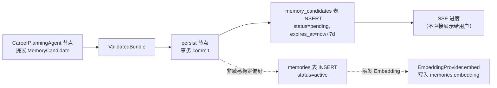
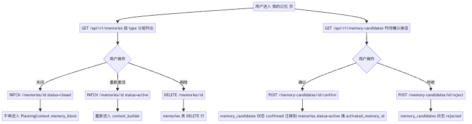
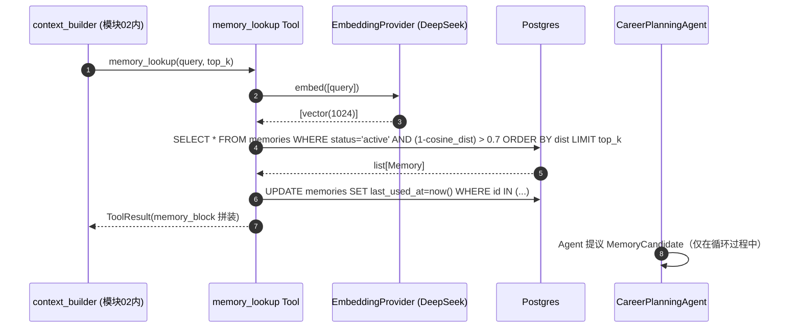
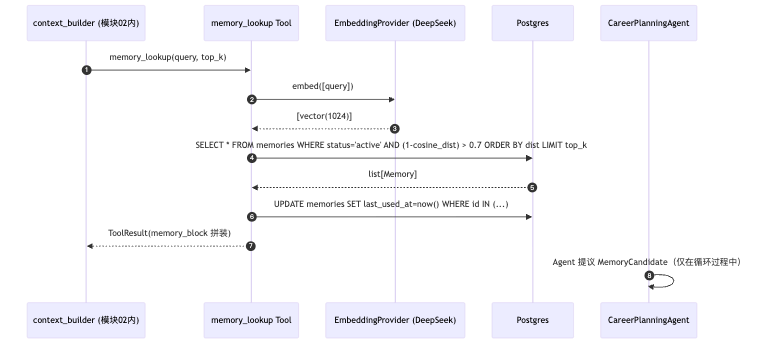

# 05-memory-management.md — 功能模块：记忆管理 + 敏感候选

| 项目 | 内容 |
|---|---|
| 模块编号 | FM-05 |
| 业务定位 | 用户对自己长期记忆/敏感候选的查看/确认/关闭/删除；以及 Agent 如何把这些记忆带回上下文 |
| PRD §6 出处 | "记忆管理：查看/删除/关闭"（P0） + "敏感记忆确认：candidates 池 → 用户确认后写入"（P0）|
| 用户旅程出处 | [PRD §5.1](../../overview/product-overview.md) 多处：建档发现的偏好、复盘阻碍、执行 pattern |
| 涉及端点 spec | [memories.md](../api-spec/memories.md) |
| 涉及表 | `memories`、`memory_candidates`、`agent_steps`（用户确认动作写 trace） |
| 涉及节点 | `context_builder`（读 memories 进上下文）；`career_planning_agent`（提议 candidates）；`persist`（写 candidates 与确认后迁入 memories）|
| 涉及 Provider | EmbeddingProvider（DeepSeek 1024），LLMProvider（context_builder 可能调 context_summarize） |

---

## A. 模块概览

按 PRD §3.3 与 ADR-006，记忆系统分两层（决策 5/20 收敛后）：

1. **主记忆表 `memories`**：4 类型（profile_fact / stable_preference / execution_pattern / session_temp），不含敏感；用户主表控制（LIST/DELETE/PATCH close）
2. **候选池 `memory_candidates`**：敏感内容（health/finance/family/strong_emotion）+ Agent 主动提议的非敏感稳定偏好（被自动归类为"需用户确认"的）；7 天未确认 cron 清理

主行为：
- **写入**：仅由 persist 节点（plan_run 内）或 task/review 副作用调用 `services.memory.write*` 写入；绝不在外部接口直接 POST
- **激活迁移**：用户在 candidates 页面点"确认" → 写入 memories 表（status=active）+ UPDATE candidate.status=confirmed + activated_memory_id
- **关闭/删除**：用户PATCH 切换 status=active/closed；DELETE 真删行

---

## B. 业务流程图（3.1）

### B.1 写入路径（plan_run 内）



**渲染图**：

### B.2 用户确认/管理路径

```mermaid
flowchart TD
    ENTER[用户进入"我的记忆"页] --> LIST[GET /api/v1/memories<br/>按 type 分组列出]
    ENTER --> CAND[GET /api/v1/memory-candidates<br/>列待确认候选]
    CAND --> CONFIRM{用户操作}
    CONFIRM -->|确认| ACCEPT[POST /memory-candidates/id/confirm]
    CONFIRM -->|拒绝| REJECT[POST /memory-candidates/id/reject]
    ACCEPT --> MIG[memory_candidates 状态 confirmed<br/>迁移到 memories.status=active<br/>填 activated_memory_id]
    REJECT --> REJC[memory_candidates 状态 rejected]
    LIST --> OPS{用户操作}
    OPS -->|关闭| CLOSE[PATCH /memories/id status=closed]
    OPS -->|重新激活| ACT[PATCH /memories/id status=active]
    OPS -->|删除| DEL[DELETE /memories/id]
    CLOSE --> INACTIVECtx[不再进入 PlanningContext.memory_block]
    ACT --> ACTIVECtx[重新进入 context_builder]
    DEL --> HARDDEL[memories 表 DELETE 行]
```

**渲染图**：

---

## C. 接口与请求字段清单（3.2）

| # | 业务动作 | HTTP / 路径 | 必填 Request 字段 | Request 示例 | 触发时机 |
|---|---|---|---|---|---|
| 1 | 列记忆 | GET /api/v1/memories | header；Query：`type` / `include_sensitive`(默认 false) / `cursor` / `limit` | `?type=stable_preference&limit=50` | 用户进入"我的记忆"|
| 2 | 关闭/激活记忆 | PATCH /api/v1/memories/{id} | header + `Idempotency-Key` + `If-Match-Version`；body：`status` + `version` | `{"status":"closed","version":3}` | 用户切开关 |
| 3 | 删除记忆 | DELETE /api/v1/memories/{id} | header | —— | 用户删 |
| 4 | 列待确认候选 | GET /api/v1/memory-candidates | header + Query：`status` (默认 pending) / `cursor` / `limit` | `?status=pending&limit=20` | 用户进入候选页 |
| 5 | 确认候选 | POST /api/v1/memory-candidates/{id}/confirm | header + `Idempotency-Key` | —— | 用户点击"加入我的记忆" |
| 6 | 拒绝候选 | POST /api/v1/memory-candidates/{id}/reject | header + `Idempotency-Key` | —— | 用户点击"忽略" |

### Request/Response 示例

```http
GET /api/v1/memory-candidates?status=pending
Authorization: Bearer eyJhb...
```
Response：
```json
{
  "items": [
    { "id":"mc-7c1d", "memory_type":"sensitive_content",
      "content_json":{"category":"health","note":"用户提到焦虑问题"},
      "sensitivity":"sensitive", "status":"pending",
      "expires_at":"2026-08-02T10:00:00Z" }
  ],
  "next_cursor": null
}
```

确认响应（200 Memory）：
```json
{
  "id":"m-5e6f", "user_id":"u-7c3e",
  "memory_type":"stable_preference",
  "content_json":{"key":"task_count","value":2,"note":"用户偏好每日 2 个任务"},
  "status":"active", "sensitivity":"none", "confidence":0.85,
  "source":"agent_proposal", "version":1
}
```

---

## D. 数据表与 CRUD 矩阵（3.3）

| # | 接口 | 影响表 | CRUD | 关键字段 | 状态机 / 版本 |
|---|---|---|---|---|---|
| 1 | GET /memories | `memories` | R | 按 user_id + type + status='active'（默认）+ cursor 分页 | — |
| 2 | PATCH /memories/{id} | `memories` | U | `status` active↔closed + `closed_at` + `version++` | memories status active↔closed |
| 3 | DELETE /memories/{id} | `memories` | D | `WHERE id=? AND user_id=current_user` 真删行 | — |
| 4 | GET /memory-candidates | `memory_candidates` | R | WHERE user_id + status 和 expires_at 过滤 + cursor | — |
| 5 | POST .../confirm | `memory_candidates` + `memories` | U + C（同事务） | candidate.status=confirmed+confirmed_at；INSERT memories(status=active, source=agent_proposal)；回填 candidate.activated_memory_id | candidate pending→confirmed |
| 6 | POST .../reject | `memory_candidates` | U | status=rejected | candidate pending→rejected |

### Cron

- CRON-2 每小时：删 candidate WHERE status='pending' AND expires_at<now()
- CRON-3 每天 03:00：删 memories WHERE type='session_temp' AND expires_at<now()

### 不变量

- `memories.embedding` 维度严格 1024；非 execution_pattern 类型可空
- `memories.sensitivity='none'`（决策 5/20：敏感只走 candidates，sensitivity='sensitive' 取值废弃）

---

## E. 后端组件依赖（3.4）

### E.1 涉及节点序列



**渲染图**：

### E.2 组件清单

| 组件 | 代码路径（建议） | Protocol / 接口 | 作用 |
|---|---|---|---|
| `memories` repositories | `repositories/memory.py` | `list/get/update_status/delete` + `update_last_used_at(ids)` | 主表 CRUD |
| `memory_candidates` repositories | `repositories/memory_candidate.py` | `list_pending/confirm(id, user_id)/reject(id, user_id)` | 候选池操作；confirm 内含同事务迁入 memories |
| `memory_lookup` Tool | `tools/memory_lookup.py` | 走 `harness/tool_executor` 包装 | context_builder 调用：embed + 向量召回 + last_used_at 更新 |
| EmbeddingProvider | `providers/embedding/deepseek.py` + `providers/embedding/__init__.py` mock | `EmbeddingProvider.embed(texts) → list` | 1024 维向量；既有写入路径同样用它（写 memories.embedding）|
| Migration Service | `services/memory.migrate_candidate(candidate_id, user_id)` | 单事务：UPDATE candidate + INSERT memories + 回填 activated_memory_id | 被 confirm 端点调用 |
| TraceWriter | 仅 candidate confirm 时写一行 `agent_steps`（node_name='user_action'，可选）| —— | 阶段五评估是否需要 |

### E.3 自检约束

- **INV-3** (persist)：敏感候选必须先入候选池，不得直接激活——Repository 层 SQL 加 CHECK 或应用 validator 守
- **INV-4**：候选 7 天未确认过期——cron 实现（[cron-and-workers.md CRON-2](../../architecture/cron-and-workers.md)）

### E.4 不调用的组件

- 不调 Search（memory_lookup 是 RAG，不是联网）
- 不调 V4 LLM（Embedding 而非生成）
- 不调 companion_response（用户管理动作不触发陪伴话术）

---

## F. 模块边界与已知缺口

| 边界 | 描述 |
|---|---|
| 用户看不到候选来源 run | UI 不暴露 proposed_by_run_id（避免"AI 暗中记录我"感）；仅显示内容 |
| 候选二次提议 | 同一内容若已 rejected 不再提议（应用层 dedup 哈希，需 spec 明示）—— 阶段五 TODO |
| 记忆版本 | memories.version 字段已加（PATCH 关闭时用）；memory_candidates 无 version（候选生命周期短，幂等接受/拒绝对话）|

### 待办

- candidate 去重哈希（防止 7 天内重复提议）建议加 `content_hash varchar(64)` 列 + 唯一索引 `(user_id, content_hash)`——阶段五 TODO
