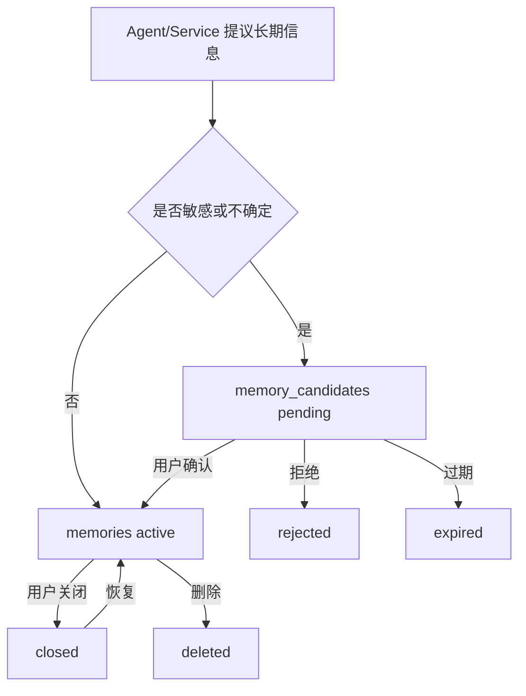

# FM-05：记忆管理

```mermaid
flowchart TD
    A[Agent/Service 提议长期信息] --> B{是否敏感或不确定}
    B -->|否| M[memories active]
    B -->|是| C[memory_candidates pending]
    C -->|用户确认| M
    C -->|拒绝| R[rejected]
    C -->|过期| X[expired]
    M -->|用户关闭| CL[closed]
    CL -->|恢复| M
    M -->|删除| D[deleted]
```

高风险 Run 不创建 memory 或 candidate。检索只读取当前用户 active memory。
