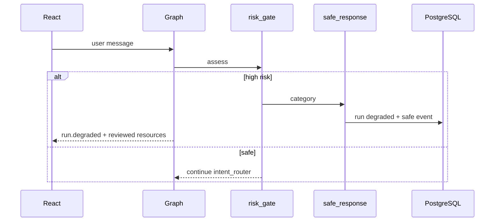

# FM-06：风险分流

```mermaid
sequenceDiagram
    participant FE as React
    participant G as Graph
    participant RG as risk_gate
    participant SR as safe_response
    participant DB as PostgreSQL
    FE->>G: user message
    G->>RG: assess
    alt high risk
      RG->>SR: category
      SR->>DB: run degraded + safe event
      G-->>FE: run.degraded + reviewed resources
    else safe
      RG-->>G: continue intent_router
    end
```

安全资源从集中配置读取并由人工审核。项目不在 spec 中猜测用户所在国家或硬编码可能变化的热线。
