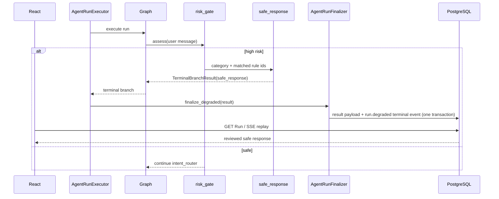

# FM-06：风险分流

```mermaid
sequenceDiagram
    participant FE as React
    participant EX as AgentRunExecutor
    participant G as Graph
    participant RG as risk_gate
    participant SR as safe_response
    participant F as AgentRunFinalizer
    participant DB as PostgreSQL
    EX->>G: execute run
    G->>RG: assess(user message)
    alt high risk
      RG->>SR: category + matched rule ids
      SR-->>G: TerminalBranchResult(safe_response)
      G-->>EX: terminal branch
      EX->>F: finalize_degraded(result)
      F->>DB: result payload + run.degraded terminal event (one transaction)
      FE->>DB: GET Run / SSE replay
      DB-->>FE: reviewed safe response
    else safe
      RG-->>G: continue intent_router
    end
```

安全资源从集中配置读取并由人工审核。项目不猜测用户所在国家、不硬编码可能变化的热线。high 路径不调用规划 Agent、Tool、Search、Memory 写入；Agent 节点不直接操作 ORM。
