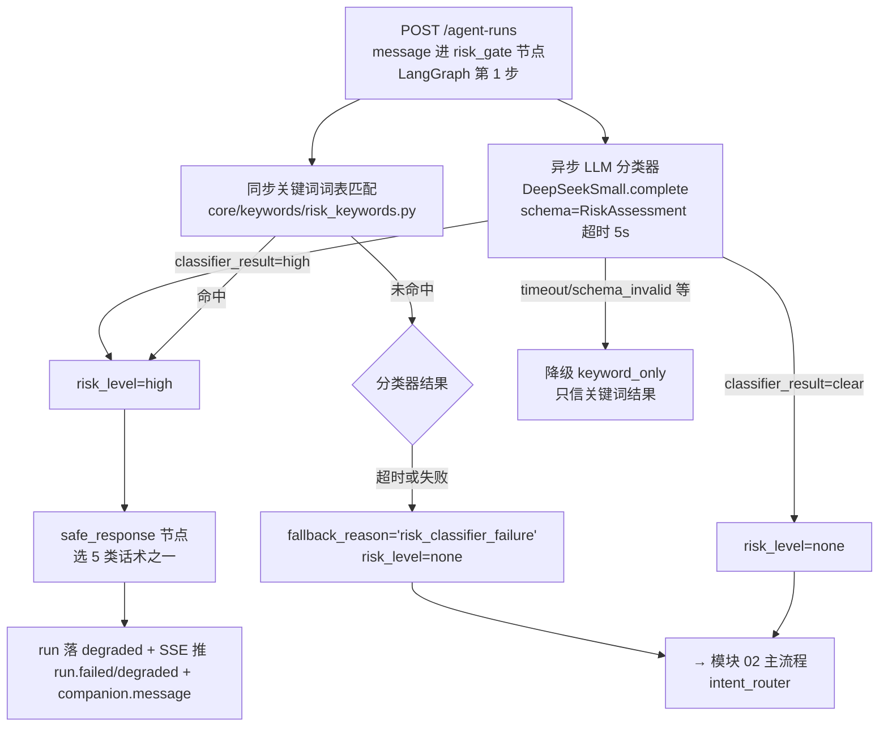
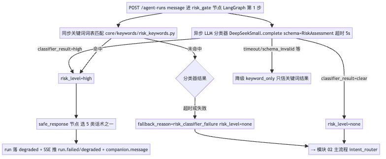
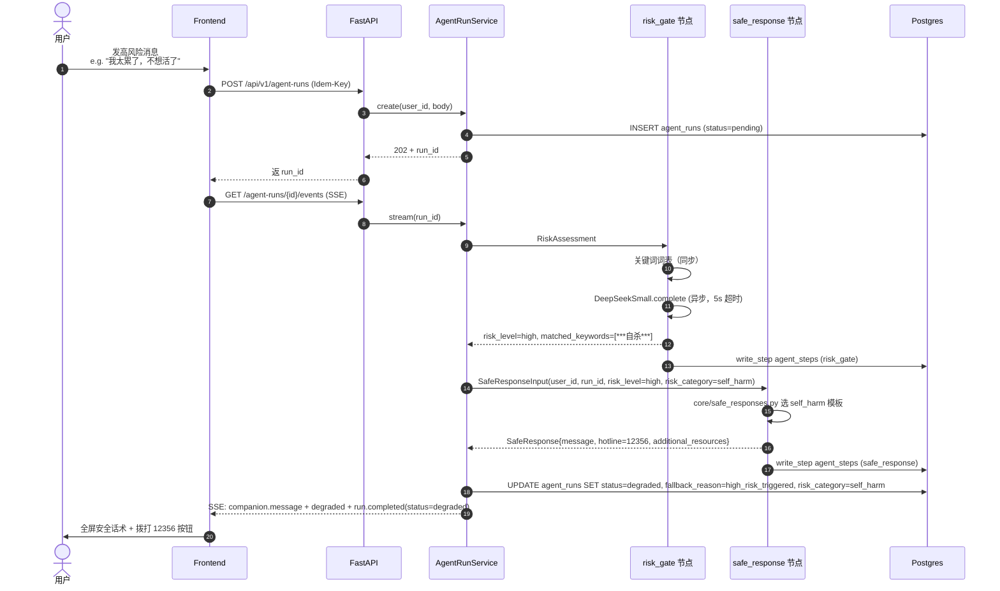
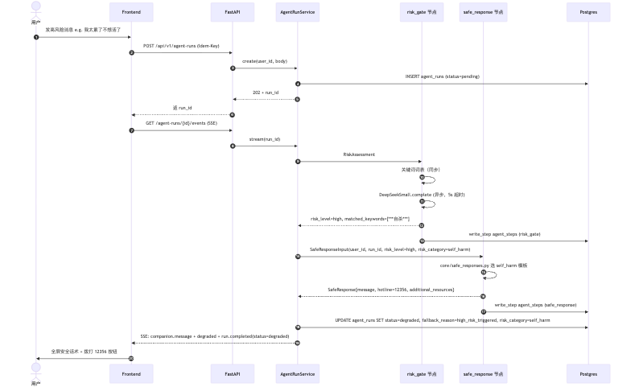

# 06-risk-triage.md — 功能模块：安全分流

| 项目 | 内容 |
|---|---|
| 模块编号 | FM-06 |
| 业务定位 | 高风险请求识别 → 固定话术 + 援助资源；不入记忆；后台脱敏告警 |
| PRD §6 出处 | "安全分流：高风险识别 + 固定话术 + 12356"（P0） |
| 涉及端点 spec | [agent-runs.md POST + GET](../api-spec/agent-runs.md) |
| 涉及表 | `agent_runs`（status=degraded）、`agent_steps`（risk_gate + safe_response 各 1 行）、`tools_calls`（不写，本分支不调 Tool） |
| 涉及节点 | `risk_gate`（入口判定）、`safe_response`（输出固定话术） |
| 涉及 Provider | LLMProvider（小模型，仅 risk_gate 异步分类器用，失败可降级到关键词词表）；safe_response 不调 LLM |

---

## A. 模块概览

这是产品的**安全合规底线模块**。任何进入 plan_run 的用户消息必须先过 `risk_gate`（LangGraph 第 1 步）。一旦判定 `risk_level=high`：

1. 直接路由到 `safe_response` 节点（跳过 intent_router 之后所有节点）
2. safe_response 输出 5 类固定话术之一 + 援助资源
3. run 走 degraded 路径，状态沉为 `degraded`，fallback_reason='high_risk_triggered'
4. **不写入 memories/memory_candidates**（INV-3 / safe_response INV-2）
5. 后台脱敏记录（trace 字段 risk_category、hotline_provided）

产品红线（PRD §2.2 / §9.3）：
- 心理危机误判/漏判 = 0（MVP 标准）
- 必须包含 "12356" 字符串
- 话术不经 LLM 生成（避免意外的"安抚式忽略"——INV-4）

入口路径：唯一用户消息入口（POST /agent-runs 内）；模块 02/03/04 都先经此模块的 risk_gate。

---

## B. 业务流程图（3.1）

### B.1 风险分流判定与输出



**渲染图**：

### B.2 完整端到端时序



**渲染图**：

---

## C. 接口与请求字段清单（3.2）

| # | 业务动作 | HTTP / 路径 | 必填 Request 字段 | Request 示例 | 触发时机 |
|---|---|---|---|---|---|
| 1 | 发消息（入口同模块 02）| POST /api/v1/agent-runs | header + Idem-Key；body：`message`（必填） + 可选 `goal_type_override` / `hint_intent` | `{"message":"我太累了，有时候不想活了"}` | 任何用户消息 |
| 2 | SSE 订阅（同模块 02）| GET /api/v1/agent-runs/{id}/events | header `Accept: text/event-stream` | —— | run 启动后 |
| 3 | 查最终权威状态 | GET /api/v1/agent-runs/{id} | header | —— | SSE 完成后 |

### 关键响应字段（risk 透出）

GET /agent-runs/{id} 当 status=degraded 且 fallback_reason='high_risk_triggered' 时：
```json
{
  "run_id": "uuid-run-002",
  "status": "degraded",
  "plan": null,
  "companion_message": "我能感受到你现在很难受...",
  "fallback_reason": "high_risk_triggered",
  "risk_category": "self_harm",
  "hotline": "12356 全国心理援助热线",
  "additional_resources": ["https://www.12356.cn/"]
}
```

> 字段已在 [agent-runs.md RunDetailResponse](../api-spec/agent-runs.md) 增补（决策见 gap-analysis §7）。

---

## D. 数据表与 CRUD 矩阵（3.3）

| # | 节点 | 影响表 | CRUD | 关键字段 | 状态机 |
|---|---|---|---|---|---|
| 1 | Service 创建 run | `agent_runs` | C | status='pending'，session_id | run-status pending |
| 2 | `risk_gate` 节点 | `agent_steps` | C | node_name='risk_gate'、trace_data 含 risk_level/matched_keywords/assessment_method | — |
| 3 | `safe_response` 节点 | `agent_steps` | C | node_name='safe_response'、trace_data.risk_category | — |
| 4 | Service 结束 run | `agent_runs` | U | status='degraded' / finished_at / fallback_reason='high_risk_triggered' / risk_category（自填）| run-status running→degraded |
| 5 | 后台监控告警 | `agent_steps` 或独立 `safe_response_events`（推荐新建表） | R / I（推送给 ops） | 读最近 N 条 safe_response 步骤 | — |

### 不写入的表（强制约束）

| 表 | 不写入理由 |
|---|---|
| `memories` / `memory_candidates` | INV-3 / safe_response INV-2：高风险相关内容绝不入长期记忆 |
| `plans` / `tasks` / `companion_messages` | 高风险分支没有 plan 输出，也无业务话术（safe_response 输出的是固定模板，不入 companion_messages 表；该表只存 LLM 生成的话术）|
| `tool_calls` | 本分支不调任何 Tool |

---

## E. 后端组件依赖（3.4）

### E.1 节点组件清单

| 组件 / 节点 | 代码路径（建议） | Protocol / 接口 | 作用 |
|---|---|---|---|
| `risk_gate` 节点 | `agent/nodes/risk_gate.py` | 输出 `RiskAssessment`；调 `LLMProvider.complete(schema=RiskAssessment)` 异步分类 | 双重检测：词表（同步） + LLM（异步）|
| 关键词词表 | `core/keywords/risk_keywords.py` | list[str]，按 5 类别归档 | 同步预过滤，**绝不与 LLM 输出拼接成 prompt**（防泄漏）|
| LLM Provider (Small) | `providers/llm/deepseek.py` + `providers/llm/mock.py` | `LLMProvider.complete(messages, schema)` | 仅做"是否 high 风险"分类；**输入前预脱敏** |
| 模板（风险分类）Prompt | `prompts/risk_gate/v1.py` | —— | LLM 分类器系统 prompt |
| `safe_response` 节点 | `agent/nodes/safe_response.py` | 输出 `SafeResponse`，**无 LLM 调用** | 选 5 类话术之一 + 援助资源固定输出 |
| 固定话术模板 | `core/safe_responses.py` | dict[risk_category, message_template] | 5 种 self_harm / mental_health / legal / financial / other 各一条 |
| TraceWriter | `harness/trace.py` | `write_step(...)` | 写两行 agent_steps；脱敏词进入 trace |

### E.2 5 类固定话术（来自 [safe_response.spec.md §3](../agent-nodes/safe_response.spec.md)）

| risk_category | 话术示例（节选） | 援助资源 |
|---|---|---|
| self_harm | "如果你有伤害自己的念头，**请立即拨打 12356 或 110**。" | 110/120 |
| mental_health | "我注意到你可能正在经历困难时刻。你的感受是真实的，不孤单..." | 12356 |
| legal | "我无法在法律上给出准确建议，请咨询专业机构。" | 当地法律援助 |
| financial | "在财务方面，建议咨询专业顾问。" | —— |
| other | "你的情况可能需要专业帮助..." | 12356 |

### E.3 INV 与红线对应

| INV | 内容 | 实现位置 |
|---|---|---|
| INV-1 | `risk_logged == True` | agent_steps trace 强制写 |
| INV-2 | 不写入长期记忆 | safe_response/outgoing hook 检查 |
| INV-3 | 必须包含 "12356" 字符串 | core/safe_responses.py 模板内置 |
| INV-4 | 话术不经 LLM 生成 | safe_response 节点本身是程序节点 |

### E.4 后台告警（决策 21 已确认 MVP 范围）

- 写 trace，**不接推送通道**（MVP 范围 [gap-analysis 决策 21](./gap-analysis.md)）
- 后续 WORKER-2（[cron-and-workers.md](../../architecture/cron-and-workers.md)）阶段 6 落地：扫描 agent_steps WHERE node_name='safe_response' 推送给 ops 通道

---

## F. 模块边界与已知缺口

| 边界 | 描述 |
|---|---|
| 单次风险分流即结束 run | MVP 不支持"safe_response 后用户继续聊"。下一轮新开 run（决策 22 已确认） |
| 风险分类器失败 | 降级到 keyword_only，trace 记 `fallback_reason='risk_classifier_failure'`；不阻塞 run |
| 关键词词表与 Spell-check | 词表需独立维护；不在 prompt 内拼接（防止 prompt injection）|

### 待办

- 实装 `core/safe_responses.py` 5 模板措辞需经心理学专家评审（阶段 6 产品完整度阶段）
- `risk_keywords.py` 词表需建立分类标签和敏感度分级（防止误伤，比如"我想 dead"是幽默还是真实求助）—— 阶段 5/6 持续优化
