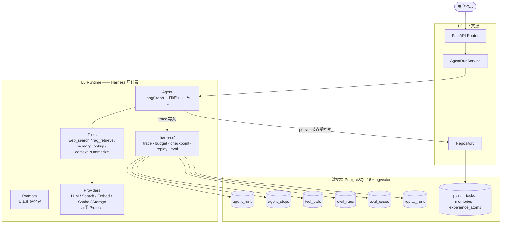
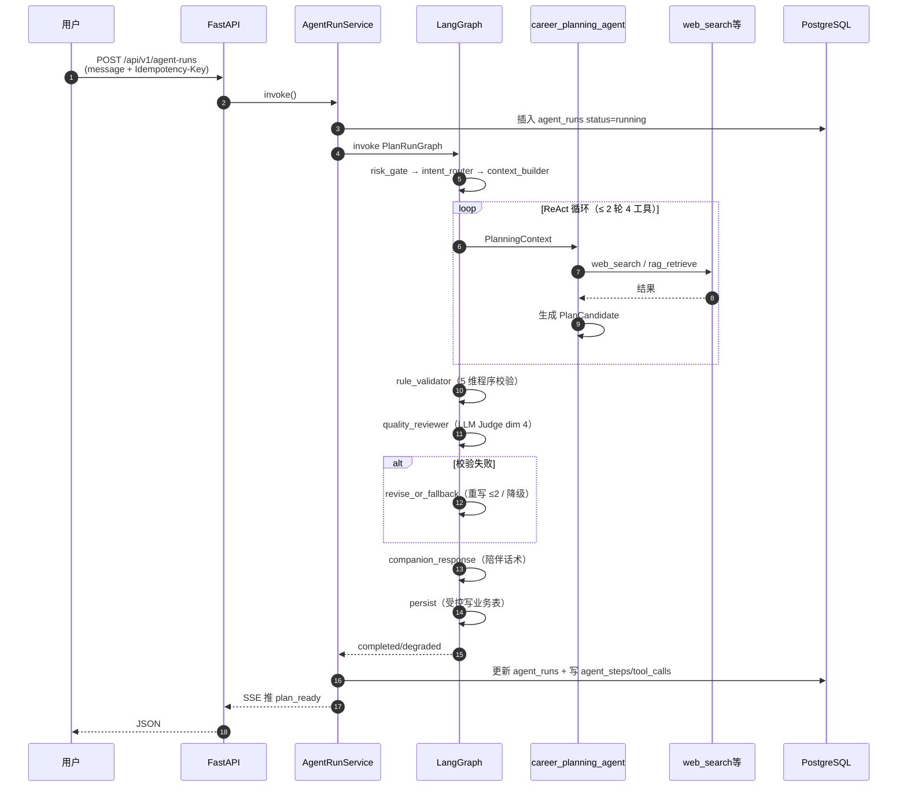
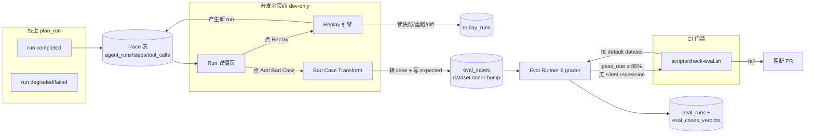
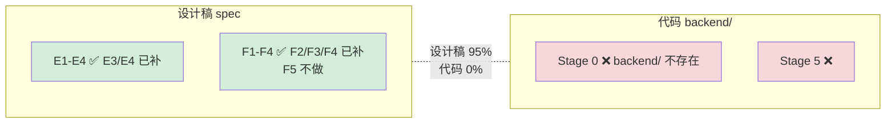
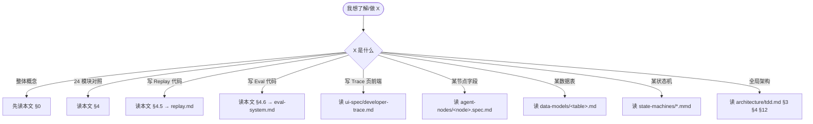
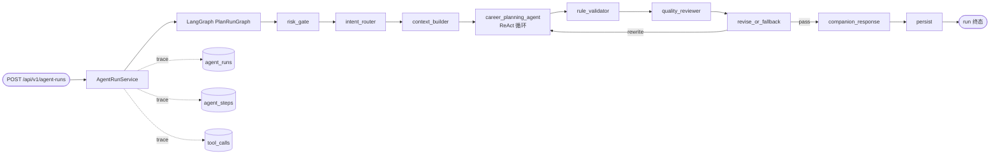
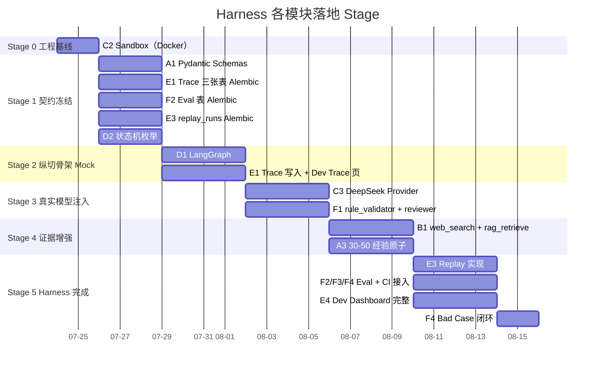

# Harness 总体设计

| 版本 | v1.2 |
|---|---|
| 日期 | 2026-07-24 |
| 状态 | 草稿 |
| 目的 | harness 在本仓库的统一定义、入门图解、模块边界、与已有 spec 的映射；Trace / Replay / Eval 等子文档的入口 |
| v1.1 → v1.2 | §5 仓库结构改为方案 A：`evals/` 与 `harness/` 平级并列（不嵌套）；具体施工总图移至 [implementation-structure.md](./implementation-structure.md) |

---

## 0. 5 分钟入门

### 0.1 一句话定义

> **Agent = Model + Harness。Harness 是"模型权重之外的一切"。**

在本项目里：包裹 DeepSeek V4 之外、让 LLM 从"会回答问题"变成"能在受控工作流中真正跑完一次 plan_run 并可追踪 / 可重放 / 可评测"的工程工件总称。

来源：LangChain《The Anatomy of an Agent Harness》(Trivedy, 2026) + arXiv:2604.21003v3 §2.1 同一定义。

### 0.2 为什么必须有 harness

| 场景 | 没 harness | 有 harness |
|---|---|---|
| Prompt 改了 | 上线看用户反馈才知道——风险大 | Eval + CI 立刻量化 diff |
| 节点跑挂了 | 静默吞错，用户看到空白 | Trace 落表 + 降级 + `fallback_reason` |
| 模型乱编来源 | 用户分辨不出 | 来源标注 + rule_validator 校验 |
| 单 run 飙到 ¥1 | 直接烧钱 | Budget 强制降级 |
| Prompt 升级 v1→v2 | 没法对比 | Replay 同 run 重跑 + diff 可视化 |
| 生产 case 翻车 | 又口头过一次 | Bad Case 一键入 Eval 集，下次 CI 必抓 |

按 AIGOV 教训：**命名为 agent 但实际无 harness 是项目翻车第一条（外部 PDF《Harness-engineering 开源工程分享》P-05）**。harness 是本项目唯一的工程卖点。

### 0.3 harness 在系统中的位置



### 0.4 一次 plan_run 内部时序



### 0.5 反馈层闭环（Replay + Eval + Bad Case）



### 0.6 完成度一图



### 0.7 怎么读这些 spec



### 0.8 FAQ

| Q | A |
|---|---|
| harness 是流程还是思想？ | **工程工件总称**。承载思想、编排流程、体现架构，但作名词是工件（像 Spring Boot） |
| 为什么用 LangGraph 而非 AutoGen？ | ADR-009：LangGraph 是单 Agent + 受控节点立场；AutoGen 是多 agent，已被否决 |
| Replay 与 Eval 区别？ | Replay=对历史真实 run 的 A/B 回放（dev 手动，不进 CI）；Eval=对固定集的快速回归（CI 自动） |
| 为什么 dev API 在生产 fail-fast？ | 避免生产环境泄露用户 trace（含 cost / 输入 hash） |
| Bad Case 流程怎么走？ | Run 详情页点 "Add Bad Case" → transform 为 EvalCase → dataset minor bump → 下次 CI 自动捕获 |
| 能不能堆 spec 不写代码？ | ❌ 反模式 P-01：设计覆盖远超代码。Stage 0-4 期间不要堆新文档 |

---

## 1. 与生产级 product 对标

下表把本项目每个模块对照 GitHub 高 star 开源 harness 项目，作设计合理性的交叉验证：

| 模块类 | 对标项目（可查源码） | 对标机制 | 验证结论 |
|---|---|---|---|
| 编排器 | **LangGraph**（[ADR-009](../../architecture/adr.md) 选型依据） | StateGraph + Checkpointer + 中断 | 与本仓库"单 Agent + 受控节点"立场一致 |
| 状态机 | **OpenHands ConversationState** | 8 态状态机 + EventLog | 本仓库 3 状态机 + 3 trace 表已对齐（外部 PDF《Harness-engineering 开源工程分享》§4.5 提炼） |
| Generator/Evaluator 分离 | **Anthropic Rajasekaran 2026** | Generator/Evaluator adversarial + Sprint Contract | 本仓库 `career_planning_agent` / `quality_reviewer` 分离即此原则 |
| Trace 表三件套 | **LangSmith / LangFuse** | run → span → tool 三级事件 | 本仓库 `agent_runs` / `agent_steps` / `tool_calls` 完全对齐 |
| Replay | **Claude Code `/rewind`** | 文件快照 + 上下文回放 | 本仓库 Replay 用相同输入 + prompt_version 重跑（更弱版本，够 MVP） |
| CI 评测门禁 | **Continue `.continue/checks/`**（外部 PDF §5 提炼） | 仓库内 checks 配置 + CI 强制 | 本仓库 `scripts/check-eval.sh` 已对齐（[check-scripts-spec.md §5](../../governance/check-scripts-spec.md)） |

---

## 2. 四层 harness 模型（来自《Harness-engineering 开源工程分享》§1.6 + LangChain Anatomy）

| 层 | 职责 | 本仓库落位 |
|---|---|---|
| **记忆层** | 跨 run 持久化知识 + Prompt/规则版本化加载 | `prompts/`（[prompt-versioning-standard.md](../../standards/prompts/prompt-versioning-standard.md)）、`experience_atoms` / `memories` 表、`core/config.py` 默认配置 |
| **编排层** | 工作流节点串联 + 状态机 + 路由 | `agent/`（[TDD §4](../../architecture/tdd.md) LangGraph + 11 节点 + 3 状态机） |
| **执行层** | Tool 调用 + 沙箱 + Provider 屏蔽 | `tools/`（[TDD §6](../../architecture/tdd.md) ToolRegistry + 4 工具）+ `providers/`（[TDD §3.2.1](../../architecture/tdd.md) 五类 Protocol） |
| **反馈层** | 校验 → 重写/降级 → 持久化 + Trace/Replay/Eval | `rule_validator` + `quality_reviewer` + `revise_or_fallback` + `persist` 节点 + `harness/` 子模块 |

---

## 3. 模块清单（24 anatomy × 本仓库映射）

业界六份一手资料合并去重得 24 个 harness 模块，下表逐项映射到本仓库已有 spec 或显式标注"缺失"。**任何新增设计先对照此表，不重复造已有件。**

### 3.1 A 输入侧（让模型"想对"）

| # | 模块 | 状态 | 落位 / spec |
|---|---|---|---|
| A1 | System / Task Prompt 库（版本化） | ✅ | [prompt-versioning-standard.md](../../standards/prompts/prompt-versioning-standard.md) + 节点 spec §6 |
| A2 | Context Engineering（召回→压缩→组装） | ✅ | [context_builder.spec.md](../agent-nodes/context_builder.spec.md)、[TDD §7](../../architecture/tdd.md) |
| A3 | Memory（跨会话 + AGENTS.md 加载） | ✅ | `memories` / `memory_candidates` 表 |

### 3.2 B 输出侧（让模型"能做"）

| # | 模块 | 状态 | 落位 / spec |
|---|---|---|---|
| B1 | Tool Registry + ToolSpec | ✅ | [TDD §6](../../architecture/tdd.md) |
| B2 | Action / Observation 协议 | ✅ | [career_planning_agent.spec.md](../agent-nodes/career_planning_agent.spec.md) §7 |
| B3 | Tool Middleware（超时/重试/审计/只读） | ⚠️ 部分 | [TDD §12.4](../../architecture/tdd.md) 仅预算；中间件实现在 Stage 3 |

### 3.3 C 环境与执行

| # | 模块 | 状态 | 落位 / spec |
|---|---|---|---|
| C1 | Filesystem + Git worktree | ✅ | [TDD §6](../../architecture/tdd.md) + `persist` 节点 |
| C2 | Sandbox / Runtime | ✅ | Stage 0 Docker Compose + Stage 3 故障注入 |
| C3 | Model Configuration & Routing | ✅ | [ADR-005](../../architecture/adr.md) + Provider 五类 Protocol |

### 3.4 D 控制义务（让模型"做对"）

| # | 模块 | 状态 | 落位 / spec |
|---|---|---|---|
| D1 | Orchestration Logic | ✅ | [TDD §4.3](../../architecture/tdd.md) + 11 节点 spec |
| D2 | State Machine | ✅ | [state-machines/](../state-machines/)（3 份 .mmd） |
| D3 | Budget（token/cost/time/calls） | ✅ | [TDD §12.4](../../architecture/tdd.md) + §14 |
| D4 | Hooks / Middleware | ⚠️ 部分 | [check-scripts-spec.md](../../governance/check-scripts-spec.md) CI hook；运行时级 hook 非 MVP |

### 3.5 E 可观测 / 可恢复

| # | 模块 | 状态 | 落位 / spec |
|---|---|---|---|
| E1 | Trace（run/step/tool 三级） | ✅ | [trace-tables.md](../data-models/trace-tables.md) |
| E2 | State Machine + Checkpoint | ✅ | [state-machines/](../state-machines/) + [TDD §12.3](../../architecture/tdd.md) |
| E3 | Replay（同输入 + Prompt 版本重跑 + diff） | 🆕 **本系列补** | [replay.md](./replay.md) |
| E4 | Dev Dashboard | 🆕 **本系列补** | [../ui-spec/developer-trace.md](../ui-spec/developer-trace.md) |

### 3.6 F 评测 / 进化

| # | 模块 | 状态 | 落位 / spec |
|---|---|---|---|
| F1 | Verification Loops（Generator/Evaluator 分离） | ✅ | [rule_validator](../agent-nodes/rule_validator.spec.md) + [quality_reviewer](../agent-nodes/quality_reviewer.spec.md) + [revise_or_fallback](../agent-nodes/revise_or_fallback.spec.md) |
| F2 | Eval Dataset + Graders | 🆕 **本系列补** | [eval-system.md](./eval-system.md) |
| F3 | CI 门禁（改动触发回归） | 🆕 **本系列补** | [eval-system.md §6](./eval-system.md) |
| F4 | Bad Case 回流（生产 trace → eval 集） | 🆕 **本系列补** | [eval-system.md §5](./eval-system.md) |
| F5 | Harness 自进化（论文级 Meta-Evolution Loop） | ❌ **不做** | arXiv:2604.21003v3 §3，非 MVP 范围 |

**🆕 标记的 E3 / E4 / F2 / F3 / F4 是当前 Grit——本系列刚补完。**

---

## 4. 运行时数据流（run 级别）



- **同步执行栈**：REQ → 加载 Prompt → 节点 → Trace 实时写 → DONE（[run-status.mmd](../state-machines/run-status.mmd) 状态机守）
- **异步回路**：DONE 的 trace 后被 Replay 调出做对比 / 被 Eval 抽取评测 / 被 Bad Case 抽取做回归集 / 被 CI 调用做门禁（见 [eval-system.md](./eval-system.md)）

---

## 5. harness 模块仓库结构（参考）

> ⚠️ 当前仓库尚未有 `backend/`，下面是 Stage 0+ 落地后的目标结构。与 [TDD §3.3](../../architecture/tdd.md) 一致。
>
> **方案 A 已定**：`harness/`（运行时反馈层）与 `evals/`（离线反馈层）**并列独立**，不嵌套。
> 理由（详见 [implementation-structure.md](./implementation-structure.md)）：
> - 运行时与离线的生命周期 / 失败容忍度 / 入口 / 延迟要求都不同
> - import-linter 可精确守 `app.harness` / `app.evals` 分层（避免子包嵌套守不住）
> - 与 stage-delivery 节奏一致（Stage 2-3 只用 `harness/`，Stage 5 才上 `evals/`）
> - 与 TDD §3.3 + ADR-001 演进原则一致

```
backend/app/
├── agent/                              # 编排层（D1, D2）
│   ├── graph.py                        # LangGraph 工作流装配
│   ├── state.py                        # PlanState（[TDD §4.4](../../architecture/tdd.md)）
│   ├── routing.py                      # 条件边（INTENT 分支）
│   └── nodes/                          # 11 节点实现（@with_harness 装饰）
├── tools/                              # 执行层（B1, B2, B3）
│   ├── specs.py                        # ToolSpec 声明
│   ├── registry.py                     # ToolRegistry
│   ├── middleware.py                   # 超时/重试/审计/只读
│   └── executors/                      # web_search / rag_retrieve / memory_lookup / context_summarize
├── providers/                          # Provider 横切（C3）
│   ├── base.py                         # LLMProvider / SearchProvider / Embedding / Cache / Storage Protocol
│   ├── llm/{base,mock,deepseek}.py
│   ├── search/{base,mock,tavily}.py
│   ├── embedding/{base,mock,bge}.py
│   ├── cache/{base,memory}.py
│   └── storage/{base,s3}.py
├── prompts/                            # 记忆层-版本化（A1, A3）
│   └── {goal_type}/                    # 按场景分目录（对齐 TDD §3.3）
│       ├── intent_router_system_v1.py
│       └── career_planning_agent_task_v1.py
├── harness/                            # ⭐ 运行时反馈层（E1~E3, D3）
│   ├── contracts.py                    # TraceRecord/StepRecord/ToolRecord/BudgetSpec Pydantic
│   ├── trace/
│   │   ├── writer.py                   # 异步批量写 trace 三表
│   │   ├── reader.py                   # 按 run_id/step_id 查询
│   │   └── decorators.py               # @trace_step / @trace_tool
│   ├── budget/
│   │   ├── policy.py                   # BudgetPolicy（不可变 dataclass）
│   │   ├── tracker.py                  # 运行时累加 + 阈值检查
│   │   └── exceptions.py               # BudgetExceeded
│   ├── checkpoint/
│   │   └── postgres_checkpointer.py    # LangGraph PostgresSaver 适配
│   ├── replay/                         # E3
│   │   ├── snapshot.py                 # 从 trace 表重建输入快照
│   │   ├── engine.py                   # ReplayEngine.invoke()
│   │   ├── diff.py                     # hash + changed_fields diff
│   │   └── fixtures/                   # {tool_name}/{args_hash}.json 工件库
│   ├── middleware.py                   # ⭐ 协调器：把 trace+budget+lifecycle 串成统一中间件链（@with_harness）
│   └── lifecycle.py                    # run/step/tool 生命周期钩子
├── evals/                              # ⭐ 离线反馈层（F2/F3/F4）—— 与 harness/ 并列，不嵌套
│   ├── contracts.py                    # EvalCase / EvalCaseInput / EvalCaseExpected / GraderResult
│   ├── datasets/                       # YAML case 数据集
│   │   ├── default_v1.yaml            # 30 case
│   │   └── README.md
│   ├── graders/                        # 6 个 Grader 实现
│   │   ├── base.py                     # Grader Protocol
│   │   ├── status_grader.py
│   │   ├── intent_grader.py
│   │   ├── task_structure_grader.py
│   │   ├── dimensions_grader.py
│   │   ├── safety_grader.py
│   │   └── output_grader.py            # LLM Judge grader（仅失败时触发）
│   ├── runner.py                       # EvalRunner（跑 dataset, 写 eval_runs/cases_verdicts）
│   ├── judge.py                        # pass_rate + baseline diff + silent regression detection
│   ├── bad_case.py                     # source_run → EvalCase transform
│   └── cli.py                          # python -m app.evals.cli run --dataset=default
└── ...（api/schemas/services/repositories/models/core/db/main.py 见 implementation-structure.md §3）
```

完整施工总图（含 `api/v1/dev/*` / `services/*` / `tests/*` / `scripts/*` / `.importlinter.toml` 增强 / 生命周期钩子语义）见 [implementation-structure.md](./implementation-structure.md)。

---

## 6. 实施时序（与 stage-delivery 对齐）



**关键纪律**（AIGOV 反模式 P-01）：**Stage 0 完成 → Stage 5 启动之间不要堆新文档**。本系列 spec（Replay / Eval / Developer Trace）属 Stage 5 前置设计，可与 Stage 0-4 代码并行准备但**不阻塞**落地。

---

## 7. 范围声明

### 7.1 本系列补的（E3 / E4 / F2 / F3 / F4）

- [replay.md](./replay.md) — Replay 机制（输入快照 / prompt_version 锁定 / diff 展示）
- [eval-system.md](./eval-system.md) — Eval 数据集 schema + grader 接口 + 报告 + Bad Case 回流 + CI 门禁
- [../ui-spec/developer-trace.md](../ui-spec/developer-trace.md) — Trace 调试页前端交互

### 7.2 本系列明确不补的

| 不补 | 理由 |
|---|---|
| Tool Middleware（B3） | 非 E/F 范围；归 Stage 3 实现时由 `tools/middleware.py` 自带 |
| Stop Hook（D4 运行时） | 非 MVP；CI hook 已覆盖（[check-scripts-spec.md](../../governance/check-scripts-spec.md)） |
| F5 Harness 自进化 | 论文级前沿（arXiv:2604.21003v3 §3），非 MVP |
| Provider 五类 Protocol 实现 | 已在 [TDD §3.2.1](../../architecture/tdd.md) 定义，归 Stage 1 |

---

## 8. 参考依据

| 来源 | 用于本文 § |
|---|---|
| [TDD §12 Harness](../../architecture/tdd.md) | §0.1, §2, §5, §6 |
| [ADR v2.0](../../architecture/adr.md) | §0.3, §1, §2 |
| [trace-tables.md](../data-models/trace-tables.md) | §3.5 E1 |
| [state-machines/](../state-machines/) | §3.4 D2, §3.5 E2, §4 |
| [check-scripts-spec.md](../../governance/check-scripts-spec.md) | §3.4 D4, §3.6 F3 |
| [prompt-versioning-standard.md](../../standards/prompts/prompt-versioning-standard.md) | §3.1 A1 |
| [stage-delivery-definition.md](../../governance/stage-delivery-definition.md) | §6 |
| 《Harness-engineering 开源工程分享》PDF §1.6 | §0.1, §2 |
| arXiv:2604.21003v3《The Last Harness You'll Ever Build》§2.1 | §0.1 |
| LangChain《Anatomy of an Agent Harness》(Trivedy, 2026) | §0.1, §1 |
| OpenHands ConversationState / EventLog | §1 |
| Anthropic Rajasekaran 2026 Generator/Evaluator | §1 |

---

*本文档是 harness 设计的总图入口；具体子能力见 [replay.md](./replay.md) / [eval-system.md](./eval-system.md) / [../ui-spec/developer-trace.md](../ui-spec/developer-trace.md)。目录入口见 [README.md](./README.md)。*
