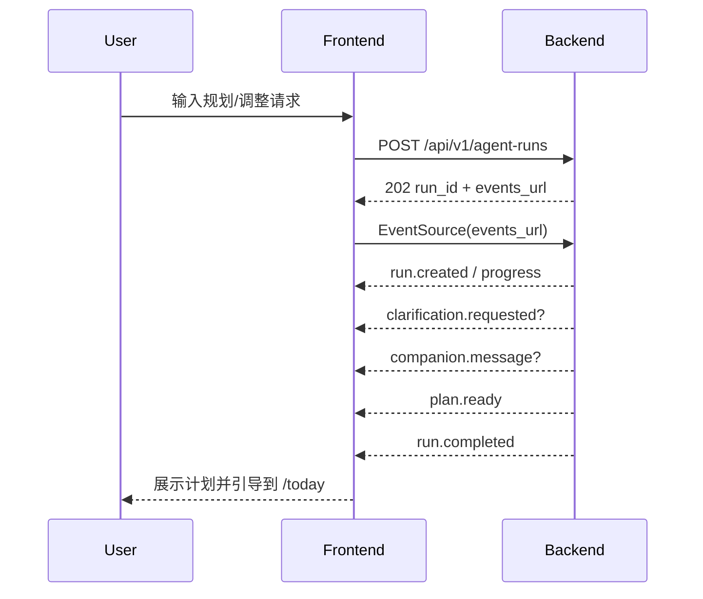

# Product Navigation — 前端页面使用流

| 项目 | 内容 |
|---|---|
| 版本 | v1.0 |
| 日期 | 2026-07-26 |
| 状态 | 本轮实现 |
| 面向对象 | 前端开发者、原型设计者、AI 编程助手 |
| 定位 | 定义 Dazi PC 端与移动端的页面关系、导航规则、核心用户路径和页面间状态传递 |

English summary: Product navigation and information architecture spec for Dazi web. It covers desktop/mobile navigation, route responsibilities, primary user journeys, and page transition rules.

---

## 1. 定位

### 1.1 是什么

本文是前端页面级 spec 的上游导航与信息架构文档。它回答：

- 用户进入产品后先看到什么；
- PC 端和移动端如何导航；
- 首页、今日任务、规划对话、复盘、任务列表、记忆管理、开发者 Trace 页之间怎么跳转；
- 哪些页面是主路径，哪些页面是辅助路径；
- 前端如何根据用户档案、今日任务、未完成 run、风险分流等状态决定入口。

### 1.2 不是什么

- 不定义单页字段细节，字段细节在 `ui-spec/<page>.md` 和 `api-spec/`。
- 不定义视觉风格，视觉由 Figma/Stitch/v0 原型和前端实现决定。
- 不改 API 契约，API 以 `model-design/api-spec/` 为准。
- 不定义后端节点行为，节点以 `agent-nodes/` 为准。

### 1.3 范围

MVP 只做 Web，不做原生 App。移动端是响应式 Web，而不是 iOS/Android 客户端。

## 2. 页面地图

| 页面 | 路由 | 优先级 | PC 导航 | 移动端导航 | 说明 |
|---|---|---|---|---|---|
| 首页 / 次日续上 | `/` | P0 | 侧边栏/顶部入口 | 底部导航首页 | 聚合 active plan、today tasks、昨日复盘 |
| 今日任务页 | `/today` | P0 | 主导航常驻 | 底部导航常驻 | 每天最高频入口 |
| 规划对话页 | `/chat` | P0 | 主导航常驻 | 底部导航常驻 | 发起规划、重规划、澄清 |
| 每日复盘页 | `/reviews/new` | P0 | 从今日任务/首页进入 | 从今日任务/首页进入 | 闭环入口，不建议常驻底栏 |
| 任务列表页 | `/tasks` | P1 | 主导航或更多菜单 | 更多菜单 | 查看历史和筛选任务 |
| 记忆管理页 | `/memories` | P1 | 主导航或设置区 | 更多菜单 | 管理长期记忆与候选记忆 |
| 开发者 Trace 页 | `/dev/traces` | Dev | 开发者入口 | 不在移动端主导航 | 调试 Trace/Replay/Eval |

## 3. PC 信息架构

PC 端优先服务演示、调试和深度使用。建议采用“左侧主导航 + 顶部状态区 + 主内容”的结构。

```text
┌──────────────────────────────────────────────────────────────┐
│ Top Bar: Dazi / 当前目标 / 运行状态 / 用户入口                 │
├───────────────┬──────────────────────────────────────────────┤
│ Sidebar       │ Main Content                                  │
│ - 首页         │ 页面主内容                                      │
│ - 今日任务     │                                                │
│ - 规划对话     │                                                │
│ - 任务列表     │                                                │
│ - 记忆管理     │                                                │
│ - 开发者       │                                                │
└───────────────┴──────────────────────────────────────────────┘
```

PC 主导航顺序：

1. 首页
2. 今日任务
3. 规划对话
4. 任务列表
5. 记忆管理
6. 开发者

PC 端不要把所有功能做成卡片入口堆叠。用户每天最需要的是今日任务和规划入口，开发者最需要的是 Trace。

## 4. 移动端信息架构

移动端优先服务每日执行和复盘。建议使用底部导航，只放 3 个最高频入口。

```text
┌─────────────────────┐
│ Header: 今日状态      │
├─────────────────────┤
│ Main Content         │
│                     │
├─────────────────────┤
│ 首页  今日  对话       │
└─────────────────────┘
```

移动端底部导航：

| Tab | 路由 | 理由 |
|---|---|---|
| 首页 | `/` | 次日续上和整体状态 |
| 今日 | `/today` | 高频执行入口 |
| 对话 | `/chat` | 发起规划/调整 |

移动端更多入口：

- 每日复盘：从今日任务完成后出现，不常驻底栏。
- 任务列表：放到首页或更多菜单。
- 记忆管理：放到设置或更多菜单。
- 开发者 Trace：移动端不做主体验入口。

## 5. 首次进入路由决策

前端启动后先请求 `GET /api/v1/me`，根据返回状态决定入口。

```mermaid
flowchart TD
    A[App boot] --> B[GET /api/v1/me]
    B --> C{profile 是否完整}
    C -->|否| D[/chat 或 onboarding panel: 补齐档案]
    C -->|是| E{是否有未完成 run}
    E -->|是| F[/chat: 恢复规划进度]
    E -->|否| G{是否有 today_tasks}
    G -->|是| H[/today]
    G -->|否| I[/ : 次日续上/发起规划入口]
```

路由优先级：

1. 高风险分流 modal 优先于普通页面展示。
2. 未完成 run 优先于今日任务展示，避免用户看不到正在生成的计划。
3. profile 缺失优先于规划入口。
4. 有今日任务时默认进入 `/today`。
5. 无今日任务但有 active plan 时进入 `/`，显示续上入口。

## 6. 主路径一：首次建档到第一份计划

```mermaid
flowchart TD
    A[用户首次进入] --> B[GET /me: profile 缺失]
    B --> C[/chat 显示建档式引导]
    C --> D[用户填写目标/阶段/时间]
    D --> E[PUT /profile]
    E --> F[用户输入规划请求]
    F --> G[POST /agent-runs]
    G --> H[SSE 展示规划进度]
    H --> I[plan.ready]
    I --> J[/today 展示今日任务]
```

设计规则：

- 建档不应该像后台表单，应贴近对话或轻表单。
- 第一份计划生成后自动引导到今日任务页。
- 如果缺槽，显示 `clarification.requested` 的问题，不跳新页面。

## 7. 主路径二：每日执行与复盘

```mermaid
flowchart TD
    A[/today 查看任务] --> B[开始任务]
    B --> C{结果}
    C -->|完成| D[标记完成]
    C -->|放弃| E[记录阻碍]
    D --> F{是否到复盘时机}
    E --> F
    F -->|是| G[/reviews/new]
    F -->|否| H[留在 /today]
    G --> I[提交复盘]
    I --> J{是否建议重规划}
    J -->|是| K[/chat 创建 replan run]
    J -->|否| L[/ 首页次日续上]
```

设计规则：

- 复盘入口应从任务完成/放弃后的上下文中出现。
- 不强迫用户每完成一个任务都复盘；复盘是一天级动作。
- 如果触发重规划，前端进入 `/chat`，并显式展示“正在调整计划”。

## 8. 主路径三：规划对话与 SSE



前端状态映射：

| SSE 事件 | 页面行为 |
|---|---|
| `run.created` | 锁定输入框，显示运行中 |
| `node.started` / `progress` | 更新时间线或简化进度 |
| `clarification.requested` | 展示追问，不结束会话 |
| `tool.called` | 可选显示工具调用气泡 |
| `companion.message` | 弹出陪伴提示 |
| `plan.ready` | 展示计划摘要和任务 |
| `degraded` | 显示保守建议和原因 |
| `run.failed` | 显示错误态和重试 |
| `run.completed` | 关闭 EventSource |

## 9. 辅助路径：记忆管理

记忆管理不是每天最高频页面，但必须透明。

```mermaid
flowchart TD
    A[/memories] --> B[查看 active memories]
    A --> C[查看 memory candidates]
    B --> D[关闭/删除记忆]
    C --> E[确认/拒绝候选]
    E --> F[更新记忆列表]
```

设计规则：

- 用户必须能看懂“系统记住了什么”。
- 候选记忆和已确认记忆分区展示。
- 敏感候选必须要求用户确认。

## 10. 辅助路径：开发者 Trace

开发者 Trace 是工程化项目的展示重点，但不是普通用户路径。

```mermaid
flowchart TD
    A[/dev/traces] --> B[Run 列表]
    B --> C[Run 详情]
    C --> D[Step 时间线]
    C --> E[Tool calls]
    C --> F[Replay / Eval / Bad Case]
```

设计规则：

- PC 端优先做好；移动端不要求完整体验。
- 生产环境不展示入口。
- 与用户页面共享运行状态语言，但展示更多 trace 字段。

## 11. 页面状态与空态策略

| 页面 | 空态 | 加载态 | 错误态 | 成功态 |
|---|---|---|---|---|
| `/` | 无 active plan 时引导发起规划 | Summary skeleton | 重试 GET /me | 展示续上卡片 |
| `/today` | 无任务时引导去 `/chat` | Task skeleton | 重试 GET today tasks | 任务卡片列表 |
| `/chat` | 初始欢迎 + 输入框 | 发送中/运行中 | run failed + 重试 | 消息流 + 计划摘要 |
| `/reviews/new` | 无可复盘任务时返回今日任务 | Form skeleton | 提交失败可重试 | 复盘结果/重规划确认 |
| `/tasks` | 暂无历史任务 | Table skeleton | 筛选重试 | 列表/筛选/详情 |
| `/memories` | 暂无记忆，说明用途 | List skeleton | 重试 | 记忆列表 + 候选池 |
| `/dev/traces` | 暂无 run | Table skeleton | 重试 | Run 列表 |

## 12. PC 与移动端差异

| 维度 | PC | 移动端 |
|---|---|---|
| 主导航 | Sidebar 或顶部主导航 | 底部 3 Tab |
| Trace | 完整支持 | 不作为主体验 |
| 任务操作 | 卡片 + 右侧详情/抽屉 | 单列卡片 + 底部操作 |
| 对话页 | 左侧消息流 + 右侧计划摘要可选 | 单列消息流，计划结果折叠 |
| 复盘页 | Stepper + 侧边摘要 | 单步表单或竖向 Stepper |
| 记忆管理 | 分栏展示 | 分 Tab 展示 |

## 13. 原型输入给 Codex 的建议

如果先用 Figma/Stitch/v0 产出原型，交给 Codex 时建议包含：

1. PC 首页、今日任务、对话页截图。
2. 移动端首页、今日任务、对话页截图。
3. 组件命名：`TaskCard`、`PlanSummary`、`CompanionToast`、`RunProgress`。
4. 每页的 4 态截图或文字说明。
5. 所有按钮的目标行为，例如“完成任务”调用哪个 API。

Codex 实现前端时必须以本文和 `api-spec/` 为行为依据，以原型为视觉依据。

## 14. 不做

- 不做 PWA。
- 不做原生移动端。
- 不做完整后台管理。
- 不做复杂主题系统。
- 不把开发者 Trace 页作为普通用户卖点。

## 15. 关联文档

- [用户使用说明书](../../overview/user-manual.md)
- [端到端运行流程](../end-to-end-runtime-flow.md)
- [UI spec 目录入口](./README.md)
- [Agent Run API spec](../api-spec/agent-runs.md)
- [任务 API spec](../api-spec/tasks.md)
- [复盘 API spec](../api-spec/reviews.md)
- [记忆 API spec](../api-spec/memories.md)
