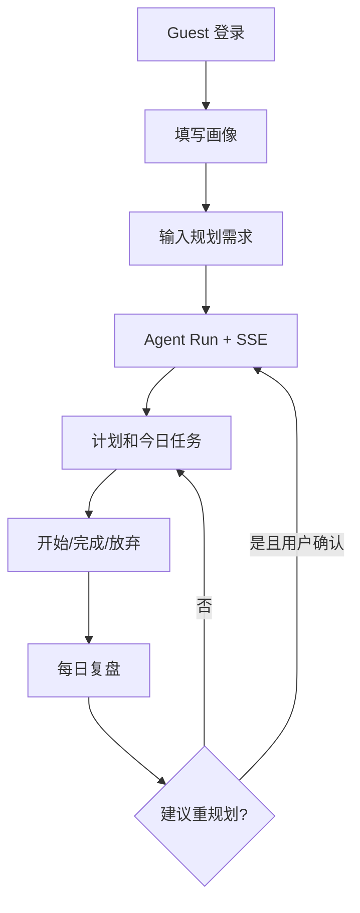

# AI 求职规划搭子 PRD v3.0

## 1. 产品定位

面向计算机专业学生，把“我该准备什么”转成“我今天先做什么”，并根据真实执行结果持续调整。

它不是通用聊天机器人，也不是 ClawAgent 的业务皮肤，而是一个独立的垂直产品：

```text
建档 → 规划 → 今日任务 → 执行 → 复盘 → 重规划
```

## 2. 用户问题

- 信息太多，不知道优先级；
- 计划过重，无法启动；
- 做了几天后中断，不知道如何调整；
- 项目、八股、算法、投递互相抢时间；
- 通用大模型每轮从头回答，缺少执行事实闭环。

## 3. 目标用户

- 计算机本科高年级和研究生；
- 目标方向为 AI 后端、Agent 应用、Java 后端、数据工程、全栈等；
- 每天可投入时间有限；
- 希望得到可执行任务，而不是长篇路线介绍。

## 4. 核心价值

1. 根据目标、阶段、截止时间和技能现状生成 1~8 周方向与每周重点；
2. 每次展开未来连续 7 天、每天 1 个高质量任务；
3. 每个任务都有 starter_action、deliverable 和预计时长；
4. 记录开始、完成、放弃和实际耗时；
5. 复盘后根据事实建议重规划；
6. 对动态信息提供来源，对不确定内容明确说明；
7. 用户可查看和管理长期记忆。

## 5. MVP 用户旅程



## 6. 功能范围

### P0

| 模块 | 功能 |
|---|---|
| 身份 | Guest JWT、用户隔离 |
| 画像 | 目标方向、阶段、时间预算、技能水平、截止时间 |
| Agent Run | 创建、进度、取消、结果、失败收敛 |
| 计划 | 当前计划、历史、来源、重规划版本 |
| 任务 | 今日查询、开始、完成、放弃、过期 |
| 复盘 | 情绪、阻碍、调整请求、建议重规划 |
| 记忆 | 查看、关闭、恢复、删除、敏感候选确认 |
| 安全 | 风险分流、固定安全响应、人工审核资源配置 |
| Trace | 开发者 Run/Step/Tool/Event 详情 |
| 交付 | Docker Compose、30 条 Eval Case、Demo |

### P1

- Replay；
- LLM Judge；
- 搜索证据蒸馏；
- 更丰富的经验原子管理；
- 邮箱/OAuth；
- 主动提醒。

### 不做

- 多 Agent/Swarm；
- MCP 市场；
- Redis/Celery/Kafka；
- 微服务/Kubernetes；
- 心理、医疗、法律、金融专业建议；
- 自动投递简历和代替用户做高风险决策。

## 7. 用户画像

必填：

- goal_type；
- stage：exploring/preparing/applying/interviewing；
- time_budget_minutes：15~480；
- skill_level。

可选：skill_summary、deadline、target_companies、preferred_time_slot。

建档摩擦原则：首屏只填核心字段，其他后补。

## 8. 计划输出

一次计划至少包含：

- 1~8 周的 planning window、overall_direction 和 weekly_focus；
- summary、rationale；
- 从 `plan_date` 开始连续 7 天、每天 1 个任务；
- 每个任务的 title、task_type、scheduled_date、starter_action、deliverable、estimated_minutes；
- 使用过的来源；
- adjust replan 时的 adjustment_reason。

产品铁律：方向可以看中期，但行动只展开到今天；宁可给 1 个可完成任务，也不给 3 个空泛任务。

## 9. 计划质量规则

| 维度 | 合格 |
|---|---|
| 可启动 | 明确动作 + 明确对象 |
| 时间匹配 | 总时长不超过预算 |
| 认知负荷 | 任务粒度适中，不用“了解/熟悉”充当行动 |
| 连续性 | 使用最近完成、放弃和阻碍事实 |
| 可验证 | 有可观察产物 |
| 来源完整 | 动态事实引用真实 source id |
| 目标稳定 | 不未经确认改变用户方向 |

## 10. 复盘和重规划

Review 内容：mood、blockers、adjustment_request、free_text。复盘后用户总可以主动生成次日计划：没有明显偏差时 continue，有调整需求时 adjust。

系统从任务表计算完成/放弃统计。以下情况建议重规划：

- 连续放弃；
- 时间预算明显变化；
- 用户明确要求调整；
- 方向变化；
- 阻塞持续存在。

原则：

- 不静默替换计划；
- 用户点击“生成明日任务/调整明日计划”后才创建 replan Run；
- 只有归档旧计划和创建新计划的同一事务成功提交后，旧计划才归档；
- 已完成事实不得丢失；
- 连续完成不自动加量。

## 11. 陪伴行为

陪伴不是夸奖模板堆砌，而是基于事实给短反馈：

- 首次开始任务；
- 完成任务；
- 放弃任务；
- 保存复盘；
- 建议重规划；
- 次日续接。

MVP 全部使用版本化模板，避免陪伴话术占用规划模型预算；后续如实验模型生成，必须单独配置、评测并保留模板兜底。

## 12. 风险分流

当输入明显不属于普通求职规划且涉及高风险时：

- 停止规划 Graph；
- 使用人工审核的固定响应和地区化资源配置；
- 不把内容写入长期记忆；
- 不做诊断；
- Run 以 degraded 结束。

## 13. 成功指标

### 离线

- 30 条固定 Case；
- Schema 通过率；
- 时间预算满足率；
- 可启动性和可验证性通过率；
- 来源完整率；
- 安全测试集分流通过率；
- Agent 成功/降级/失败分布；
- Token、成本、延迟。

### 产品上线后

- 周第一步完成率；
- 计划采纳率（adopted_at）；
- 复盘提交率；
- 重规划后任务完成率；
- 7 日回访率。

离线指标不得伪装成真实用户指标。

## 14. 非功能要求

- 普通 CRUD P95 < 500ms（本地/测试环境不作为生产承诺）；
- Agent Run 默认截止 45s；
- SSE 支持断线回放；
- 用户数据严格隔离；
- 模型不可用时有明确降级；
- 单 Run 成本可统计；
- Docker Compose 一键启动；
- 关键状态可追踪。

## 15. 开发节奏

以 [阶段任务书](../implementation/README.md) 为准。先骨架和 Mock 纵切，再接真实模型，最后接 RAG 和 Eval。禁止在没有纵切代码时继续无限扩充设计文档。
