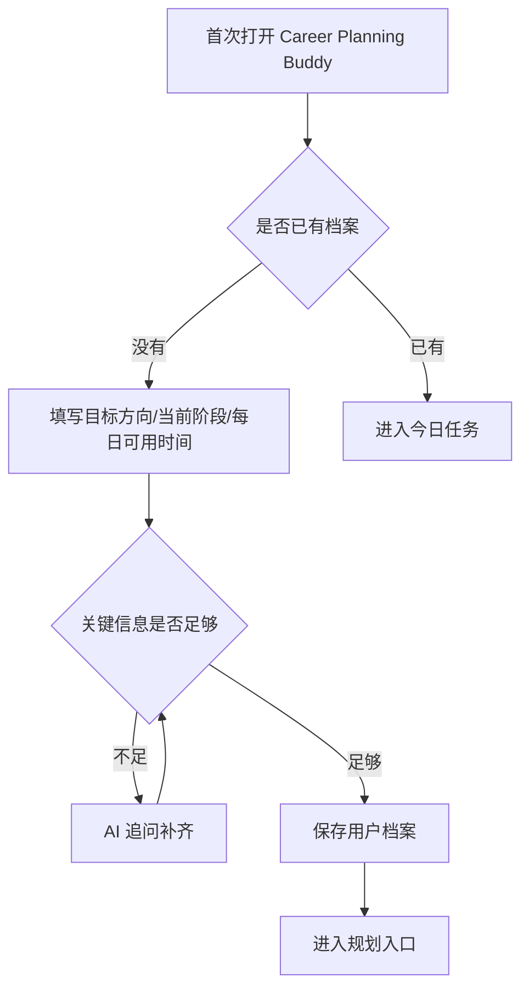
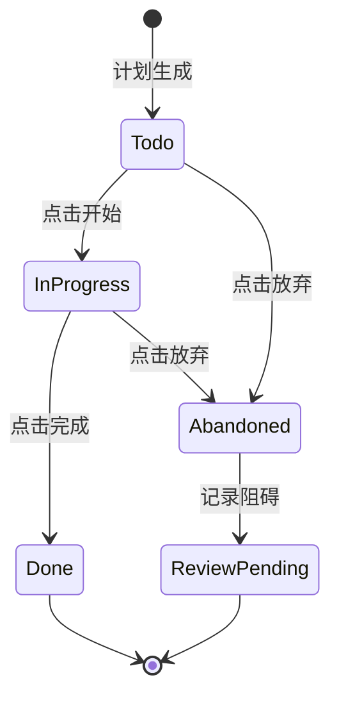
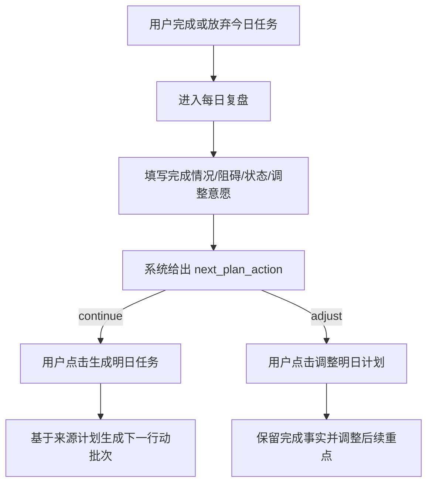
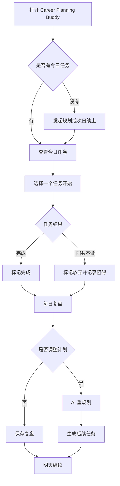

# Career Planning Buddy 用户使用说明书

> **历史 v1 使用说明。** 本文保留早期规划、任务、复盘与记忆流程；当前界面还包含工作台、求职材料、模拟面试、报告和成长页。公开演示请以 [5 分钟演示脚本](./demo-walkthrough.md) 和 [Current System Overview](../architecture/current-system-overview.md) 为准。

| 项目 | 内容 |
|---|---|
| 版本 | v1.0 |
| 状态 | 设计基线 |
| 面向对象 | 最终用户、产品演示者、面试官 |
| 定位 | 用用户能理解的语言说明 Career Planning Buddy 从首次建档到每日执行、复盘、调整、记忆管理的完整使用链路 |

English summary: User-facing manual for Career Planning Buddy. It explains what users do first, how the product moves through planning, tasks, reviews, replanning, memories, and safety states.

---

## 1. Career Planning Buddy 是什么

Career Planning Buddy 是一个面向计算机学生的 AI 求职规划搭子。它不是普通聊天机器人，而是围绕你的求职目标、当前阶段、每天可投入时间和历史执行情况，帮你生成可执行的求职计划，并在每天执行后根据复盘继续调整。

MVP 聚焦一个主场景：计算机学生准备 AI 应用开发、后端开发、Agent 应用等方向的求职。

## 2. 第一次使用：完成建档

第一次打开 Career Planning Buddy 时，系统会先判断你是否已经有档案。

如果没有档案，你需要先补齐最少信息：

| 信息 | 说明 |
|---|---|
| 目标方向 | 例如 AI 应用开发、后端开发、Agent 应用、数据工程、全栈等 |
| 当前阶段 | 例如刚开始准备、有项目但缺复盘、准备投递、准备面试等 |
| 每日可用时间 | 例如每天 1 小时、2 小时、半天 |

如果信息不足，Career Planning Buddy 会先追问，而不是直接生成模糊计划。



## 3. 生成第一份求职规划

建档完成后，你可以向 Career Planning Buddy 发起规划请求，例如：

```text
帮我制定 5 周后的 Agent 应用开发秋招计划。
```

系统会创建一次规划运行，并通过进度流展示当前进展。你可能会看到：

| 阶段 | 用户看到什么 |
|---|---|
| 识别意图 | 正在判断是首次规划、次日续接还是明显调整 |
| 检查风险 | 如果内容涉及高风险主题，系统会进入安全分流 |
| 补上下文 | 正在结合你的档案、历史任务、复盘、记忆 |
| 生成候选计划 | AI 形成 1~8 周方向、每周重点和今日任务 |
| 质量校验 | 检查任务是否可执行、是否有 starter_action、是否过宽泛 |
| 保存结果 | 生成计划和今日任务 |

生成完成后，你会得到：

- 1~8 周整体方向和每周重点；
- 今日 1-3 个任务；
- 每个任务的起步动作；
- 为什么今天做这些任务；
- 必要时展示来源或依据；
- 一段陪伴式反馈。

## 4. 今日任务页

今日任务页是每天最常用的页面。用户进入后应优先看到当前最该做的任务，而不是复杂报表。

每个任务至少包含：

| 内容 | 说明 |
|---|---|
| 任务标题 | 今天要完成的具体事项 |
| 起步动作 | 第一小步该怎么开始，避免任务过空 |
| 预计时长 | 帮助用户安排时间 |
| 状态 | 待开始、进行中、已完成、已放弃等 |
| 操作 | 开始、完成、放弃 |

任务操作链路：



## 5. 每日复盘

每日复盘用于告诉 Career Planning Buddy 今天真实发生了什么。复盘不是写长篇日记，而是补充对明天计划有用的信息。

复盘建议包含：

| 问题 | 用途 |
|---|---|
| 今天完成了什么 | 判断计划推进情况 |
| 哪些任务卡住了 | 判断是否需要降低粒度或调整路径 |
| 今天的状态如何 | 判断明天任务强度 |
| 明天是否需要调整 | 决定是否触发重规划 |



## 6. AI 如何根据复盘调整计划

如果复盘显示方向和节奏还能继续，Career Planning Buddy 会给出 `continue` 建议：沿用中期方向和周重点，只生成明天的新行动批次。

如果复盘显示明显偏离，比如任务连续未完成、时间变少或用户明确要求调整，系统会给出 `adjust` 建议。

两种方式都需要用户点击确认，都会基于来源计划创建新版本；旧计划只有在新版本事务成功后才归档。调整不是推翻一切，而是在已有档案、计划、任务、复盘和记忆基础上改变后续重点。

常见触发场景：

| 触发 | 结果 |
|---|---|
| 今日任务全部完成 | 明天可进入下一小步 |
| 任务过难或过大 | 降低任务粒度，补起步动作 |
| 用户时间减少 | 缩短任务数量或时长 |
| 方向变化 | 重新生成适配目标方向的计划 |
| 连续放弃 | 追问阻碍或降级为更轻任务 |

## 7. 记忆管理

Career Planning Buddy 会把对长期规划有帮助的信息整理成记忆，例如目标方向、偏好、限制条件、长期项目背景等。

敏感信息不会直接进入长期记忆，系统应先生成候选记忆，由用户确认。

提交复盘时，系统只根据明确的调整请求、重复阻碍或当天多次放弃等确定性信号，
生成最多 2 条待确认候选；它不会调用模型自由猜测。候选默认是敏感信息，14 天后
过期。只有用户确认后，候选才会向量化并成为 active Memory；拒绝或未确认候选不会
进入后续规划。

后续规划会优先使用 active 且置顶的记忆，再按本次请求、岗位方向、阻碍和调整请求
检索相关 active Memory。关闭的记忆、其他用户的记忆和未确认候选都不会被使用。
被选中的记忆可在计划来源和开发者 Trace 中核对。

用户可以在记忆管理页：

| 操作 | 说明 |
|---|---|
| 查看记忆 | 看系统目前记住了什么 |
| 关闭记忆 | 暂停某条记忆的使用 |
| 删除记忆 | 移除不再需要的信息 |
| 确认候选记忆 | 允许系统保存某条新记忆 |
| 拒绝候选记忆 | 不保存该条信息 |

## 8. 安全分流

如果用户输入涉及高风险内容，Career Planning Buddy 不会继续普通求职规划链路，也不会把高风险内容写入长期记忆。

系统会：

- 停止普通规划；
- 展示固定支持话术；
- 必要时展示心理援助热线或权威资源；
- 记录必要的安全 Trace，避免生成不合适的建议。

## 9. 用户可见状态说明

| 状态 | 用户看到什么 | 系统发生什么 |
|---|---|---|
| 未建档 | 引导填写目标方向、阶段、可用时间 | 创建或更新用户档案 |
| 待澄清 | AI 提出 1-3 个问题 | 暂停规划，等待用户补充 |
| 规划中 | 显示进度和陪伴提示 | 创建 agent_run 并执行规划工作流 |
| 已生成计划 | 显示今日任务和计划说明 | 写入 plans、tasks、trace |
| 任务待开始 | 显示开始按钮 | 等待用户操作 |
| 任务进行中 | 显示进行中状态 | 更新任务状态 |
| 任务已完成 | 显示完成反馈 | 记录完成，并可能生成陪伴话术 |
| 任务已放弃 | 引导记录阻碍 | 保存放弃原因，用于复盘和调整 |
| 复盘待提交 | 展示复盘表单 | 等待用户反馈今日情况 |
| 复盘完成 | 显示次日建议 | 写入 reviews |
| 重规划中 | 显示调整中 | 创建 replan run |
| 降级 | 显示保守建议和原因 | 模型超时、预算超限、质量不达标或外部能力失败 |
| 安全分流 | 显示固定支持话术 | 不进入普通规划链路 |

## 10. 一天的典型使用方式



## 11. 常见问题

### 为什么 Career Planning Buddy 有时会先追问？

因为缺少目标方向、当前阶段或可用时间时，直接生成计划容易变成泛泛建议。追问是为了让计划更具体。

### 为什么每天只有 1-3 个任务？

MVP 强调可执行，而不是堆很多看起来完整的任务。任务必须能启动、能完成、能复盘。

### 为什么任务里必须有起步动作？

起步动作是为了避免“学习 LangGraph”“准备项目”这类过大的任务。一个合格任务应该告诉你第一步怎么做。

### 为什么高风险内容不会进入普通规划？

Career Planning Buddy 是求职规划产品，不是心理、法律或金融咨询服务。遇到高风险内容时，系统优先保证安全，进入固定分流流程。

### 我可以删除系统记住的信息吗？

可以。记忆管理页应该允许查看、关闭和删除记忆；敏感候选记忆需要用户确认后才保存。

## 12. 关联文档

- [产品概览 PRD](./product-overview.md)
- [功能流程总览](../model-design/feature-flows/README.md)
- [API 端点 spec](../model-design/api-spec/README.md)
- [状态机 spec](../model-design/state-machines/README.md)
- [端到端运行流程](../model-design/end-to-end-runtime-flow.md)
