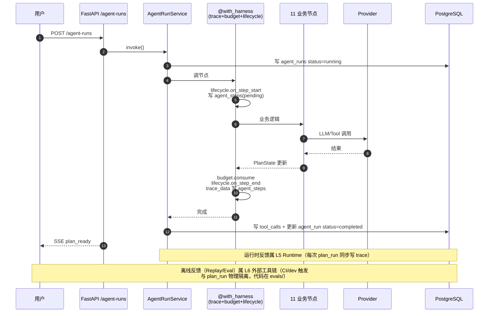

# harness-skeleton 实现计划

| 版本 | v1.0 |
|---|---|
| 日期 | 2026-07-24 |
| 状态 | 已实现 |
| 性质 | **回顾性 plan**——配合 [`clarify.md`](./clarify.md)，作为 `governance/spec-driven-workflow.md` plan.md 模板的首份真实范例 |

English summary: Retrospective implementation plan for harness reflection-layer specs. Demonstrates plan.md format for the SDD workflow's first real example.

---

## 1. 目标

把 [TDD §12](../../architecture/tdd.md) 中三行级别的"harness = Trace / Replay / Eval"概念展开为**施工级字段 spec**，覆盖 24 个 harness 模块中 5 个空缺的位置（E3 Replay / E4 Dev Dashboard / F2 Eval Dataset / F3 CI 门禁 / F4 Bad Case），让 Stage 0-5 写代码时 AI 可 1:1 照抄，无需再猜。

## 2. 澄清与假设

见 [`clarify.md`](./clarify.md)。关键决议：①方案 A（harness/ + evals/ 平级）；②节点用装饰器写 trace；③Replay 只重跑 agent 节点；④Eval 30 case + 85% 硬门禁；⑤dev 路由生产 fail-fast。

## 3. 交互流程（mermaid）

**必填：SDD 流程的 mermaid 图。本次描绘 harness 反馈层在 plan_run 中如何与业务节点协同。**

**关键设计意图**：上图显示 trace 中间件（HW）介于 service 与业务节点之间，**节点代码不感知 trace 写入**——这是横切层落地标准。

## 4. 实现步骤（已执行，回顾）

1. 编 `harness/README.md` + `harness-overview.md`（5 分钟入门 + 24 模块映射），明确 harness 范围与业界定标
2. 写 `replay.md`（E3）——输入快照重建 + prompt_version 锁定 + diff 报告格式 + replay_runs 表
3. 写 `eval-system.md`（F2/F3/F4）——case schema + 6 grader + 4 表 + Bad Case 回流 + CI 门禁
4. 写 `ui-spec/developer-trace.md`（E4）——5 页前端 spec 含 Replay/Bad Case 入口
5. 写 `implementation-structure.md`（施工总图）——完整目录树 + 三要素表 + import-linter 增强 + 生命周期钩子语义 + 专业术语对应
6. 合并 5 份 spec 推送（commit 99ebe8d）
7. 后续 rectify：①方案 A（harness-overview §5 拆出 evals/）；②删孤儿 README-v0-original.md；③补 `../third-party-integration/deepseek-api.md` 与 `../architecture/poc-verification-report.md`（commit cda558e）

## 5. 验证清单（SDD 模板要求）

- [x] 5 份 spec 七要素完整（版本/状态/日期/目的/范围/不变量/参考依据）
- [x] 所有相对链接有效（`find + grep` 核过）
- [x] 与已有 spec 无重复设计（24 模块映射表确认）
- [x] 与 [`stage-delivery-definition.md`](../../governance/stage-delivery-definition.md) Stage 5 退出条件对齐
- [x] 与 [`check-scripts-spec.md`](../../governance/check-scripts-spec.md) check-eval.sh 一致
- [x] 跨 doc 自检：harness-overview §5、implementation-structure §3、replay §6.2、eval-system §6.1、developer-trace §11——五处 Stage 退出条件互相同步

## 6. 影响面与回滚

| 触及层 | 影响 |
|---|---|
| `docs/model-design/harness/`（新）| 新增目录 + 5 份 spec（约 1800 行）|
| `docs/model-design/ui-spec/`（新）| 新增目录 + 1 份 spec |
| `docs/model-design/README.md` | 登记 harness/ 与 ui-spec/ 子目录 |
| `docs/architecture/tdd.md` | 不改（harness spec 是 TDD §12 的具体化） |
| `docs/architecture/adr.md` | 不改（无新架构决策） |
| `backend/app/` | **0 改动**（代码零存在）|
| 数据表 | 设计稿新增 `replay_runs` / `eval_datasets` / `eval_cases` / `eval_runs` / `eval_cases_verdicts` 5 张（Stage 1 才建）|

**回滚方案**：本次只改 docs，无代码变更——回滚 = `git revert <commit>` 即可。

## 7. 状态流转记录

| 时间 | 事件 |
|---|---|
| 2026-07-24（早） | 规划中（当时未写 plan.md）—— 直接开始编 spec |
| 2026-07-24（晚） | **本轮实现**（commit 99ebe8d + cda558e 已推送）|
| 2026-07-24 | **已实现** + 回顾补 plan.md 当 SDD 范例（本文件） |

## 8. 与 SDD 模板的偏差说明

**模板要求"plan.md 先于 spec 编写"，本项目当时反着走（先 spec 后 plan）**。回顾判断这种"反向补"可接受的前提：

1. 改动只触及 docs 不触及代码（回滚成本零，无生产风险）
2. 所有决策已固化在已编写的 spec 中，本 plan 是 1:1 映射不是新决策
3. 明确标注为"回顾性"（状态：已实现），避免误导后人认为这是施工前置

**但**：下次任何代码层改动（Stage 0 起），**必须严格先 clarify.plan.tasks 再 implement**——这是 SDD 流程的不可妥协红线。
