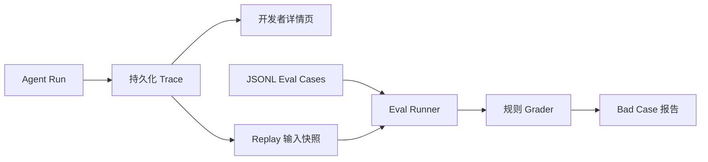

# Harness Workbench 实现计划

状态：approved（Stage 2 与 Stage 5 分步实现）。

## Stage 2

- 写入 Run、Step、Tool Call 和 Event；
- 保存 Prompt 版本、实际 model id、Token、耗时、错误和脱敏摘要；
- 提供 Run 状态与 SSE，不做复杂 Dashboard。

## Stage 5

- 开发者 Run 列表与详情；
- Replay：原输入 + Tool fixture + 可选新 Prompt/模型；
- 30 条 JSONL Eval Case；
- 规则 Grader 与回归报告；
- 失败 Case 进入人工维护的 Bad Case 集。

## 安全

Trace 不保存密钥、JWT、完整敏感文本和网页全文。生产环境关闭或严格授权 dev 路由。

## 验收

见 `docs/implementation/stage-5-eval-delivery.md`。
