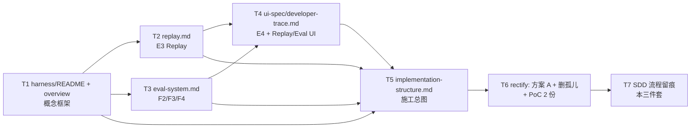

# harness-skeleton 任务清单

| 版本 | v1.0 |
|---|---|
| 日期 | 2026-07-24 |
| 状态 | 已实现 |
| 性质 | **回顾性 tasks**——配合 [`clarify.md`](./clarify.md) + [`plan.md`](./plan.md)，作为 `governance/spec-driven-workflow.md` tasks.md 模板的首份真实范例 |

English summary: Retrospective tasks with `[P]` parallel markers for cross-context harness work. Demonstrates tasks.md format for the SDD workflow's first real example.

---

## 1. 任务依赖（mermaid）

## 2. 任务列表

- [x] 1. **harness 概念框架**：编 `harness/README.md`（5 分钟入门） + `harness/harness-overview.md`（24 模块映射 + Stage 时序）（依赖：无）
- [x] 2. **E3 Replay 设计**：编 `harness/replay.md`，含输入快照重建算法 + prompt_version 锁定 + diff 报告格式 + `replay_runs` 表 schema（依赖：1）
- [x] [P] 3. **F2/F3/F4 Eval 系统**：编 `harness/eval-system.md`，含 30 case schema + 6 grader 接口 + 4 张表 + Bad Case 回流 API + CI 门禁规则（与 4 可并行；依赖：1）
- [x] [P] 4. **E4 Dev Dashboard**：编 `ui-spec/developer-trace.md`，含 5 个前端页面 + Trace/Replay/Bad Case 入口跳转（与 3 可并行；依赖：1）
- [x] 5. **施工总图**：编 `harness/implementation-structure.md`，含完整目录树 + 三要素表 + import-linter 增强 + 7 个 lifecycle 钩子 + 专业术语对应（依赖：2、3、4）
- [x] 6. **方案 A 收敛 + 缺口补**：①改 overview §5 把 evals/ 移出 harness/ 平级；②删孤儿 README-v0-original.md；③补 `third-party-integration/deepseek-api.md`；④补 `architecture/poc-verification-report.md`；⑤同步各 README（依赖：5）
- [x] 7. **SDD 流程留痕**：补本 `requirements/harness-skeleton/{clarify,plan,tasks}.md` 三件套作为首范例（依赖：6）

`[P]` 表示可与同波次其它 `[P]` 任务并行：T3 与 T4 都依赖 T1，彼此独立可并行。

## 3. 实际工作量（回顾）

| 任务 | 实际耗时 | 备注 |
|---|---|---|
| T1 | 0.5（生成 2 份 ~700 行 spec）| 约 0.5 个工作日 |
| T2 + T3 + T4（[P] 并行） | 1（合计 1400 行）| 三个子任务并行推进 |
| T5 | 0.5（503 行施工总图）| 大量引用已有 spec |
| T6 | 0.5 | 方案 A 切换 + 新增 2 份阶段 3 文档 |
| T7 | 0.3 | 本三件套本文档 |
| **总** | **2.8 工作日** | 实际跨多轮会话 |

## 4. 与 SDD 模板的对照（meta）

本 tasks.md 严格遵循 [`spec-driven-workflow.md` §tasks 模板](../../governance/spec-driven-workflow.md)：

- ✅ mermaid 任务依赖图（节 1）
- ✅ `[P]` 并行标记（节 2 之 T3/T4）
- ✅ 任务依赖关系标注（依赖：X）
- ✅ 复选框 + 任务先后顺序
- ✅ 状态流转与 plan.md 一致

---

## 5. 引用

- 上游：[`plan.md`](./plan.md)（特性实现计划）
- 模板定义：[`spec-driven-workflow.md` §tasks 模板](../../governance/spec-driven-workflow.md)
- 产物：[`harness-overview.md`](../../model-design/harness/harness-overview.md) · [`implementation-structure.md`](../../model-design/harness/implementation-structure.md) · [`replay.md`](../../model-design/harness/replay.md) · [`eval-system.md`](../../model-design/harness/eval-system.md) · [`ui-spec/developer-trace.md`](../../model-design/ui-spec/developer-trace.md)
