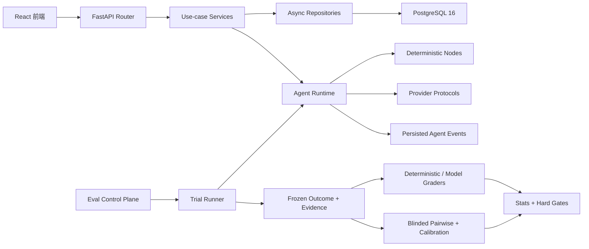

# Career Planning Buddy：2026-08-09 项目加固与面试复习

> 目标：把“能展示功能的校招 Demo”推进为“能够解释架构约束、故障语义、评测可信度和工程门禁的单体应用”。本文既是今日工作记录，也是面试前的复习提纲。

## 1. 项目定位

Career Planning Buddy 是一个基于 FastAPI、PostgreSQL 和 React 的职业规划 Agent。它不把一次 LLM 调用包装成接口就结束，而是把规划、追问、安全降级、工具调用、SSE 事件、结果持久化和离线评测组织为可恢复、可审计的完整链路。

MVP 采用模块化单体和单进程执行器：这符合当前规模，也避免为了“看起来企业级”提前引入 Redis、Celery、微服务或多 Agent 框架。企业级体现在边界与不变量，而不在组件数量。

## 2. 今日结论

今天按“运行时正确性 → Harness 可信度 → 数据与事务 → 工程门禁 → 前端与资源治理”的顺序完成了修复。

| 检查维度 | 原问题 | 今日结果 |
|---|---|---|
| 架构设计 | 进程恢复、配置失效和主动停机的终态语义不完整 | 补全恢复与终态分类，保持一个 Run 恰好一个终态事件 |
| Eval Harness | fixture replay 未持久绑定来源，评分可能重读在线业务表 | 持久化来源 Trial；执行完成时冻结 outcome、evidence、provider calls；评分只读冻结事实 |
| Pairwise | 展示面可能为空或信任请求侧数据，Pair 未严格限定在 Sweep | 服务端重建脱敏视图，校验 pair hash 和 sweep membership |
| 数据完整性 | Fixture 哈希、调用顺序、消费完整性和 payload 边界不足 | 全链路重算哈希、严格顺序/一次消费/全部消费、敏感字段清洗、256 KiB 上限 |
| 事务 | 并发 get-or-create 冲突会回滚外层事务 | 使用 nested transaction/savepoint 隔离唯一键竞争 |
| 幂等 | 相同 key 不同 payload 可能被当成重复成功 | 创建与取消都记录请求指纹；冲突返回 409 |
| Schema/迁移 | ORM 与 Alembic 存在索引漂移 | 新增 3 个迁移并对齐部分索引；`alembic check` 无漂移 |
| Provider 生命周期 | 真实 HTTP Provider 每次调用创建 Client | 复用连接池并显式 `aclose`，执行器和 Trial 负责释放自有资源 |
| 前端 | token 长期存 localStorage、请求无超时、SSE 重连无上限 | 改 sessionStorage、默认 15 秒超时、401 停止、指数退避和最大重试 |
| 交付门禁 | CI 只跑 legacy eval 的局部范围 | CI 和本地脚本执行全量 Stage 5 Eval V2 硬门禁，并验证迁移往返 |

## 3. 最重要的设计不变量

### 3.1 Run 只有一个终态事件

业务状态和事件流必须一致。正常完成、用户取消、进程停机、配置快照失效、运行时异常都通过统一 finalizer 收敛。启动恢复不再只处理“已超过 deadline”的记录，而是处理遗留的 pending/running Run；主动停机归类为 `PROCESS_INTERRUPTED`，用户取消归类为 `RUN_CANCELLED`。

面试表达：**SSE 不是状态真相，数据库中的 Run 与持久化事件才是。事件先落库再推流，断线后可按游标恢复。**

### 3.2 评分只读冻结事实

Trial 完成时，在同一最终化过程里写入：

1. `outcome_snapshot_json`；
2. provider call 统计；
3. 授权后的 `EvalEvidenceItem`。

之后 grader 从快照重建 `RunOutcome`，不再重读可能已经变化的 Plan、Task 或 AgentRun。终态 Trial 不能继续追加 evidence。

这解决的是评测的“时间一致性”：如果产品数据在运行后被用户编辑，同一个 Trial 的评分仍应保持不变。

### 3.3 Fixture Replay 是可验证重放，不是普通 Mock

每个 fixture replay Trial 持久记录 `fixture_source_trial_id`。创建实验时验证源实验、dataset、fixture mapping 和 bundle 兼容性；运行时验证：

- bundle hash、fixture hash、response hash；
- sequence 连续且唯一；
- 一次调用只能消费一次；
- Trial 结束时所有 fixture 必须恰好消费完；
- payload 必须可 JSON 序列化且不超过 256 KiB；
- token、secret、authorization、cookie 等敏感键递归清洗。

任何错位都以 `FIXTURE_DESYNC` 失败，不能静默退回 Mock 或 Live Provider。

### 3.4 Pairwise 判断必须既盲测又有权限边界

API 不直接信任数据库中可能过期的展示 JSON，也不接受客户端自报内容。服务层从授权后的 Evidence 重新生成 A/B 视图，并验证：

- pair hash 未被篡改；
- pair 的两个 Trial 确实属于指定 Sweep；
- baseline/candidate 映射不泄漏给 judge；
- 跨 Sweep 访问返回 404。

这同时解决公平性、越权和实验污染。

### 3.5 幂等不等于“相同 key 永远返回旧结果”

幂等键必须与规范化后的请求指纹绑定。相同 key + 相同 payload 返回原结果；相同 key + 不同 payload 返回 409。创建 Run 和取消 Run 都使用该规则。

数据库并发冲突使用 savepoint 处理，只回滚冲突语句，不破坏调用方的外层事务。

## 4. 按模块复习今日实现

### 4.1 Agent Runtime

- 配置快照无效时也能走统一终态流程，并产生 `CONFIG_SNAPSHOT_INVALID`。
- 启动时回收遗留的 pending/running Run，避免永久悬挂。
- 区分用户取消与进程中断，便于告警、重试和统计。
- executor 在 shutdown 时释放 Provider/Tool Registry 资源。
- 保持节点不直接写 ORM，状态迁移仍由 Service/Finalizer 控制。

### 4.2 Eval Control Plane

- CLI/API 支持 `run_type` 和 `fixture_source_experiment_id`。
- 每个 replay Trial 持久绑定确定的源 Trial，支持恢复和审计。
- Trial finalization 冻结 outcome、evidence 和 provider calls。
- grader 校验 case id 与 fixture hash，再从快照评分。
- 统计继续区分配置失败、运行时失败、取消和硬门禁失败，避免把基础设施错误算成模型低分。

### 4.3 Fixture、Evidence 与数据治理

- FixtureStore 重新计算所有哈希，不信任输入元数据。
- 调用序列必须连续、唯一、完整消费。
- 对可疑敏感键进行递归清洗，同时保留正常的 `tokens_in/tokens_out` 指标。
- 限制单个 payload 大小，避免评测数据库被异常响应拖垮。
- 冻结后的 Evidence 成为 grader 与 pairwise 的唯一事实来源。

### 4.4 Pairwise 与 Calibration

- pairwise 展示由服务端基于授权证据重建，不再出现“有 Trial 但展示为空”。
- Sweep membership 成为读取和提交 judge 结果的前置条件。
- 通过 pair hash 防止 A/B 映射或内容被替换。
- Calibration 仍是诊断能力：只有积累足够人工标注后，其统计置信度才有业务意义。

### 4.5 数据库与迁移

新增迁移：

- `20260817_0020_eval_fixture_response_payload.py`：持久化 fixture 响应 payload；
- `20260818_0021_eval_fixture_replay_source.py`：绑定 replay 来源 Trial；
- `20260819_0022_agent_cancel_idempotency.py`：保存取消幂等键和请求哈希。

同时对齐 ORM 中的部分索引定义。CI 在临时 PostgreSQL 上执行 `upgrade head → downgrade -1 → upgrade head → alembic check`，验证迁移可往返且无模型漂移。

### 4.6 Provider 与工具资源

- OpenAI-compatible planning、Baidu Search、Evidence Distillation Provider 复用 `httpx.AsyncClient`。
- 测试中的 MockTransport 仍保持隔离，不引入跨测试连接状态。
- ToolRegistry、AgentRunExecutor 和 TrialRunner 明确资源所有权并负责关闭。

核心概念：**谁创建资源，谁关闭资源；依赖注入进来的共享资源不应被下游擅自关闭。**

### 4.7 前端与网络健壮性

- Bearer token 从 localStorage 迁移到 sessionStorage，关闭标签页后失效，并清理旧 token。
- 普通 API 默认 15 秒超时，统一抛出 `REQUEST_TIMEOUT`。
- SSE 遇到 401 清理登录态并停止重连；其他可恢复错误使用带 jitter 的指数退避，最多 8 次、单次最多 30 秒。
- 路由按页面懒加载，降低首包体积。
- Nginx 增加 CSP、Referrer-Policy、nosniff 和 frame 限制。

## 5. 今日验收证据

| 门禁 | 结果 |
|---|---|
| Ruff 全量 | 通过 |
| mypy | 通过，239 个源码文件无类型错误 |
| pytest 全量 | 592 passed |
| Alembic upgrade/check | 通过，未检测到新迁移操作 |
| Docker Compose config | 通过 |
| 前端单测 | 7 个测试文件、14 个测试全部通过 |
| 前端生产构建 | 通过，页面 chunk 已拆分 |
| Legacy Stage 5 Eval | 30/30 case，grader pass rate 100% |
| Legacy Stage 6 Eval | 12/12 case，grader pass rate 100% |
| Eval V2 Stage 5 全量硬门禁 | 30/30 Trial 完成，30/30 hard gate 通过，退出码 0 |

Eval V2 本次运行中有 completed 与 degraded 两种业务终态；degraded 包括合理追问、安全响应和预期格式降级，不等于 Trial 失败。30 个 Trial 的 `terminal_event_count` 均为 1。

## 6. 面试时怎么讲

### 6.1 三分钟项目介绍

> 我做的是一个职业规划 Agent，但重点不是单次调用大模型，而是把它做成可恢复、可审计、可评测的应用。后端采用 FastAPI、SQLAlchemy Async 和 PostgreSQL 的模块化单体，Router 只处理 HTTP，Service 管用例和状态机，Repository 管持久化。Agent 的每个事件先落库再通过 SSE 推送，所以断线可恢复，并保证每个 Run 只有一个终态事件。
>
> 项目里我单独实现了 Eval Control Plane。评测不是直接调一个 Mock，而是用同一套真实 Runtime 跑 Trial；运行结束时冻结 outcome、evidence 和 provider call，再由 deterministic grader、model grader、pairwise judge 和 hard gate 消费。Fixture Replay 还会校验来源、哈希、顺序和完整消费，确保可重复性。工程上有 Alembic 漂移检测、全量类型检查、592 个后端测试、前端测试和完整 Stage 5 评测门禁。
>
> 我刻意没有在 MVP 引入 Redis、Celery 或微服务，因为当前是单 Worker 部署。先把事务、幂等、资源生命周期、故障分类和评测可信度做对；达到多实例规模后，再把执行权升级为数据库 lease 或队列，而不是为了技术栈数量提前复杂化。

### 6.2 三个 STAR 故事

**故事一：评分漂移**

- S：Trial 跑完后，业务 Plan 可能被编辑，grader 重读在线表会得到不同分数。
- T：让历史评测可复现、可审计。
- A：在 Trial finalization 时原子冻结 outcome 和授权 evidence，grader 只读快照；终态 Trial 禁止追加 evidence。
- R：新增“运行后修改业务数据，评分不变”的测试；全量 Eval V2 30/30 硬门禁通过。

**故事二：并发幂等**

- S：并发创建 pair 时唯一键冲突，旧实现会 rollback 整个 Session。
- T：处理竞争但不破坏外层事务。
- A：用 nested transaction/savepoint 包住插入；冲突后查询 winner。幂等 key 同时绑定 payload hash，防止错误复用。
- R：重复请求可稳定返回原对象，不同 payload 明确 409，外层工作单元不被误回滚。

**故事三：可验证重放**

- S：普通 Mock 能稳定返回结果，却不能证明重放的是某次真实 Provider 交互。
- T：构建有来源、有完整性保证的 Fixture Replay。
- A：持久绑定源 Trial，重算 bundle/fixture/response hash，强制连续顺序、一次消费和全部消费，增加敏感字段清洗及大小限制。
- R：错位立即以 `FIXTURE_DESYNC` 失败，不能静默污染统计。

## 7. 高频追问与回答

### 为什么不用 Redis/Celery？

当前部署约束是单后端 Worker，数据库已经承担状态真相、幂等和事件恢复。先引入队列只会增加双写一致性、部署和监控成本。扩展到多实例时，优先增加 lease/heartbeat 或持久化队列，并保持现有 Run 状态机不变。

### Mock Eval 和 Fixture Replay 有什么区别？

Mock 验证确定性业务分支；Fixture Replay 重放已记录的 Provider 交互，验证真实调用形态下的回归。后者必须有来源绑定、顺序、哈希和完整消费约束，否则只是另一种手写 Mock。

### 为什么不让 grader 直接查业务表？

在线业务表会变化，历史评分应该对应运行当时的事实。冻结快照把“发生了什么”和“后来怎么评分”解耦，也允许新增 grader 后对同一证据重新评分。

### exactly-once 做到了吗？

网络与进程环境下通常不能轻率宣称端到端 exactly-once。项目实现的是：数据库状态迁移受约束、终态事件唯一、请求幂等、事件持久化后再推送，以及恢复时的确定性收敛。这是可验证的 effectively-once 业务效果。

### savepoint 为什么重要？

唯一键冲突是局部、预期的竞争。如果直接 `session.rollback()`，会撤销同一请求里已经完成的其他修改。savepoint 只回滚竞争插入，让上层事务仍由 Service 决定提交或回滚。

### 为什么 degraded 也可以通过 Eval？

degraded 是业务语义，不等于系统错误。例如资料不足时追问、风险输入时安全响应、一次格式修复失败后走规则兜底，都是预期行为。grader 应按 case 的期望结果判断，而不是把所有 degraded 当失败。

## 8. 当前仍需诚实说明的边界

这些不是本轮遗漏，而是 MVP 的明确边界：

1. Agent 与 Eval 执行仍是单进程所有权；启动时会收敛中断任务，但还没有分布式 lease、heartbeat 和跨实例抢占。
2. 前端仍使用 Bearer token。sessionStorage 与 CSP 降低了暴露面，但生产环境更理想的是 SameSite HttpOnly Cookie，并配套 CSRF 防护。
3. Live Provider Eval 可观测、可记录，但模型和搜索结果天然会漂移；严格回归应依赖版本化 Fixture Replay。
4. Fixture 已有脱敏与大小限制，但长期生产仍需要明确 retention、加密、删除和访问审计策略。
5. Pairwise calibration 在人工标注量不足时只能用于诊断，不能把小样本一致率包装成可靠结论。
6. 当前 CI 的全量 Stage 5 使用 Mock Provider；真实 Provider smoke/eval 应在有密钥的受控流水线中单独运行，不能阻塞每次普通提交。

## 9. 面试前速记卡

- 架构：模块化单体；Router → Service → Repository；Agent 节点不写 ORM。
- 状态：一个 Run 恰好一个终态事件；事件先持久化再 SSE。
- 评测：真实 Runtime 跑 Trial；完成时冻结事实；grader 不读活数据。
- 重放：来源绑定 + 三层哈希 + 严格顺序 + 恰好消费 + 脱敏限流。
- Pairwise：授权 evidence 重建盲测视图；pair hash；sweep membership。
- 事务：并发唯一键冲突用 savepoint；外层事务由 Service 管理。
- 幂等：key 必须绑定 payload hash；同 key 异 payload 返回 409。
- 资源：创建方负责关闭；真实 Provider 复用连接池。
- 工程：Ruff、mypy、pytest、Alembic drift、前端 build、Eval hard gate 全部进 CI。
- 边界：单 Worker 是有意的 MVP 选择，不虚构分布式能力。

## 10. 后续优先级建议

1. 做一次带真实密钥的 Live Provider smoke，记录 provider/model/prompt/tool 版本，然后导出可重放 fixture。
2. 增加 Fixture retention 与审计操作说明，补充生产数据治理闭环。
3. 若要演示多实例，再设计 DB lease/heartbeat；在需求出现前不要引入队列和微服务。
4. 准备 5 分钟录屏：创建 Run → SSE 恢复 → Eval V2 报告 → Fixture Replay → Pairwise 盲测。
5. 把本文的三分钟介绍和三个 STAR 故事各口述两遍，确保能讲清“为什么这样设计”，而不只会列技术名词。
