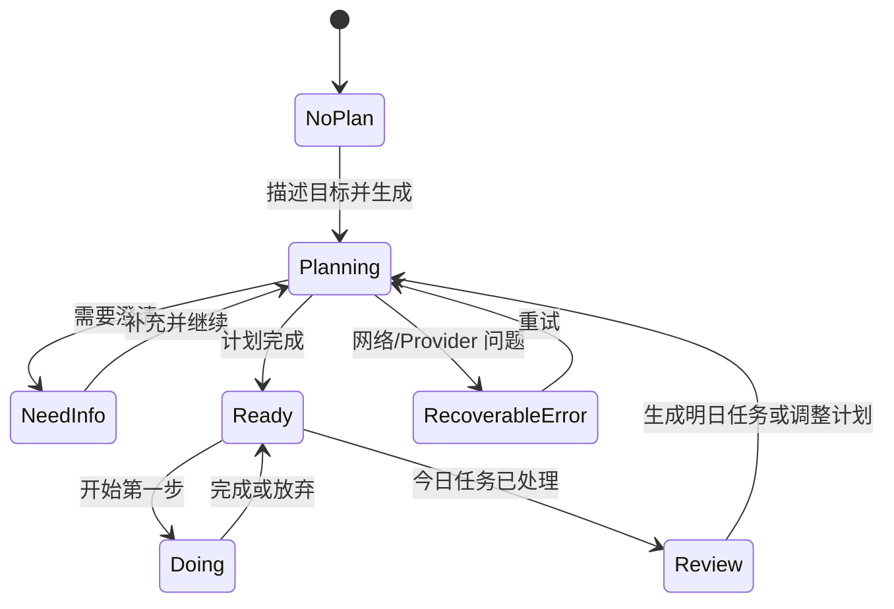

# 职业规划伙伴：产品交互、UI 与前端落地方案

> 日期：2026-08-03  
> 依据：当前 React/FastAPI 实现、OpenAPI snapshot、产品基线、桌面与 390px 移动端真实页面检查  
> 目标：把当前“可跑通的工程 Demo”收敛成“用户愿意开始第一步的产品 MVP”

## 1. 结论先行

当前项目的后端闭环已经覆盖“建档 → 规划 → 任务 → 复盘 → 重规划 → 记忆”，但前端还主要按数据库资源分页面，用户感知到的是“表单 + 卡片列表”，没有充分表达产品最重要的价值：

1. 系统理解了我的目标和限制；
2. 系统为什么让我先做这一件事；
3. 我现在只需要迈出一个很小的第一步；
4. 做完或卡住之后，计划真的会调整。

因此，新 UI 不应优先增加更多页面，而应围绕一个核心工作台重组现有功能：

```text
今天要做什么 → 立即开始 → 记录结果 → 轻量复盘 → 自动续接下一步
            ↘ 随时查看 1~8 周路线和“为什么”
```

建议产品名在用户界面中使用“求职搭子”或“职业规划搭子”；“职业规划伙伴”可以保留为正式名称。语气应像可靠的教练，不像聊天机器人，也不像企业项目管理工具。

## 2. 当前实现审查

### 2.1 已经可以复用的能力

- `/api/v1/me` 已聚合画像、当前计划、今日任务、最近复盘和活跃 Run，适合做 Today 首屏。
- Run 支持 pending/running/completed/degraded/failed/cancelled，SSE 断线后仍可通过 GET 恢复。
- 计划已包含 `overall_direction`、`weekly_focus`、`rationale`、`sources`，足够做路线图，不需要先改后端。
- 任务已有 `starter_action`、`deliverable`、预计/实际时长和放弃原因，能支撑“低压力启动”交互。
- 复盘能够返回 `suggested_replan`、`next_plan_action`、`companion_message`，可做有解释的下一步建议。
- 画像 PATCH、记忆启停/删除、计划/任务/复盘筛选接口已经存在，只是前端没有完整使用。

### 2.2 P0 问题：先修交互逻辑，再做视觉

| 问题 | 当前证据 | 用户影响 | 处理建议 |
|---|---|---|---|
| 新用户绕过建档 | Router 使用 `<RequireAuth />`，但 `requireProfile` 默认是 false | 用户在系统不了解自己的情况下直接看到“生成计划”，规划输入质量下降 | 将 onboarding 与 product routes 分成两层守卫；产品路由必须 `requireProfile` |
| 移动端横向溢出 | 顶部品牌 + 4 个导航项强制单行；390px 截图中输入卡与按钮被截断 | 手机无法可靠完成核心操作 | 手机使用底部导航；品牌栏只放标题和个人入口；全局加 `min-w-0`/响应式约束 |
| 画像无法再次编辑 | Onboarding 文案说“可在设置调整”，但没有设置路由 | 时间预算、阶段变化后用户无法自行纠正 | 新增 `/settings/profile`，复用 PUT/PATCH Profile API |
| 错误直接暴露内部 code | Today 渲染 `error_code` 和 `fallback_reason` | 用户看见 `PROVIDER_*` 等工程术语，却不知道怎么恢复 | 建立 `toUserFacingError()`；展示原因类别、可执行恢复动作和 request id 折叠信息 |
| SSE 重连不可感知 | `onerror` 为空函数 | 用户不知道系统仍在工作还是已经卡死 | `useRunEventStream` 返回 `connecting/live/reconnecting/closed`，页面展示连接状态 |
| 前后端契约漂移 | 前端 `TaskUpdateResponse.plan_completed`，后端返回 `plan_status + companion_message`；记忆确认响应类型也不一致 | TypeScript 不能真正保护接口变化；后续使用响应字段时会出错 | 从 OpenAPI 生成类型，或至少立刻手工对齐并加 contract test |
| 计划周次 Tab 是假交互 | 点击周次没有改变任何内容 | 产生“不可信按钮” | 在仅有当日任务的 MVP 中移除 Tab，改成真实的周路线时间轴 |
| 记忆候选承诺不真实 | 候选生成链路尚未实现，但空态暗示“多跑几份就会出现” | 用户等待一个不会发生的能力 | 未接通前隐藏候选区，或明确标注 Beta/暂未启用；先保留用户可控的已有记忆 |

### 2.3 P1 问题：产品价值没有被 UI 放大

- Today 首屏同时强调“输入生成计划”和“今日任务”，但真正的主动作应该随状态变化：无计划时生成；有任务时立即开始；全部结束时复盘。
- 计划详情把路线写成普通文本列表，没有体现“当前处在哪一周、今天与中期方向的关系”。
- 完成/放弃任务后没有立即展示后端的 `companion_message`，闭环反馈丢失。
- 复盘被拆到独立导航，用户必须主动理解产品流程；更自然的方式是 Today 在任务结束后主动出现复盘卡，完整历史再放到独立页面。
- Memories 是后端概念。用户更容易理解“搭子记住了什么”，它应放在“我的”下面，而不是与“今天”并列为最高级导航。
- 没有 landing/demo 路径，不利于可用性测试和产品解释。

## 3. 产品信息架构

### 3.1 推荐主导航

移动端采用 4 个底部入口：

```text
今天        路线        复盘        我的
Today       Journey     Reviews     Me
```

- “计划”改为“路线”：用户关心的是前进路径，不是计划对象列表。
- “记忆”下沉到“我的 → 搭子记忆”。画像、偏好、隐私和退出也都在“我的”。
- Dev Trace 仅在 dev role 下通过“我的 → 开发者工具”进入，不占用户主导航。

桌面端使用窄左侧导航，主内容最大宽度 760px；路线页可扩展到 1040px。不要让所有内容永久铺满宽屏。

### 3.2 页面与路由

| 路由 | 页面职责 | 数据来源 |
|---|---|---|
| `/welcome` | 价值说明、体验 Demo、开始使用 | 静态；登录仍可自动完成 |
| `/onboarding` | 3 步建档 | GET/PUT Profile |
| `/today` | 唯一主工作台：生成、执行、反馈、复盘入口 | GET Me、Run、Task PATCH、SSE |
| `/journey` | 当前 1~8 周路线、当前周、成功信号 | Active Plan |
| `/journey/history` | 历史计划与调整版本 | Plans list |
| `/reviews` | 复盘历史和调整结果 | Reviews list |
| `/me` | 画像摘要、时间偏好、记忆、隐私 | Me/Profile/Memories |
| `/settings/profile` | 编辑画像 | PATCH Profile |
| `/dev/runs` | 开发者 Trace，仅 dev role | Dev APIs |

## 4. 关键用户流程

### 4.1 首次进入


建档原则：

- 第一屏只问目标方向与阶段；不要一次给出 6 个字段。
- 时间预算使用常用选项 30/45/60/90 分钟 + 自定义，不要求先输入数字。
- 技能摘要支持示例提示或“让 AI 帮我整理”，但 MVP 可先保留纯文本。
- 提交前用一句话确认：“你要准备 Agent 应用岗位，每天约 60 分钟，目标在 10 月前进入投递阶段。”

### 4.2 日常执行



交互重点：

- 有任务时收起“重新生成计划”输入框，改为次级动作“调整今天”。
- 首屏只高亮一个“建议先做”任务，其余任务折叠为“完成后再看”。
- “开始”后进入轻量专注态：展示 starter action、交付物、预计时长；不必做复杂计时器。
- “完成”后先展示事实反馈和 `companion_message`，再问实际时长。
- “放弃”不用红色惩罚性表达，按钮文案改为“今天先放下”；原因用于调整，不用于评判。
- 当天任务都进入终态后，Today 原位出现 30 秒复盘卡，避免依赖用户主动进入“复盘”页。

## 5. UI 方案

### 5.1 Today 桌面线框

```text
┌──────────────┬───────────────────────────────────────────────┐
│ 求职搭子      │  早上好，今天只推进一个关键结果                │
│              │  Agent 应用求职 · 每日 60 分钟        [调整]   │
│ ● 今天        │                                               │
│ ○ 路线        │  ┌─────────────────────────────────────────┐  │
│ ○ 复盘        │  │ 建议先做  25 分钟                      │  │
│ ○ 我的        │  │ 搭建一个最小 Agent 项目入口            │  │
│              │  │ 先打开仓库，新建 app/main.py            │  │
│              │  │ 交付物：可运行的 hello-agent endpoint   │  │
│              │  │                         [开始这一步 →]   │  │
│              │  └─────────────────────────────────────────┘  │
│              │                                               │
│              │  今天剩余 2 步 · 共 60 分钟                   │
│              │  ○ 阅读岗位 JD 并提取 3 个关键词      15 分钟 │
│              │  ○ 更新项目 README                    20 分钟 │
│              │                                               │
│              │  ┌─ 这一步为什么在最前面？ ────────────────┐ │
│              │  │ 它同时补齐项目证据和面试表达，且符合…    │ │
│              │  └─────────────────────────────────────────┘ │
│              │                                               │
│              │  本周路线  Week 2/4  ███████░░░  [看路线]     │
└──────────────┴───────────────────────────────────────────────┘
```

### 5.2 Today 移动端线框

```text
┌──────────────────────────┐
│ 8 月 3 日             ◉  │
│ 今天只推进一个关键结果    │
│                          │
│ ┌──────────────────────┐ │
│ │ 建议先做 · 25 分钟   │ │
│ │ 搭建最小 Agent 入口  │ │
│ │                      │ │
│ │ 第一步               │ │
│ │ 打开仓库，新建…      │ │
│ │                      │ │
│ │ [开始这一步]         │ │
│ └──────────────────────┘ │
│                          │
│ 今天剩余 2 步        展开 │
│ 本周进度  Week 2/4  40%  │
│                          │
├──────────────────────────┤
│ 今天    路线    复盘   我的│
└──────────────────────────┘
```

### 5.3 无计划状态

不要先给一个大文本框。先用结构化选择降低空白输入压力：

```text
今天想解决什么？
[从零规划求职] [调整当前方向] [准备投递] [准备面试]

告诉我你的具体目标（可选）
“例如：两周内做出一个能写进简历的 Agent 项目”

[为我生成路线]
```

选择 chip 后仍提交当前 `POST /agent-runs`，无需后端新增接口；将选择转成 message 模板即可。

### 5.4 规划中状态

用户等待 30~60 秒时，应展示稳定的产品阶段，不展示内部节点名：

```text
✓ 理解目标与时间限制
● 整理适合你的求职路径
○ 检查任务是否能在今天完成
○ 生成第一步

连接正常 · 已用 12 秒                      [取消]
```

内部 event 可以在前端映射为四个阶段。重连时显示“连接中断，正在恢复；你的进度不会丢失”，不要清空已完成阶段。

### 5.5 路线页

路线页不是未来任务日历，因为后端只展开当天任务。它应诚实表达“方向与成功信号”：

```text
目标：4 周内具备 Agent 应用实习投递能力

● 第 1 周  做出最小可运行项目          已完成
● 第 2 周  增加记忆与评测              当前
○ 第 3 周  整理简历项目表达
○ 第 4 周  定向投递并准备追问

当前周成功信号
“能演示一次完整请求，并解释状态与错误恢复。”

[今天该做什么]                 [为什么这样安排？]
```

历史计划放在二级入口。`adjustment_reason` 用“上次调整”卡片展示，让用户看到反馈确实改变了计划。

### 5.6 复盘与记忆

- 复盘使用 3 步渐进表单：感受 → 阻碍 → 是否调整；自由记录最后出现。
- 提交后立即展示“系统从事实中学到了什么”和“明日建议 continue/adjust”。
- 记忆页标题使用“搭子记住了什么”，按“目标与背景 / 稳定偏好 / 执行规律”分组。
- 每条记忆显示用途：“用于调整每日任务量”；支持停用和删除，删除需要确认。
- 敏感候选必须解释“为什么建议记住”和“不确认会怎样”，默认不确认。

## 6. 视觉系统

### 6.1 方向

关键词：平静、清楚、可信、轻行动。避免大面积渐变、游戏化徽章、夸张 AI 光效和密集数据面板。

- 背景：暖灰白 `#F7F8F5`，避免纯白刺眼。
- 主色：深青绿 `#187A70`，用于主动作和当前状态。
- 强调色：暖黄色 `#E3A33A`，只用于“需要注意/建议调整”，不表达失败。
- 危险色：低饱和砖红 `#B64B45`，仅用于删除和不可恢复行为。
- 正文：深蓝灰 `#1E2D35`；次级文本 `#617078`。
- 卡片：白色、1px 低对比边框、轻阴影；不要让每段文字都包一张卡。
- 圆角：卡片 16px，按钮 10~12px；保持一致。
- 字体：系统中文无衬线；数字使用 tabular nums 以减少进度抖动。

### 6.2 可访问性与响应式底线

- 正文对比度至少 4.5:1；不能只用颜色表达任务状态。
- 点击目标移动端至少 44×44px。
- 320px 宽度无横向滚动；输入框、Dialog、卡片都必须 `min-width: 0`。
- 底部导航为内容留出 safe-area；桌面左栏与移动底栏不能同时出现。
- 所有异步动作提供 pending、success、error 状态；成功消息不能只闪现。
- Dialog 关闭前保留用户已填内容；API 失败不得自动关闭。

## 7. 前端实现方案

### 7.1 推荐目录

```text
src/
  app/                 router、providers、route guards
  features/
    onboarding/
    today/
    journey/
    reviews/
    memories/
    profile/
    run-lifecycle/
  components/
    ui/                无业务语义的基础组件
    shell/             DesktopSidebar、MobileTabbar、PageHeader
  api/
    generated/         OpenAPI 生成类型（推荐）
    queries/           query key 与 hooks
  lib/
    labels.ts
    errors.ts
    dates.ts
```

不需要引入全局 Zustand。服务器事实继续交给 TanStack Query；局部表单和展开状态放组件内。Run 生命周期单独封装为 `useRunLifecycle`，组合 GET、SSE、轮询、connection state 和 invalidate。

### 7.2 组件拆分

```text
TodayPage
├── TodayHeader
├── RunProgressPanel
├── FirstStepCard
├── RemainingTasks
├── InlineReviewCard
└── WeeklyJourneyTeaser

JourneyPage
├── JourneySummary
├── WeeklyTimeline
├── CurrentWeekSignal
├── AdjustmentNote
└── EvidenceDrawer
```

`TaskCard` 不应继续承担所有状态和两个 Dialog。拆为 `TaskSummaryCard`、`TaskFocusPanel`、`CompleteTaskDialog`、`PauseTaskDialog`，并在 mutation success 后消费 `companion_message`。

### 7.3 错误与状态

建立产品错误映射：

| 错误类别 | 用户文案 | 主动作 |
|---|---|---|
| NETWORK_UNREACHABLE | 网络似乎断开了，已完成的进度不会丢失 | 重新连接 |
| Provider 限流/超时 | 规划服务有点忙，请稍后再试 | 倒计时后重试 |
| 并发 Run | 已有一份计划正在生成 | 查看进度 |
| VERSION_CONFLICT | 内容已在其他页面更新 | 刷新最新状态 |
| 未知错误 | 暂时没能完成这一步 | 重试；展开 request id |

`degraded` 不是用户错误。若仍有可执行计划，文案应为“已先生成一份保守方案，部分最新资料暂未核对”，工程原因只放开发 Trace。

## 8. 后端接口审查与补全

### 8.1 现有接口即可完成的 P0

| 前端能力 | 现有接口 | 结论 |
|---|---|---|
| Today 聚合恢复 | `GET /me` | 直接使用 |
| 创建/取消/恢复规划 | Agent Run POST/GET/cancel/SSE | 直接使用，前端增加状态映射 |
| 路线与历史 | Plan active/list/detail/sources | 直接使用 |
| 今日任务 | Tasks list/PATCH | 直接使用；对齐响应类型 |
| 复盘与续接 | Reviews list/create/start-next-plan | 直接使用 |
| 编辑画像 | Profile GET/PATCH | 直接使用 |
| 记忆控制 | Memories list/PATCH/DELETE | 前端补删除和筛选 |

### 8.2 建议补充的接口/字段

| 优先级 | 建议 | 原因 |
|---|---|---|
| P0 | OpenAPI 自动生成前端类型，并在 CI 检查 drift | 当前已有真实响应类型错位 |
| P0 | Profile 保存 `timezone`，或请求携带可信时区 | 后端 `date.today()` 与浏览器日期可能跨日不一致 |
| P1 | `/me` 增加 `server_date`、`today_summary`（pending/in_progress/completed/abandoned/estimated_minutes） | 避免客户端重复聚合并统一“今天”口径 |
| P1 | Run GET 增加产品级 `progress_stage`，或固定 event → stage 契约 | 避免前端依赖内部节点名 |
| P1 | 任务 PATCH 返回的 `companion_message` 明确进入 OpenAPI 前端模型 | 完成动作后及时反馈 |
| P1 | 增加 `POST /product-events`，至少记录 onboarding_complete、plan_requested、first_task_started/completed、review_submitted、replan_started | 才能验证北极星指标和漏斗 |
| P1 | Memory candidate 接通真实 distill 路径前返回 feature capability | 前端据此隐藏无法兑现的入口 |
| P2 | `/me` 或独立 insight API 返回最近 7 日执行摘要 | 支撑复盘趋势，而不是前端下载全部任务后计算 |

不建议为新 UI 单独增加 GraphQL、Redux、WebSocket、微服务或新的 Agent。现有 REST + SSE 足够。

## 9. 分阶段落地

### Phase 0：交互正确性（1~2 天）

1. 修 Route Guard，新用户强制建档。
2. 修 320/390px 横向溢出，增加移动端底部导航。
3. 对齐 OpenAPI 类型、Memory 决策幂等头和 Task 响应。
4. 增加 Profile Settings。
5. 建立产品错误映射和 SSE 连接状态。

验收：新浏览器从 `/` 必须经过 onboarding；320/390/768/1440 四个尺寸无横向滚动；失败后有可执行恢复动作。

### Phase 1：核心 Today（2~4 天）

1. Today 改为状态驱动工作台。
2. 无计划使用 quick intents；有任务突出 First Step。
3. 完成/放弃后展示 companion feedback。
4. 今日任务结束后原位出现轻量复盘。
5. Run 进度显示产品阶段。

验收：核心链路不需要用户理解“计划/复盘/记忆”等系统概念也能完成。

### Phase 2：路线与信任（2~3 天）

1. 实现 Journey timeline，删除假 Week Tabs。
2. 显示 rationale、success signal、adjustment reason。
3. 来源放入 Evidence Drawer，URL 可用时可打开，标注 unavailable。
4. 历史计划做版本对比摘要。

### Phase 3：记忆与数据闭环（3~5 天，依赖后端）

1. 接通 memory candidate/distill evidence。
2. 记忆解释、确认、停用、删除闭环。
3. 加核心埋点与漏斗。
4. 用 5~8 名目标用户做可用性测试，重点记录首次计划生成率、第一步开始率、第一步完成率。

## 10. 如何用 Codex 实现

### 10.1 推荐工作方式

Codex 每次只完成一个纵切，不要一次要求“重做全部 UI”。每个任务都要求先读：

1. `AGENTS.md`；
2. `docs/implementation/project-baseline.md`；
3. 本文；
4. 相关页面、API schema 和测试。

每个纵切采用同一循环：

```text
让 Codex 静态审查 → 给出文件/API/测试计划 → 实现 → 跑测试和 build
→ 启动本地页面 → 浏览器检查 4 个尺寸 → 修复 → 截图交付
```

视觉参考最好直接作为图片附件交给 Codex，并明确“复用当前 Tailwind/Radix 组件，不引入另一套 UI 框架”。Codex 可以根据截图还原组件，但产品状态、错误行为和接口约束仍应以本文和 OpenAPI 为准。

### 10.2 可直接复制的 Codex 任务

#### 任务 A：修基础路径和响应式 Shell

```text
请在当前仓库完成 Phase 0 的第一个纵切：
1. 阅读 AGENTS.md、project-baseline.md 和 ui-product-frontend-plan-2026-08-03.md。
2. 修复路由守卫：无画像用户只能进入 onboarding；有画像用户访问 onboarding 返回 today。
3. 重构 AppLayout：桌面左侧导航，<768px 使用固定底部导航；320px 起不得横向滚动。
4. 不改后端，不引入新状态库。
5. 先列出涉及文件、接口变化（应为无）和测试，再实现。
6. 增加路由守卫和 Shell 测试，运行 npm test 与 npm run build。
7. 用浏览器检查 320、390、768、1440 四个尺寸并保存截图到 output/playwright。
```

#### 任务 B：重构 Today 状态机

```text
请按 UI 方案实现 Today 工作台。复用 GET /me、Agent Run、Task PATCH 和 SSE，
不要新增后端接口。将页面明确拆为 no-plan、planning、clarification、ready、doing、
review-ready、recoverable-error 状态；有任务时突出一个 FirstStepCard，生成计划输入降为次级动作。
实现 useRunLifecycle，返回 SSE connection state；SSE 只做临时进度和 invalidate，
TanStack Query 仍是服务器事实来源。为每个状态写组件测试，并运行前端全量检查。
```

#### 任务 C：实现路线页

```text
请把 Plans/PlanDetail 重构为 Journey/History。
当前后端只展开当日任务，所以不要伪造未来每日任务；用 weekly_focus 做真实时间轴，
展示当前周、success_signal、rationale、adjustment_reason 和 sources。
删除无行为的 WeekTabs。保持旧 /plans/:planId 链接可重定向或兼容。
补空态、错误态、加载骨架和移动端测试。
```

#### 任务 D：契约与错误治理

```text
请对照 backend/tests/snapshots/openapi.json 审查 frontend/src/api/types.ts 和所有 hooks。
修正 TaskUpdateResponse、MemoryCandidateDecisionResponse、UserSummary、分页响应和
Memory confirm/reject 的 Idempotency-Key。新增统一的产品错误映射，不再在用户 UI 直接展示
error_code/fallback_reason。不要改变后端错误契约；开发 Trace 仍可显示原始字段。
增加契约测试，运行前后端相关测试与前端 build。
```

### 10.3 AI 工具组合

- Codex：读仓库、拆纵切、实现 React/FastAPI、补测试、跑构建、做浏览器回归。
- 图像生成：生成视觉情绪板或单页高保真参考；只用于视觉方向，不作为接口和状态事实。
- 浏览器自动化：检查实际路由、表单、SSE 状态、错误恢复和 4 个响应式尺寸。
- OpenAPI：作为前后端类型事实源，优先于手写 TypeScript 猜测。
- 离线 Eval：保证 UI 重构没有误改 Agent 输出契约；前端变化通常不应改运行时 Prompt。

## 11. 验收指标

体验验收不是“看起来更漂亮”，而是：

- 新用户能在 90 秒内完成建档并发起第一份计划；
- 用户能在计划生成后 10 秒内指出“今天第一步是什么”；
- 第一任务的开始动作和交付物无需展开即可看见；
- 完成/放弃后，用户能理解系统记录了什么、下一步会怎样调整；
- 规划中、重连中、降级、失败、取消五种状态不会混淆；
- 320px 到 1440px 无横向滚动、核心按钮不被遮挡；
- 前端类型与 OpenAPI 无漂移；
- 埋点能计算首次建档完成率、计划请求成功率、第一步开始率、第一步完成率和复盘提交率。

## 12. 当前截图

- 桌面现状：`output/playwright/current-today.png`
- 390px 现状：`output/playwright/current-today-mobile.png`

移动截图已复现横向溢出，建议作为 Phase 0 的视觉回归基线。
